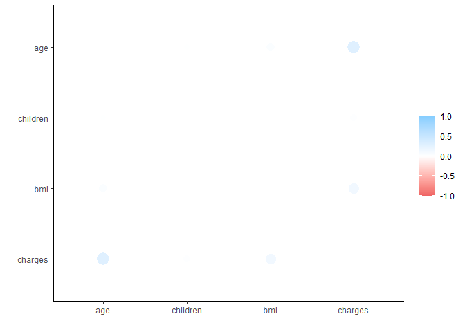
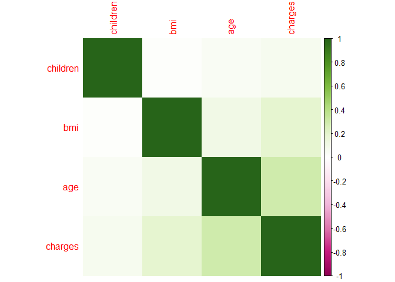
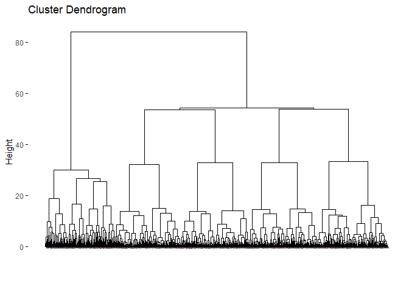
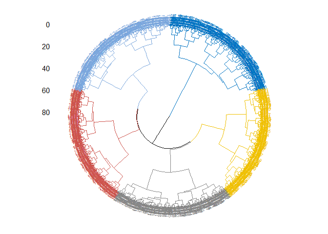
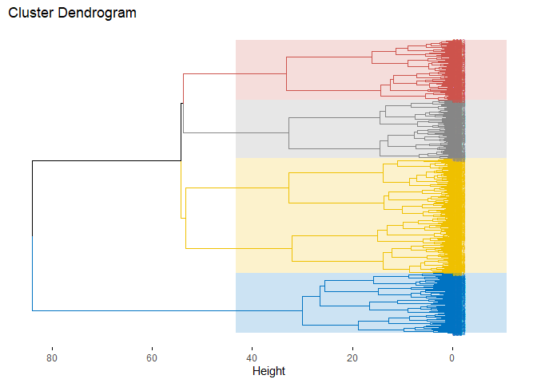
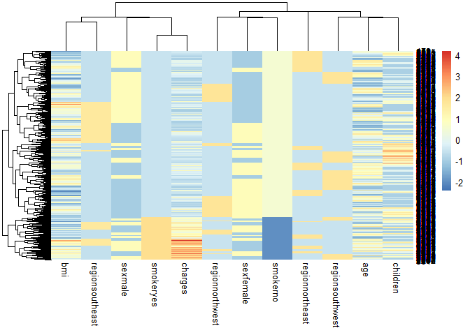

Visualization_hw2
================
Polina Pchelintseva
2022-10-28

## R Markdown

This is an R Markdown document. Markdown is a simple formatting syntax
for authoring HTML, PDF, and MS Word documents. For more details on
using R Markdown see <http://rmarkdown.rstudio.com>.

When you click the **Knit** button a document will be generated that
includes both content as well as the output of any embedded R code
chunks within the document. You can embed an R code chunk like this:

``` r
summary(cars)
```

    ##      speed           dist       
    ##  Min.   : 4.0   Min.   :  2.00  
    ##  1st Qu.:12.0   1st Qu.: 26.00  
    ##  Median :15.0   Median : 36.00  
    ##  Mean   :15.4   Mean   : 42.98  
    ##  3rd Qu.:19.0   3rd Qu.: 56.00  
    ##  Max.   :25.0   Max.   :120.00

## Including Plots

Note that the `echo = FALSE` parameter was added to the code chunk to
prevent printing of the R code that generated the plot.

Задание 1.

Загружаем данные

``` r
dat <- read.csv('./insurance_cost.csv')
```

Задание 2. Сделайте интерактивный plotly график отношения индекса массы
тела и трат на страховку. Раскрасьте его по колонке smoker.

``` r
library(plotly)
plot_ly(dat,
  x = ~ bmi, y = ~ charges,
  color = ~ smoker,
  type = "scatter"
)
```

Задание 3. Сделайте тоже самое через ggplotly.

``` r
library(ggplot2)
```

    ## Warning: пакет 'ggplot2' был собран под R версии 4.1.3

``` r
library(plotly)
```

    ## Warning: пакет 'plotly' был собран под R версии 4.1.3

    ## 
    ## Присоединяю пакет: 'plotly'

    ## Следующий объект скрыт от 'package:ggplot2':
    ## 
    ##     last_plot

    ## Следующий объект скрыт от 'package:stats':
    ## 
    ##     filter

    ## Следующий объект скрыт от 'package:graphics':
    ## 
    ##     layout

``` r
plot <- ggplot()+geom_point(data = dat, aes(x = bmi, y= charges, fill = smoker)) + theme_minimal()
ggplotly(plot)
```

<div id="htmlwidget-7d08b763c56e44e029a6" style="width:672px;height:480px;" class="plotly html-widget"></div>
<script type="application/json" data-for="htmlwidget-7d08b763c56e44e029a6">{"x":{"data":[{"x":[33.77,33,22.705,28.88,25.74,33.44,27.74,29.83,25.84,26.22,34.4,39.82,24.6,30.78,23.845,40.3,36.005,32.4,34.1,28.025,27.72,23.085,32.775,17.385,26.315,28.6,28.31,20.425,32.965,20.8,26.6,36.63,21.78,30.8,37.05,37.3,38.665,34.77,24.53,35.625,33.63,28.69,31.825,37.335,27.36,33.66,24.7,25.935,28.9,39.1,26.315,36.19,28.5,28.1,32.01,27.4,34.01,29.59,35.53,39.805,32.965,26.885,38.285,41.23,27.2,27.74,26.98,39.49,24.795,34.77,37.62,30.8,38.28,31.6,25.46,30.115,27.5,28.4,30.875,27.94,33.63,29.7,30.8,35.72,32.205,28.595,49.06,27.17,23.37,37.1,23.75,28.975,33.915,28.785,37.4,34.7,26.505,22.04,35.9,25.555,28.785,28.05,34.1,25.175,31.9,36,22.42,32.49,29.735,38.83,37.73,37.43,28.4,24.13,29.7,37.145,25.46,39.52,27.83,39.6,29.8,29.64,28.215,37,33.155,31.825,18.905,41.47,30.3,15.96,34.8,33.345,27.835,29.2,28.9,33.155,28.595,38.28,19.95,26.41,30.69,29.92,30.9,32.2,32.11,31.57,26.2,25.74,26.6,34.43,30.59,32.8,28.6,18.05,39.33,32.11,32.23,24.035,22.3,28.88,26.4,31.8,41.23,33,30.875,28.5,26.73,30.9,37.1,26.6,23.1,29.92,23.21,33.7,33.25,30.8,33.88,38.06,41.91,31.635,25.46,36.195,27.83,17.8,27.5,24.51,26.73,38.39,38.06,22.135,26.8,35.3,30.02,38.06,35.86,20.9,28.975,30.3,25.365,40.15,24.415,25.2,38.06,32.395,30.2,25.84,29.37,37.05,27.455,27.55,26.6,20.615,24.3,31.79,21.56,27.645,32.395,31.2,26.62,48.07,26.22,26.4,33.4,29.64,28.82,26.8,22.99,28.88,27.55,37.51,33,38,33.345,27.5,33.33,34.865,33.06,26.6,24.7,35.86,33.25,32.205,32.775,27.645,37.335,25.27,29.64,40.945,27.2,34.105,23.21,36.7,31.16,28.785,35.72,34.5,25.74,27.55,27.72,27.6,30.02,27.55,36.765,41.47,29.26,35.75,33.345,29.92,27.835,23.18,25.6,27.7,35.245,38.28,27.6,43.89,29.83,41.91,20.79,32.3,30.5,26.4,21.89,30.78,32.3,24.985,32.015,30.4,21.09,22.23,33.155,33.33,30.115,31.46,33,43.34,22.135,34.4,39.05,25.365,22.61,30.21,35.625,37.43,31.445,31.35,32.3,19.855,34.4,31.02,25.6,38.17,20.6,47.52,32.965,32.3,20.4,38.38,24.31,23.6,21.12,30.03,17.48,23.9,35.15,35.64,34.1,39.16,30.59,30.2,24.31,27.265,29.165,16.815,30.4,33.1,20.235,26.9,30.5,28.595,33.11,31.73,28.9,46.75,29.45,32.68,43.01,36.52,33.1,29.64,25.65,29.6,38.6,29.6,24.13,23.4,29.735,46.53,37.4,30.14,30.495,39.6,33,36.63,38.095,25.935,25.175,28.7,33.82,24.32,24.09,32.67,30.115,29.8,33.345,35.625,36.85,32.56,41.325,37.51,31.35,39.5,34.3,31.065,21.47,28.7,31.16,32.9,25.08,25.08,43.4,27.93,23.6,28.7,23.98,39.2,26.03,28.93,30.875,31.35,23.75,25.27,28.7,32.11,33.66,22.42,30.4,35.7,35.31,30.495,31,30.875,27.36,44.22,33.915,37.73,33.88,30.59,25.8,39.425,25.46,31.73,29.7,36.19,40.48,28.025,38.9,30.2,28.05,31.35,38,31.79,36.3,30.21,35.435,46.7,28.595,30.8,28.93,21.4,31.73,41.325,23.8,33.44,34.21,35.53,19.95,32.68,30.5,44.77,32.12,30.495,40.565,30.59,31.9,29.1,37.29,43.12,36.86,34.295,27.17,26.84,30.2,23.465,25.46,30.59,45.43,23.65,20.7,28.27,20.235,35.91,30.69,29,19.57,31.13,40.26,33.725,29.48,33.25,32.6,37.525,39.16,31.635,25.3,39.05,34.1,25.175,26.98,29.37,34.8,33.155,19,33,28.595,37.1,31.4,21.3,28.785,26.03,28.88,42.46,38,36.1,29.3,35.53,22.705,39.7,38.19,24.51,38.095,33.66,42.4,33.915,34.96,35.31,30.78,26.22,23.37,28.5,32.965,42.68,39.6,31.13,36.3,35.2,42.4,33.155,35.91,28.785,46.53,23.98,31.54,33.66,28.7,29.81,31.57,31.16,29.7,31.02,21.375,40.81,36.1,23.18,17.4,20.3,24.32,18.5,26.41,26.125,41.69,24.1,27.36,36.2,32.395,23.655,34.8,40.185,32.3,33.725,39.27,34.87,44.745,41.47,26.41,29.545,32.9,28.69,30.495,27.74,35.2,23.54,30.685,40.47,22.6,28.9,22.61,24.32,36.67,33.44,40.66,36.6,37.4,35.4,27.075,28.405,40.28,36.08,21.4,30.1,27.265,32.1,34.77,23.7,24.035,26.62,26.41,30.115,27,21.755,36,30.875,28.975,37.905,22.77,33.63,27.645,22.8,37.43,34.58,35.2,26.03,25.175,31.825,32.3,29,39.7,19.475,36.1,26.7,36.48,34.2,33.33,32.3,39.805,34.32,28.88,41.14,35.97,29.26,27.7,36.955,36.86,22.515,29.92,41.8,27.6,23.18,31.92,44.22,22.895,33.1,26.18,35.97,22.3,26.51,35.815,41.42,36.575,30.14,25.84,30.8,42.94,21.01,22.515,34.43,31.46,24.225,37.1,33.7,17.67,31.13,29.81,24.32,31.825,21.85,33.1,25.84,23.845,34.39,33.82,35.97,31.5,28.31,23.465,31.35,31.1,24.7,30.495,34.2,50.38,24.1,32.775,32.3,23.75,29.6,32.23,28.1,28,33.535,19.855,25.4,29.9,37.29,43.7,23.655,24.3,36.2,29.48,24.86,30.1,21.85,28.12,27.1,33.44,28.8,29.5,34.8,27.36,22.135,26.695,30.02,39.5,33.63,29.04,24.035,32.11,44,25.555,40.26,22.515,22.515,27.265,36.85,35.1,29.355,32.585,32.34,39.8,28.31,26.695,27.5,24.605,33.99,28.2,34.21,25,33.2,31,35.815,23.2,32.11,23.4,20.1,39.16,34.21,46.53,32.5,25.8,35.3,37.18,27.5,29.735,24.225,26.18,29.48,23.21,46.09,40.185,22.61,39.93,35.8,35.8,31.255,18.335,28.405,39.49,26.79,36.67,39.615,25.9,35.2,24.795,36.765,27.1,25.365,25.745,34.32,28.16,23.56,20.235,40.5,35.42,40.15,29.15,39.995,29.92,25.46,21.375,30.59,30.115,25.8,30.115,27.645,34.675,19.8,27.835,31.6,28.27,23.275,34.1,36.85,36.29,26.885,25.8,29.6,19.19,31.73,29.26,24.985,27.74,22.8,33.33,32.3,27.6,25.46,24.605,34.2,35.815,32.68,37,23.32,45.32,34.6,18.715,31.6,17.29,27.93,38.38,23,28.88,27.265,23.085,25.8,35.245,25.08,22.515,36.955,26.41,29.83,21.47,27.645,28.9,31.79,39.49,33.82,32.01,27.94,28.595,25.6,25.3,37.29,42.655,21.66,31.9,31.445,31.255,28.88,18.335,29.59,32,26.03,33.66,21.78,27.835,19.95,31.5,30.495,28.975,31.54,47.74,22.1,29.83,32.7,33.7,31.35,33.77,30.875,33.99,28.6,38.94,36.08,29.8,31.24,29.925,26.22,30,20.35,32.3,26.315,24.51,32.67,29.64,19.95,38.17,32.395,25.08,29.9,35.86,32.8,18.6,23.87,45.9,40.28,18.335,33.82,28.12,25,22.23,30.25,37.07,32.6,24.86,32.34,32.3,32.775,31.92,21.5,34.1,30.305,36.48,35.815,27.93,22.135,23.18,30.59,41.1,34.58,42.13,38.83,28.215,28.31,26.125,40.37,24.6,35.2,34.105,41.91,29.26,32.11,27.1,27.4,34.865,41.325,29.925,30.3,27.36,23.56,32.68,28,32.775,21.755,32.395,36.575,21.755,27.93,33.55,29.355,25.8,24.32,40.375,32.11,32.3,17.86,34.8,37.1,30.875,34.1,21.47,33.3,31.255,39.14,25.08,37.29,30.21,21.945,24.97,25.3,23.94,39.82,16.815,37.18,34.43,30.305,24.605,23.3,27.83,31.065,21.66,28.215,22.705,42.13,21.28,33.11,33.33,24.3,25.7,29.4,39.82,19.8,29.3,27.72,37.9,36.385,27.645,37.715,23.18,20.52,37.1,28.05,29.9,33.345,30.5,33.3,27.5,33.915,34.485,25.52,27.61,23.7,30.4,29.735,26.79,33.33,30.03,24.32,17.29,25.9,34.32,19.95,23.21,25.745,25.175,22,26.125,26.51,27.455,25.745,20.8,27.72,32.2,26.315,26.695,42.9,28.31,20.6,53.13,39.71,26.315,31.065,38.83,25.935,33.535,32.87,30.03,24.225,38.6,25.74,33.4,44.7,30.97,31.92,36.85,25.8],"y":[1725.5523,4449.462,21984.47061,3866.8552,3756.6216,8240.5896,7281.5056,6406.4107,28923.13692,2721.3208,1826.843,11090.7178,1837.237,10797.3362,2395.17155,10602.385,13228.84695,4149.736,1137.011,6203.90175,14001.1338,14451.83515,12268.63225,2775.19215,2198.18985,4687.797,13770.0979,1625.43375,15612.19335,2302.3,3046.062,4949.7587,6272.4772,6313.759,6079.6715,20630.28351,3393.35635,3556.9223,12629.8967,2211.13075,3579.8287,8059.6791,13607.36875,5989.52365,8606.2174,4504.6624,30166.61817,4133.64165,1743.214,14235.072,6389.37785,5920.1041,6799.458,11741.726,11946.6259,7726.854,11356.6609,3947.4131,1532.4697,2755.02095,6571.02435,4441.21315,7935.29115,11033.6617,11073.176,8026.6666,11082.5772,2026.9741,10942.13205,5729.0053,3766.8838,12105.32,10226.2842,6186.127,3645.0894,21344.8467,5003.853,2331.519,3877.30425,2867.1196,10825.2537,11881.358,4646.759,2404.7338,11488.31695,30259.99556,11381.3254,8601.3293,6686.4313,7740.337,1705.6245,2257.47525,10115.00885,3385.39915,9634.538,6082.405,12815.44495,13616.3586,11163.568,1632.56445,2457.21115,2155.6815,1261.442,2045.68525,27322.73386,2166.732,27375.90478,3490.5491,18157.876,5138.2567,9877.6077,10959.6947,1842.519,5125.2157,7789.635,6334.34355,7077.1894,6948.7008,19749.38338,10450.552,5152.134,5028.1466,10407.08585,4830.63,6128.79745,2719.27975,4827.90495,13405.3903,8116.68,1694.7964,5246.047,2855.43755,6455.86265,10436.096,8823.279,8538.28845,11735.87905,1631.8212,4005.4225,7419.4779,7731.4271,3981.9768,5325.651,6775.961,4922.9159,12557.6053,4883.866,2137.6536,12044.342,1137.4697,1639.5631,5649.715,8516.829,9644.2525,14901.5167,2130.6759,8871.1517,13012.20865,7147.105,4337.7352,11743.299,13880.949,6610.1097,1980.07,8162.71625,3537.703,5002.7827,8520.026,7371.772,10355.641,2483.736,3392.9768,25081.76784,5012.471,10564.8845,5253.524,11987.1682,2689.4954,24227.33724,7358.17565,9225.2564,7443.64305,14001.2867,1727.785,12333.828,6710.1919,1615.7667,4463.2051,7152.6714,5354.07465,35160.13457,7196.867,24476.47851,12648.7034,1986.9334,1832.094,4040.55825,4260.744,13047.33235,5400.9805,11520.09985,11837.16,20462.99766,14590.63205,7441.053,9282.4806,1719.4363,7265.7025,9617.66245,2523.1695,9715.841,2803.69785,2150.469,12928.7911,9855.1314,4237.12655,11879.10405,9625.92,7742.1098,9432.9253,14256.1928,25992.82104,3172.018,20277.80751,2156.7518,3906.127,1704.5681,9249.4952,6746.7425,12265.5069,4349.462,12646.207,19442.3535,20177.67113,4151.0287,11944.59435,7749.1564,8444.474,1737.376,8124.4084,9722.7695,8835.26495,10435.06525,7421.19455,4667.60765,4894.7533,24671.66334,11566.30055,2866.091,6600.20595,3561.8889,9144.565,13429.0354,11658.37915,19144.57652,13822.803,12142.5786,13937.6665,8232.6388,18955.22017,13352.0998,13217.0945,13981.85035,10977.2063,6184.2994,4889.9995,8334.45755,5478.0368,1635.73365,11830.6072,8932.084,3554.203,12404.8791,14133.03775,24603.04837,8944.1151,9620.3307,1837.2819,1607.5101,10043.249,4751.07,2597.779,3180.5101,9778.3472,13430.265,8017.06115,8116.26885,3481.868,13415.0381,12029.2867,7639.41745,1391.5287,16455.70785,27000.98473,20781.48892,5846.9176,8302.53565,1261.859,11856.4115,30284.64294,3176.8159,4618.0799,10736.87075,2138.0707,8964.06055,9290.1395,9411.005,7526.70645,8522.003,16586.49771,14988.432,1631.6683,9264.797,8083.9198,14692.66935,10269.46,3260.199,11396.9002,4185.0979,8539.671,6652.5288,4074.4537,1621.3402,5080.096,2134.9015,7345.7266,9140.951,14418.2804,2727.3951,8968.33,9788.8659,6555.07035,7323.734819,3167.45585,18804.7524,23082.95533,4906.40965,5969.723,12638.195,4243.59005,13919.8229,2254.7967,5926.846,12592.5345,2897.3235,4738.2682,1149.3959,28287.89766,7345.084,12730.9996,11454.0215,5910.944,4762.329,7512.267,4032.2407,1969.614,1769.53165,4686.3887,21797.0004,11881.9696,11840.77505,10601.412,7682.67,10381.4787,15230.32405,11165.41765,1632.03625,13224.693,12643.3778,23288.9284,2201.0971,2497.0383,2203.47185,1744.465,20878.78443,2534.39375,1534.3045,1824.2854,15555.18875,9304.7019,1622.1885,9880.068,9563.029,4347.02335,12475.3513,1253.936,10461.9794,1748.774,24513.09126,2196.4732,12574.049,1967.0227,4931.647,8027.968,8211.1002,13470.86,6837.3687,5974.3847,6796.86325,2643.2685,3077.0955,3044.2133,11455.28,11763.0009,2498.4144,9361.3268,1256.299,11362.755,27724.28875,8413.46305,5240.765,3857.75925,25656.57526,3994.1778,9866.30485,5397.6167,11482.63485,24059.68019,9861.025,8342.90875,1708.0014,14043.4767,12925.886,19214.70553,13831.1152,6067.12675,5972.378,8825.086,8233.0975,27346.04207,6196.448,3056.3881,13887.204,10231.4999,3268.84665,11538.421,3213.62205,13390.559,3972.9247,12957.118,11187.6567,17878.90068,3847.674,8334.5896,3935.1799,1646.4297,9193.8385,10923.9332,2494.022,9058.7303,2801.2588,2128.43105,6373.55735,7256.7231,11552.904,3761.292,2219.4451,4753.6368,31620.00106,13224.05705,12222.8983,1664.9996,9724.53,3206.49135,12913.9924,1639.5631,6356.2707,17626.23951,1242.816,4779.6023,3861.20965,13635.6379,5976.8311,11842.442,8428.0693,2566.4707,5709.1644,8823.98575,7640.3092,5594.8455,7441.501,33471.97189,1633.0444,9174.13565,11070.535,16085.1275,9283.562,3558.62025,4435.0942,8547.6913,6571.544,2207.69745,6753.038,1880.07,11658.11505,10713.644,3659.346,9182.17,12129.61415,3736.4647,6748.5912,11326.71487,11365.952,10085.846,1977.815,3366.6697,7173.35995,9391.346,14410.9321,2709.1119,24915.04626,12949.1554,6666.243,13143.86485,4466.6214,18806.14547,10141.1362,6123.5688,8252.2843,1712.227,12430.95335,9800.8882,10579.711,8280.6227,8527.532,12244.531,3410.324,4058.71245,26392.26029,14394.39815,6435.6237,22192.43711,5148.5526,1136.3994,8703.456,6500.2359,4837.5823,3943.5954,4399.731,6185.3208,7222.78625,12485.8009,12363.547,10156.7832,2585.269,1242.26,9863.4718,4766.022,11244.3769,7729.64575,5438.7491,26236.57997,2104.1134,8068.185,2362.22905,2352.96845,3577.999,3201.24515,29186.48236,10976.24575,3500.6123,2020.5523,9541.69555,9504.3103,5385.3379,8930.93455,5375.038,10264.4421,6113.23105,5469.0066,1727.54,10107.2206,8310.83915,1984.4533,2457.502,12146.971,9566.9909,13112.6048,10848.1343,12231.6136,9875.6804,11264.541,12979.358,1263.249,10106.13425,6664.68595,2217.6012,6781.3542,10065.413,4234.927,9447.25035,14007.222,9583.8933,3484.331,8604.48365,3757.8448,8827.2099,9910.35985,11737.84884,1627.28245,8556.907,3062.50825,1906.35825,14210.53595,11833.7823,17128.42608,5031.26955,7985.815,5428.7277,3925.7582,2416.955,3070.8087,9095.06825,11842.62375,8062.764,7050.642,14319.031,6933.24225,27941.28758,11150.78,12797.20962,7261.741,10560.4917,6986.697,7448.40395,5934.3798,9869.8102,1146.7966,9386.1613,4350.5144,6414.178,12741.16745,1917.3184,5209.57885,13457.9608,5662.225,1252.407,2731.9122,7209.4918,4266.1658,4719.52405,11848.141,7046.7222,14313.8463,2103.08,1815.8759,7731.85785,28476.73499,2136.88225,1131.5066,3309.7926,9414.92,6360.9936,11013.7119,4428.88785,5584.3057,1877.9294,2842.76075,3597.596,7445.918,2680.9493,1621.8827,8219.2039,12523.6048,16069.08475,6117.4945,13393.756,5266.3656,4719.73655,11743.9341,5377.4578,7160.3303,4402.233,11657.7189,6402.29135,12622.1795,1526.312,12323.936,10072.05505,9872.701,2438.0552,2974.126,10601.63225,14119.62,11729.6795,1875.344,18218.16139,10965.446,7151.092,12269.68865,5458.04645,8782.469,6600.361,1141.4451,11576.13,13129.60345,4391.652,8457.818,3392.3652,5966.8874,6849.026,8891.1395,2690.1138,26140.3603,6653.7886,6282.235,6311.952,3443.064,2789.0574,2585.85065,4877.98105,5272.1758,1682.597,11945.1327,7243.8136,10422.91665,13555.0049,13063.883,2221.56445,1634.5734,2117.33885,8688.85885,4661.28635,8125.7845,12644.589,4564.19145,4846.92015,7633.7206,15170.069,2639.0429,14382.70905,7626.993,5257.50795,2473.3341,13041.921,5245.2269,13451.122,13462.52,5488.262,4320.41085,6250.435,25333.33284,2913.569,12032.326,13470.8044,6289.7549,2927.0647,6238.298,10096.97,7348.142,4673.3922,12233.828,32108.66282,8965.79575,2304.0022,9487.6442,1121.8739,9549.5651,2217.46915,1628.4709,12982.8747,11674.13,7160.094,6358.77645,11534.87265,4527.18295,3875.7341,12609.88702,28468.91901,2730.10785,3353.284,14474.675,9500.57305,26467.09737,4746.344,7518.02535,3279.86855,8596.8278,10702.6424,4992.3764,2527.81865,1759.338,2322.6218,7804.1605,2902.9065,9704.66805,4889.0368,25517.11363,4500.33925,16796.41194,4915.05985,7624.63,8410.04685,28340.18885,4518.82625,3378.91,7144.86265,10118.424,5484.4673,7986.47525,7418.522,13887.9685,6551.7501,5267.81815,1972.95,21232.18226,8627.5411,4433.3877,4438.2634,23241.47453,9957.7216,8269.044,36580.28216,8765.249,5383.536,12124.9924,2709.24395,3987.926,12495.29085,26018.95052,8798.593,1711.0268,8569.8618,2020.177,21595.38229,9850.432,6877.9801,4137.5227,12950.0712,12094.478,2250.8352,22493.65964,1704.70015,3161.454,11394.06555,7325.0482,3594.17085,8023.13545,14394.5579,9288.0267,3353.4703,10594.50155,8277.523,17929.30337,2480.9791,4462.7218,1981.5819,11554.2236,6548.19505,5708.867,7045.499,8978.1851,5757.41345,14349.8544,10928.849,13974.45555,1909.52745,12096.6512,13204.28565,4562.8421,8551.347,2102.2647,15161.5344,11884.04858,4454.40265,5855.9025,4076.497,15019.76005,10796.35025,11353.2276,9748.9106,10577.087,11286.5387,3591.48,11299.343,4561.1885,1674.6323,23045.56616,3227.1211,11253.421,3471.4096,11363.2832,20420.60465,10338.9316,8988.15875,10493.9458,2904.088,8605.3615,11512.405,5312.16985,2396.0959,10807.4863,9222.4026,5693.4305,8347.1643,18903.49141,14254.6082,10214.636,5836.5204,14358.36437,1728.897,8582.3023,3693.428,20709.02034,9991.03765,19673.33573,11085.5868,7623.518,3176.2877,3704.3545,9048.0273,7954.517,27117.99378,6338.0756,9630.397,11289.10925,2261.5688,10791.96,5979.731,2203.73595,12235.8392,5630.45785,11015.1747,7228.21565,14426.07385,2459.7201,3989.841,7727.2532,5124.1887,18963.17192,2200.83085,7153.5539,5227.98875,10982.5013,4529.477,4670.64,6112.35295,11093.6229,6457.8434,4433.9159,2154.361,6496.886,2899.48935,7650.77375,2850.68375,2632.992,9447.3824,8603.8234,13844.7972,13126.67745,5327.40025,13725.47184,13019.16105,8671.19125,4134.08245,18838.70366,5699.8375,6393.60345,4934.705,6198.7518,8733.22925,2055.3249,9964.06,5116.5004,36910.60803,12347.172,5373.36425,23563.01618,1702.4553,10806.839,3956.07145,12890.05765,5415.6612,4058.1161,7537.1639,4718.20355,6593.5083,8442.667,6858.4796,4795.6568,6640.54485,7162.0122,10594.2257,11938.25595,12479.70895,11345.519,8515.7587,2699.56835,14449.8544,12224.35085,6985.50695,3238.4357,4296.2712,3171.6149,1135.9407,5615.369,9101.798,6059.173,1633.9618,1241.565,15828.82173,4415.1588,6474.013,11436.73815,11305.93455,30063.58055,10197.7722,4544.2348,3277.161,6770.1925,7337.748,10370.91255,10704.47,1880.487,8615.3,3292.52985,3021.80915,14478.33015,4747.0529,10959.33,2741.948,4357.04365,4189.1131,8283.6807,1720.3537,8534.6718,3732.6251,5472.449,7147.4728,7133.9025,1515.3449,9301.89355,11931.12525,1964.78,1708.92575,4340.4409,5261.46945,2710.82855,3208.787,2464.6188,6875.961,6940.90985,4571.41305,4536.259,11272.33139,1731.677,1163.4627,19496.71917,7201.70085,5425.02335,12981.3457,4239.89265,13143.33665,7050.0213,9377.9047,22395.74424,10325.206,12629.1656,10795.93733,11411.685,10600.5483,2205.9808,1629.8335,2007.945],"text":["bmi: 33.770<br />charges:  1725.552<br />smoker: no","bmi: 33.000<br />charges:  4449.462<br />smoker: no","bmi: 22.705<br />charges: 21984.471<br />smoker: no","bmi: 28.880<br />charges:  3866.855<br />smoker: no","bmi: 25.740<br />charges:  3756.622<br />smoker: no","bmi: 33.440<br />charges:  8240.590<br />smoker: no","bmi: 27.740<br />charges:  7281.506<br />smoker: no","bmi: 29.830<br />charges:  6406.411<br />smoker: no","bmi: 25.840<br />charges: 28923.137<br />smoker: no","bmi: 26.220<br />charges:  2721.321<br />smoker: no","bmi: 34.400<br />charges:  1826.843<br />smoker: no","bmi: 39.820<br />charges: 11090.718<br />smoker: no","bmi: 24.600<br />charges:  1837.237<br />smoker: no","bmi: 30.780<br />charges: 10797.336<br />smoker: no","bmi: 23.845<br />charges:  2395.172<br />smoker: no","bmi: 40.300<br />charges: 10602.385<br />smoker: no","bmi: 36.005<br />charges: 13228.847<br />smoker: no","bmi: 32.400<br />charges:  4149.736<br />smoker: no","bmi: 34.100<br />charges:  1137.011<br />smoker: no","bmi: 28.025<br />charges:  6203.902<br />smoker: no","bmi: 27.720<br />charges: 14001.134<br />smoker: no","bmi: 23.085<br />charges: 14451.835<br />smoker: no","bmi: 32.775<br />charges: 12268.632<br />smoker: no","bmi: 17.385<br />charges:  2775.192<br />smoker: no","bmi: 26.315<br />charges:  2198.190<br />smoker: no","bmi: 28.600<br />charges:  4687.797<br />smoker: no","bmi: 28.310<br />charges: 13770.098<br />smoker: no","bmi: 20.425<br />charges:  1625.434<br />smoker: no","bmi: 32.965<br />charges: 15612.193<br />smoker: no","bmi: 20.800<br />charges:  2302.300<br />smoker: no","bmi: 26.600<br />charges:  3046.062<br />smoker: no","bmi: 36.630<br />charges:  4949.759<br />smoker: no","bmi: 21.780<br />charges:  6272.477<br />smoker: no","bmi: 30.800<br />charges:  6313.759<br />smoker: no","bmi: 37.050<br />charges:  6079.672<br />smoker: no","bmi: 37.300<br />charges: 20630.284<br />smoker: no","bmi: 38.665<br />charges:  3393.356<br />smoker: no","bmi: 34.770<br />charges:  3556.922<br />smoker: no","bmi: 24.530<br />charges: 12629.897<br />smoker: no","bmi: 35.625<br />charges:  2211.131<br />smoker: no","bmi: 33.630<br />charges:  3579.829<br />smoker: no","bmi: 28.690<br />charges:  8059.679<br />smoker: no","bmi: 31.825<br />charges: 13607.369<br />smoker: no","bmi: 37.335<br />charges:  5989.524<br />smoker: no","bmi: 27.360<br />charges:  8606.217<br />smoker: no","bmi: 33.660<br />charges:  4504.662<br />smoker: no","bmi: 24.700<br />charges: 30166.618<br />smoker: no","bmi: 25.935<br />charges:  4133.642<br />smoker: no","bmi: 28.900<br />charges:  1743.214<br />smoker: no","bmi: 39.100<br />charges: 14235.072<br />smoker: no","bmi: 26.315<br />charges:  6389.378<br />smoker: no","bmi: 36.190<br />charges:  5920.104<br />smoker: no","bmi: 28.500<br />charges:  6799.458<br />smoker: no","bmi: 28.100<br />charges: 11741.726<br />smoker: no","bmi: 32.010<br />charges: 11946.626<br />smoker: no","bmi: 27.400<br />charges:  7726.854<br />smoker: no","bmi: 34.010<br />charges: 11356.661<br />smoker: no","bmi: 29.590<br />charges:  3947.413<br />smoker: no","bmi: 35.530<br />charges:  1532.470<br />smoker: no","bmi: 39.805<br />charges:  2755.021<br />smoker: no","bmi: 32.965<br />charges:  6571.024<br />smoker: no","bmi: 26.885<br />charges:  4441.213<br />smoker: no","bmi: 38.285<br />charges:  7935.291<br />smoker: no","bmi: 41.230<br />charges: 11033.662<br />smoker: no","bmi: 27.200<br />charges: 11073.176<br />smoker: no","bmi: 27.740<br />charges:  8026.667<br />smoker: no","bmi: 26.980<br />charges: 11082.577<br />smoker: no","bmi: 39.490<br />charges:  2026.974<br />smoker: no","bmi: 24.795<br />charges: 10942.132<br />smoker: no","bmi: 34.770<br />charges:  5729.005<br />smoker: no","bmi: 37.620<br />charges:  3766.884<br />smoker: no","bmi: 30.800<br />charges: 12105.320<br />smoker: no","bmi: 38.280<br />charges: 10226.284<br />smoker: no","bmi: 31.600<br />charges:  6186.127<br />smoker: no","bmi: 25.460<br />charges:  3645.089<br />smoker: no","bmi: 30.115<br />charges: 21344.847<br />smoker: no","bmi: 27.500<br />charges:  5003.853<br />smoker: no","bmi: 28.400<br />charges:  2331.519<br />smoker: no","bmi: 30.875<br />charges:  3877.304<br />smoker: no","bmi: 27.940<br />charges:  2867.120<br />smoker: no","bmi: 33.630<br />charges: 10825.254<br />smoker: no","bmi: 29.700<br />charges: 11881.358<br />smoker: no","bmi: 30.800<br />charges:  4646.759<br />smoker: no","bmi: 35.720<br />charges:  2404.734<br />smoker: no","bmi: 32.205<br />charges: 11488.317<br />smoker: no","bmi: 28.595<br />charges: 30259.996<br />smoker: no","bmi: 49.060<br />charges: 11381.325<br />smoker: no","bmi: 27.170<br />charges:  8601.329<br />smoker: no","bmi: 23.370<br />charges:  6686.431<br />smoker: no","bmi: 37.100<br />charges:  7740.337<br />smoker: no","bmi: 23.750<br />charges:  1705.624<br />smoker: no","bmi: 28.975<br />charges:  2257.475<br />smoker: no","bmi: 33.915<br />charges: 10115.009<br />smoker: no","bmi: 28.785<br />charges:  3385.399<br />smoker: no","bmi: 37.400<br />charges:  9634.538<br />smoker: no","bmi: 34.700<br />charges:  6082.405<br />smoker: no","bmi: 26.505<br />charges: 12815.445<br />smoker: no","bmi: 22.040<br />charges: 13616.359<br />smoker: no","bmi: 35.900<br />charges: 11163.568<br />smoker: no","bmi: 25.555<br />charges:  1632.564<br />smoker: no","bmi: 28.785<br />charges:  2457.211<br />smoker: no","bmi: 28.050<br />charges:  2155.682<br />smoker: no","bmi: 34.100<br />charges:  1261.442<br />smoker: no","bmi: 25.175<br />charges:  2045.685<br />smoker: no","bmi: 31.900<br />charges: 27322.734<br />smoker: no","bmi: 36.000<br />charges:  2166.732<br />smoker: no","bmi: 22.420<br />charges: 27375.905<br />smoker: no","bmi: 32.490<br />charges:  3490.549<br />smoker: no","bmi: 29.735<br />charges: 18157.876<br />smoker: no","bmi: 38.830<br />charges:  5138.257<br />smoker: no","bmi: 37.730<br />charges:  9877.608<br />smoker: no","bmi: 37.430<br />charges: 10959.695<br />smoker: no","bmi: 28.400<br />charges:  1842.519<br />smoker: no","bmi: 24.130<br />charges:  5125.216<br />smoker: no","bmi: 29.700<br />charges:  7789.635<br />smoker: no","bmi: 37.145<br />charges:  6334.344<br />smoker: no","bmi: 25.460<br />charges:  7077.189<br />smoker: no","bmi: 39.520<br />charges:  6948.701<br />smoker: no","bmi: 27.830<br />charges: 19749.383<br />smoker: no","bmi: 39.600<br />charges: 10450.552<br />smoker: no","bmi: 29.800<br />charges:  5152.134<br />smoker: no","bmi: 29.640<br />charges:  5028.147<br />smoker: no","bmi: 28.215<br />charges: 10407.086<br />smoker: no","bmi: 37.000<br />charges:  4830.630<br />smoker: no","bmi: 33.155<br />charges:  6128.797<br />smoker: no","bmi: 31.825<br />charges:  2719.280<br />smoker: no","bmi: 18.905<br />charges:  4827.905<br />smoker: no","bmi: 41.470<br />charges: 13405.390<br />smoker: no","bmi: 30.300<br />charges:  8116.680<br />smoker: no","bmi: 15.960<br />charges:  1694.796<br />smoker: no","bmi: 34.800<br />charges:  5246.047<br />smoker: no","bmi: 33.345<br />charges:  2855.438<br />smoker: no","bmi: 27.835<br />charges:  6455.863<br />smoker: no","bmi: 29.200<br />charges: 10436.096<br />smoker: no","bmi: 28.900<br />charges:  8823.279<br />smoker: no","bmi: 33.155<br />charges:  8538.288<br />smoker: no","bmi: 28.595<br />charges: 11735.879<br />smoker: no","bmi: 38.280<br />charges:  1631.821<br />smoker: no","bmi: 19.950<br />charges:  4005.423<br />smoker: no","bmi: 26.410<br />charges:  7419.478<br />smoker: no","bmi: 30.690<br />charges:  7731.427<br />smoker: no","bmi: 29.920<br />charges:  3981.977<br />smoker: no","bmi: 30.900<br />charges:  5325.651<br />smoker: no","bmi: 32.200<br />charges:  6775.961<br />smoker: no","bmi: 32.110<br />charges:  4922.916<br />smoker: no","bmi: 31.570<br />charges: 12557.605<br />smoker: no","bmi: 26.200<br />charges:  4883.866<br />smoker: no","bmi: 25.740<br />charges:  2137.654<br />smoker: no","bmi: 26.600<br />charges: 12044.342<br />smoker: no","bmi: 34.430<br />charges:  1137.470<br />smoker: no","bmi: 30.590<br />charges:  1639.563<br />smoker: no","bmi: 32.800<br />charges:  5649.715<br />smoker: no","bmi: 28.600<br />charges:  8516.829<br />smoker: no","bmi: 18.050<br />charges:  9644.253<br />smoker: no","bmi: 39.330<br />charges: 14901.517<br />smoker: no","bmi: 32.110<br />charges:  2130.676<br />smoker: no","bmi: 32.230<br />charges:  8871.152<br />smoker: no","bmi: 24.035<br />charges: 13012.209<br />smoker: no","bmi: 22.300<br />charges:  7147.105<br />smoker: no","bmi: 28.880<br />charges:  4337.735<br />smoker: no","bmi: 26.400<br />charges: 11743.299<br />smoker: no","bmi: 31.800<br />charges: 13880.949<br />smoker: no","bmi: 41.230<br />charges:  6610.110<br />smoker: no","bmi: 33.000<br />charges:  1980.070<br />smoker: no","bmi: 30.875<br />charges:  8162.716<br />smoker: no","bmi: 28.500<br />charges:  3537.703<br />smoker: no","bmi: 26.730<br />charges:  5002.783<br />smoker: no","bmi: 30.900<br />charges:  8520.026<br />smoker: no","bmi: 37.100<br />charges:  7371.772<br />smoker: no","bmi: 26.600<br />charges: 10355.641<br />smoker: no","bmi: 23.100<br />charges:  2483.736<br />smoker: no","bmi: 29.920<br />charges:  3392.977<br />smoker: no","bmi: 23.210<br />charges: 25081.768<br />smoker: no","bmi: 33.700<br />charges:  5012.471<br />smoker: no","bmi: 33.250<br />charges: 10564.885<br />smoker: no","bmi: 30.800<br />charges:  5253.524<br />smoker: no","bmi: 33.880<br />charges: 11987.168<br />smoker: no","bmi: 38.060<br />charges:  2689.495<br />smoker: no","bmi: 41.910<br />charges: 24227.337<br />smoker: no","bmi: 31.635<br />charges:  7358.176<br />smoker: no","bmi: 25.460<br />charges:  9225.256<br />smoker: no","bmi: 36.195<br />charges:  7443.643<br />smoker: no","bmi: 27.830<br />charges: 14001.287<br />smoker: no","bmi: 17.800<br />charges:  1727.785<br />smoker: no","bmi: 27.500<br />charges: 12333.828<br />smoker: no","bmi: 24.510<br />charges:  6710.192<br />smoker: no","bmi: 26.730<br />charges:  1615.767<br />smoker: no","bmi: 38.390<br />charges:  4463.205<br />smoker: no","bmi: 38.060<br />charges:  7152.671<br />smoker: no","bmi: 22.135<br />charges:  5354.075<br />smoker: no","bmi: 26.800<br />charges: 35160.135<br />smoker: no","bmi: 35.300<br />charges:  7196.867<br />smoker: no","bmi: 30.020<br />charges: 24476.479<br />smoker: no","bmi: 38.060<br />charges: 12648.703<br />smoker: no","bmi: 35.860<br />charges:  1986.933<br />smoker: no","bmi: 20.900<br />charges:  1832.094<br />smoker: no","bmi: 28.975<br />charges:  4040.558<br />smoker: no","bmi: 30.300<br />charges:  4260.744<br />smoker: no","bmi: 25.365<br />charges: 13047.332<br />smoker: no","bmi: 40.150<br />charges:  5400.980<br />smoker: no","bmi: 24.415<br />charges: 11520.100<br />smoker: no","bmi: 25.200<br />charges: 11837.160<br />smoker: no","bmi: 38.060<br />charges: 20462.998<br />smoker: no","bmi: 32.395<br />charges: 14590.632<br />smoker: no","bmi: 30.200<br />charges:  7441.053<br />smoker: no","bmi: 25.840<br />charges:  9282.481<br />smoker: no","bmi: 29.370<br />charges:  1719.436<br />smoker: no","bmi: 37.050<br />charges:  7265.703<br />smoker: no","bmi: 27.455<br />charges:  9617.662<br />smoker: no","bmi: 27.550<br />charges:  2523.169<br />smoker: no","bmi: 26.600<br />charges:  9715.841<br />smoker: no","bmi: 20.615<br />charges:  2803.698<br />smoker: no","bmi: 24.300<br />charges:  2150.469<br />smoker: no","bmi: 31.790<br />charges: 12928.791<br />smoker: no","bmi: 21.560<br />charges:  9855.131<br />smoker: no","bmi: 27.645<br />charges:  4237.127<br />smoker: no","bmi: 32.395<br />charges: 11879.104<br />smoker: no","bmi: 31.200<br />charges:  9625.920<br />smoker: no","bmi: 26.620<br />charges:  7742.110<br />smoker: no","bmi: 48.070<br />charges:  9432.925<br />smoker: no","bmi: 26.220<br />charges: 14256.193<br />smoker: no","bmi: 26.400<br />charges: 25992.821<br />smoker: no","bmi: 33.400<br />charges:  3172.018<br />smoker: no","bmi: 29.640<br />charges: 20277.808<br />smoker: no","bmi: 28.820<br />charges:  2156.752<br />smoker: no","bmi: 26.800<br />charges:  3906.127<br />smoker: no","bmi: 22.990<br />charges:  1704.568<br />smoker: no","bmi: 28.880<br />charges:  9249.495<br />smoker: no","bmi: 27.550<br />charges:  6746.743<br />smoker: no","bmi: 37.510<br />charges: 12265.507<br />smoker: no","bmi: 33.000<br />charges:  4349.462<br />smoker: no","bmi: 38.000<br />charges: 12646.207<br />smoker: no","bmi: 33.345<br />charges: 19442.354<br />smoker: no","bmi: 27.500<br />charges: 20177.671<br />smoker: no","bmi: 33.330<br />charges:  4151.029<br />smoker: no","bmi: 34.865<br />charges: 11944.594<br />smoker: no","bmi: 33.060<br />charges:  7749.156<br />smoker: no","bmi: 26.600<br />charges:  8444.474<br />smoker: no","bmi: 24.700<br />charges:  1737.376<br />smoker: no","bmi: 35.860<br />charges:  8124.408<br />smoker: no","bmi: 33.250<br />charges:  9722.770<br />smoker: no","bmi: 32.205<br />charges:  8835.265<br />smoker: no","bmi: 32.775<br />charges: 10435.065<br />smoker: no","bmi: 27.645<br />charges:  7421.195<br />smoker: no","bmi: 37.335<br />charges:  4667.608<br />smoker: no","bmi: 25.270<br />charges:  4894.753<br />smoker: no","bmi: 29.640<br />charges: 24671.663<br />smoker: no","bmi: 40.945<br />charges: 11566.301<br />smoker: no","bmi: 27.200<br />charges:  2866.091<br />smoker: no","bmi: 34.105<br />charges:  6600.206<br />smoker: no","bmi: 23.210<br />charges:  3561.889<br />smoker: no","bmi: 36.700<br />charges:  9144.565<br />smoker: no","bmi: 31.160<br />charges: 13429.035<br />smoker: no","bmi: 28.785<br />charges: 11658.379<br />smoker: no","bmi: 35.720<br />charges: 19144.577<br />smoker: no","bmi: 34.500<br />charges: 13822.803<br />smoker: no","bmi: 25.740<br />charges: 12142.579<br />smoker: no","bmi: 27.550<br />charges: 13937.666<br />smoker: no","bmi: 27.720<br />charges:  8232.639<br />smoker: no","bmi: 27.600<br />charges: 18955.220<br />smoker: no","bmi: 30.020<br />charges: 13352.100<br />smoker: no","bmi: 27.550<br />charges: 13217.094<br />smoker: no","bmi: 36.765<br />charges: 13981.850<br />smoker: no","bmi: 41.470<br />charges: 10977.206<br />smoker: no","bmi: 29.260<br />charges:  6184.299<br />smoker: no","bmi: 35.750<br />charges:  4889.999<br />smoker: no","bmi: 33.345<br />charges:  8334.458<br />smoker: no","bmi: 29.920<br />charges:  5478.037<br />smoker: no","bmi: 27.835<br />charges:  1635.734<br />smoker: no","bmi: 23.180<br />charges: 11830.607<br />smoker: no","bmi: 25.600<br />charges:  8932.084<br />smoker: no","bmi: 27.700<br />charges:  3554.203<br />smoker: no","bmi: 35.245<br />charges: 12404.879<br />smoker: no","bmi: 38.280<br />charges: 14133.038<br />smoker: no","bmi: 27.600<br />charges: 24603.048<br />smoker: no","bmi: 43.890<br />charges:  8944.115<br />smoker: no","bmi: 29.830<br />charges:  9620.331<br />smoker: no","bmi: 41.910<br />charges:  1837.282<br />smoker: no","bmi: 20.790<br />charges:  1607.510<br />smoker: no","bmi: 32.300<br />charges: 10043.249<br />smoker: no","bmi: 30.500<br />charges:  4751.070<br />smoker: no","bmi: 26.400<br />charges:  2597.779<br />smoker: no","bmi: 21.890<br />charges:  3180.510<br />smoker: no","bmi: 30.780<br />charges:  9778.347<br />smoker: no","bmi: 32.300<br />charges: 13430.265<br />smoker: no","bmi: 24.985<br />charges:  8017.061<br />smoker: no","bmi: 32.015<br />charges:  8116.269<br />smoker: no","bmi: 30.400<br />charges:  3481.868<br />smoker: no","bmi: 21.090<br />charges: 13415.038<br />smoker: no","bmi: 22.230<br />charges: 12029.287<br />smoker: no","bmi: 33.155<br />charges:  7639.417<br />smoker: no","bmi: 33.330<br />charges:  1391.529<br />smoker: no","bmi: 30.115<br />charges: 16455.708<br />smoker: no","bmi: 31.460<br />charges: 27000.985<br />smoker: no","bmi: 33.000<br />charges: 20781.489<br />smoker: no","bmi: 43.340<br />charges:  5846.918<br />smoker: no","bmi: 22.135<br />charges:  8302.536<br />smoker: no","bmi: 34.400<br />charges:  1261.859<br />smoker: no","bmi: 39.050<br />charges: 11856.412<br />smoker: no","bmi: 25.365<br />charges: 30284.643<br />smoker: no","bmi: 22.610<br />charges:  3176.816<br />smoker: no","bmi: 30.210<br />charges:  4618.080<br />smoker: no","bmi: 35.625<br />charges: 10736.871<br />smoker: no","bmi: 37.430<br />charges:  2138.071<br />smoker: no","bmi: 31.445<br />charges:  8964.061<br />smoker: no","bmi: 31.350<br />charges:  9290.139<br />smoker: no","bmi: 32.300<br />charges:  9411.005<br />smoker: no","bmi: 19.855<br />charges:  7526.706<br />smoker: no","bmi: 34.400<br />charges:  8522.003<br />smoker: no","bmi: 31.020<br />charges: 16586.498<br />smoker: no","bmi: 25.600<br />charges: 14988.432<br />smoker: no","bmi: 38.170<br />charges:  1631.668<br />smoker: no","bmi: 20.600<br />charges:  9264.797<br />smoker: no","bmi: 47.520<br />charges:  8083.920<br />smoker: no","bmi: 32.965<br />charges: 14692.669<br />smoker: no","bmi: 32.300<br />charges: 10269.460<br />smoker: no","bmi: 20.400<br />charges:  3260.199<br />smoker: no","bmi: 38.380<br />charges: 11396.900<br />smoker: no","bmi: 24.310<br />charges:  4185.098<br />smoker: no","bmi: 23.600<br />charges:  8539.671<br />smoker: no","bmi: 21.120<br />charges:  6652.529<br />smoker: no","bmi: 30.030<br />charges:  4074.454<br />smoker: no","bmi: 17.480<br />charges:  1621.340<br />smoker: no","bmi: 23.900<br />charges:  5080.096<br />smoker: no","bmi: 35.150<br />charges:  2134.901<br />smoker: no","bmi: 35.640<br />charges:  7345.727<br />smoker: no","bmi: 34.100<br />charges:  9140.951<br />smoker: no","bmi: 39.160<br />charges: 14418.280<br />smoker: no","bmi: 30.590<br />charges:  2727.395<br />smoker: no","bmi: 30.200<br />charges:  8968.330<br />smoker: no","bmi: 24.310<br />charges:  9788.866<br />smoker: no","bmi: 27.265<br />charges:  6555.070<br />smoker: no","bmi: 29.165<br />charges:  7323.735<br />smoker: no","bmi: 16.815<br />charges:  3167.456<br />smoker: no","bmi: 30.400<br />charges: 18804.752<br />smoker: no","bmi: 33.100<br />charges: 23082.955<br />smoker: no","bmi: 20.235<br />charges:  4906.410<br />smoker: no","bmi: 26.900<br />charges:  5969.723<br />smoker: no","bmi: 30.500<br />charges: 12638.195<br />smoker: no","bmi: 28.595<br />charges:  4243.590<br />smoker: no","bmi: 33.110<br />charges: 13919.823<br />smoker: no","bmi: 31.730<br />charges:  2254.797<br />smoker: no","bmi: 28.900<br />charges:  5926.846<br />smoker: no","bmi: 46.750<br />charges: 12592.534<br />smoker: no","bmi: 29.450<br />charges:  2897.323<br />smoker: no","bmi: 32.680<br />charges:  4738.268<br />smoker: no","bmi: 43.010<br />charges:  1149.396<br />smoker: no","bmi: 36.520<br />charges: 28287.898<br />smoker: no","bmi: 33.100<br />charges:  7345.084<br />smoker: no","bmi: 29.640<br />charges: 12731.000<br />smoker: no","bmi: 25.650<br />charges: 11454.022<br />smoker: no","bmi: 29.600<br />charges:  5910.944<br />smoker: no","bmi: 38.600<br />charges:  4762.329<br />smoker: no","bmi: 29.600<br />charges:  7512.267<br />smoker: no","bmi: 24.130<br />charges:  4032.241<br />smoker: no","bmi: 23.400<br />charges:  1969.614<br />smoker: no","bmi: 29.735<br />charges:  1769.532<br />smoker: no","bmi: 46.530<br />charges:  4686.389<br />smoker: no","bmi: 37.400<br />charges: 21797.000<br />smoker: no","bmi: 30.140<br />charges: 11881.970<br />smoker: no","bmi: 30.495<br />charges: 11840.775<br />smoker: no","bmi: 39.600<br />charges: 10601.412<br />smoker: no","bmi: 33.000<br />charges:  7682.670<br />smoker: no","bmi: 36.630<br />charges: 10381.479<br />smoker: no","bmi: 38.095<br />charges: 15230.324<br />smoker: no","bmi: 25.935<br />charges: 11165.418<br />smoker: no","bmi: 25.175<br />charges:  1632.036<br />smoker: no","bmi: 28.700<br />charges: 13224.693<br />smoker: no","bmi: 33.820<br />charges: 12643.378<br />smoker: no","bmi: 24.320<br />charges: 23288.928<br />smoker: no","bmi: 24.090<br />charges:  2201.097<br />smoker: no","bmi: 32.670<br />charges:  2497.038<br />smoker: no","bmi: 30.115<br />charges:  2203.472<br />smoker: no","bmi: 29.800<br />charges:  1744.465<br />smoker: no","bmi: 33.345<br />charges: 20878.784<br />smoker: no","bmi: 35.625<br />charges:  2534.394<br />smoker: no","bmi: 36.850<br />charges:  1534.304<br />smoker: no","bmi: 32.560<br />charges:  1824.285<br />smoker: no","bmi: 41.325<br />charges: 15555.189<br />smoker: no","bmi: 37.510<br />charges:  9304.702<br />smoker: no","bmi: 31.350<br />charges:  1622.188<br />smoker: no","bmi: 39.500<br />charges:  9880.068<br />smoker: no","bmi: 34.300<br />charges:  9563.029<br />smoker: no","bmi: 31.065<br />charges:  4347.023<br />smoker: no","bmi: 21.470<br />charges: 12475.351<br />smoker: no","bmi: 28.700<br />charges:  1253.936<br />smoker: no","bmi: 31.160<br />charges: 10461.979<br />smoker: no","bmi: 32.900<br />charges:  1748.774<br />smoker: no","bmi: 25.080<br />charges: 24513.091<br />smoker: no","bmi: 25.080<br />charges:  2196.473<br />smoker: no","bmi: 43.400<br />charges: 12574.049<br />smoker: no","bmi: 27.930<br />charges:  1967.023<br />smoker: no","bmi: 23.600<br />charges:  4931.647<br />smoker: no","bmi: 28.700<br />charges:  8027.968<br />smoker: no","bmi: 23.980<br />charges:  8211.100<br />smoker: no","bmi: 39.200<br />charges: 13470.860<br />smoker: no","bmi: 26.030<br />charges:  6837.369<br />smoker: no","bmi: 28.930<br />charges:  5974.385<br />smoker: no","bmi: 30.875<br />charges:  6796.863<br />smoker: no","bmi: 31.350<br />charges:  2643.269<br />smoker: no","bmi: 23.750<br />charges:  3077.095<br />smoker: no","bmi: 25.270<br />charges:  3044.213<br />smoker: no","bmi: 28.700<br />charges: 11455.280<br />smoker: no","bmi: 32.110<br />charges: 11763.001<br />smoker: no","bmi: 33.660<br />charges:  2498.414<br />smoker: no","bmi: 22.420<br />charges:  9361.327<br />smoker: no","bmi: 30.400<br />charges:  1256.299<br />smoker: no","bmi: 35.700<br />charges: 11362.755<br />smoker: no","bmi: 35.310<br />charges: 27724.289<br />smoker: no","bmi: 30.495<br />charges:  8413.463<br />smoker: no","bmi: 31.000<br />charges:  5240.765<br />smoker: no","bmi: 30.875<br />charges:  3857.759<br />smoker: no","bmi: 27.360<br />charges: 25656.575<br />smoker: no","bmi: 44.220<br />charges:  3994.178<br />smoker: no","bmi: 33.915<br />charges:  9866.305<br />smoker: no","bmi: 37.730<br />charges:  5397.617<br />smoker: no","bmi: 33.880<br />charges: 11482.635<br />smoker: no","bmi: 30.590<br />charges: 24059.680<br />smoker: no","bmi: 25.800<br />charges:  9861.025<br />smoker: no","bmi: 39.425<br />charges:  8342.909<br />smoker: no","bmi: 25.460<br />charges:  1708.001<br />smoker: no","bmi: 31.730<br />charges: 14043.477<br />smoker: no","bmi: 29.700<br />charges: 12925.886<br />smoker: no","bmi: 36.190<br />charges: 19214.706<br />smoker: no","bmi: 40.480<br />charges: 13831.115<br />smoker: no","bmi: 28.025<br />charges:  6067.127<br />smoker: no","bmi: 38.900<br />charges:  5972.378<br />smoker: no","bmi: 30.200<br />charges:  8825.086<br />smoker: no","bmi: 28.050<br />charges:  8233.097<br />smoker: no","bmi: 31.350<br />charges: 27346.042<br />smoker: no","bmi: 38.000<br />charges:  6196.448<br />smoker: no","bmi: 31.790<br />charges:  3056.388<br />smoker: no","bmi: 36.300<br />charges: 13887.204<br />smoker: no","bmi: 30.210<br />charges: 10231.500<br />smoker: no","bmi: 35.435<br />charges:  3268.847<br />smoker: no","bmi: 46.700<br />charges: 11538.421<br />smoker: no","bmi: 28.595<br />charges:  3213.622<br />smoker: no","bmi: 30.800<br />charges: 13390.559<br />smoker: no","bmi: 28.930<br />charges:  3972.925<br />smoker: no","bmi: 21.400<br />charges: 12957.118<br />smoker: no","bmi: 31.730<br />charges: 11187.657<br />smoker: no","bmi: 41.325<br />charges: 17878.901<br />smoker: no","bmi: 23.800<br />charges:  3847.674<br />smoker: no","bmi: 33.440<br />charges:  8334.590<br />smoker: no","bmi: 34.210<br />charges:  3935.180<br />smoker: no","bmi: 35.530<br />charges:  1646.430<br />smoker: no","bmi: 19.950<br />charges:  9193.838<br />smoker: no","bmi: 32.680<br />charges: 10923.933<br />smoker: no","bmi: 30.500<br />charges:  2494.022<br />smoker: no","bmi: 44.770<br />charges:  9058.730<br />smoker: no","bmi: 32.120<br />charges:  2801.259<br />smoker: no","bmi: 30.495<br />charges:  2128.431<br />smoker: no","bmi: 40.565<br />charges:  6373.557<br />smoker: no","bmi: 30.590<br />charges:  7256.723<br />smoker: no","bmi: 31.900<br />charges: 11552.904<br />smoker: no","bmi: 29.100<br />charges:  3761.292<br />smoker: no","bmi: 37.290<br />charges:  2219.445<br />smoker: no","bmi: 43.120<br />charges:  4753.637<br />smoker: no","bmi: 36.860<br />charges: 31620.001<br />smoker: no","bmi: 34.295<br />charges: 13224.057<br />smoker: no","bmi: 27.170<br />charges: 12222.898<br />smoker: no","bmi: 26.840<br />charges:  1665.000<br />smoker: no","bmi: 30.200<br />charges:  9724.530<br />smoker: no","bmi: 23.465<br />charges:  3206.491<br />smoker: no","bmi: 25.460<br />charges: 12913.992<br />smoker: no","bmi: 30.590<br />charges:  1639.563<br />smoker: no","bmi: 45.430<br />charges:  6356.271<br />smoker: no","bmi: 23.650<br />charges: 17626.240<br />smoker: no","bmi: 20.700<br />charges:  1242.816<br />smoker: no","bmi: 28.270<br />charges:  4779.602<br />smoker: no","bmi: 20.235<br />charges:  3861.210<br />smoker: no","bmi: 35.910<br />charges: 13635.638<br />smoker: no","bmi: 30.690<br />charges:  5976.831<br />smoker: no","bmi: 29.000<br />charges: 11842.442<br />smoker: no","bmi: 19.570<br />charges:  8428.069<br />smoker: no","bmi: 31.130<br />charges:  2566.471<br />smoker: no","bmi: 40.260<br />charges:  5709.164<br />smoker: no","bmi: 33.725<br />charges:  8823.986<br />smoker: no","bmi: 29.480<br />charges:  7640.309<br />smoker: no","bmi: 33.250<br />charges:  5594.846<br />smoker: no","bmi: 32.600<br />charges:  7441.501<br />smoker: no","bmi: 37.525<br />charges: 33471.972<br />smoker: no","bmi: 39.160<br />charges:  1633.044<br />smoker: no","bmi: 31.635<br />charges:  9174.136<br />smoker: no","bmi: 25.300<br />charges: 11070.535<br />smoker: no","bmi: 39.050<br />charges: 16085.128<br />smoker: no","bmi: 34.100<br />charges:  9283.562<br />smoker: no","bmi: 25.175<br />charges:  3558.620<br />smoker: no","bmi: 26.980<br />charges:  4435.094<br />smoker: no","bmi: 29.370<br />charges:  8547.691<br />smoker: no","bmi: 34.800<br />charges:  6571.544<br />smoker: no","bmi: 33.155<br />charges:  2207.697<br />smoker: no","bmi: 19.000<br />charges:  6753.038<br />smoker: no","bmi: 33.000<br />charges:  1880.070<br />smoker: no","bmi: 28.595<br />charges: 11658.115<br />smoker: no","bmi: 37.100<br />charges: 10713.644<br />smoker: no","bmi: 31.400<br />charges:  3659.346<br />smoker: no","bmi: 21.300<br />charges:  9182.170<br />smoker: no","bmi: 28.785<br />charges: 12129.614<br />smoker: no","bmi: 26.030<br />charges:  3736.465<br />smoker: no","bmi: 28.880<br />charges:  6748.591<br />smoker: no","bmi: 42.460<br />charges: 11326.715<br />smoker: no","bmi: 38.000<br />charges: 11365.952<br />smoker: no","bmi: 36.100<br />charges: 10085.846<br />smoker: no","bmi: 29.300<br />charges:  1977.815<br />smoker: no","bmi: 35.530<br />charges:  3366.670<br />smoker: no","bmi: 22.705<br />charges:  7173.360<br />smoker: no","bmi: 39.700<br />charges:  9391.346<br />smoker: no","bmi: 38.190<br />charges: 14410.932<br />smoker: no","bmi: 24.510<br />charges:  2709.112<br />smoker: no","bmi: 38.095<br />charges: 24915.046<br />smoker: no","bmi: 33.660<br />charges: 12949.155<br />smoker: no","bmi: 42.400<br />charges:  6666.243<br />smoker: no","bmi: 33.915<br />charges: 13143.865<br />smoker: no","bmi: 34.960<br />charges:  4466.621<br />smoker: no","bmi: 35.310<br />charges: 18806.145<br />smoker: no","bmi: 30.780<br />charges: 10141.136<br />smoker: no","bmi: 26.220<br />charges:  6123.569<br />smoker: no","bmi: 23.370<br />charges:  8252.284<br />smoker: no","bmi: 28.500<br />charges:  1712.227<br />smoker: no","bmi: 32.965<br />charges: 12430.953<br />smoker: no","bmi: 42.680<br />charges:  9800.888<br />smoker: no","bmi: 39.600<br />charges: 10579.711<br />smoker: no","bmi: 31.130<br />charges:  8280.623<br />smoker: no","bmi: 36.300<br />charges:  8527.532<br />smoker: no","bmi: 35.200<br />charges: 12244.531<br />smoker: no","bmi: 42.400<br />charges:  3410.324<br />smoker: no","bmi: 33.155<br />charges:  4058.712<br />smoker: no","bmi: 35.910<br />charges: 26392.260<br />smoker: no","bmi: 28.785<br />charges: 14394.398<br />smoker: no","bmi: 46.530<br />charges:  6435.624<br />smoker: no","bmi: 23.980<br />charges: 22192.437<br />smoker: no","bmi: 31.540<br />charges:  5148.553<br />smoker: no","bmi: 33.660<br />charges:  1136.399<br />smoker: no","bmi: 28.700<br />charges:  8703.456<br />smoker: no","bmi: 29.810<br />charges:  6500.236<br />smoker: no","bmi: 31.570<br />charges:  4837.582<br />smoker: no","bmi: 31.160<br />charges:  3943.595<br />smoker: no","bmi: 29.700<br />charges:  4399.731<br />smoker: no","bmi: 31.020<br />charges:  6185.321<br />smoker: no","bmi: 21.375<br />charges:  7222.786<br />smoker: no","bmi: 40.810<br />charges: 12485.801<br />smoker: no","bmi: 36.100<br />charges: 12363.547<br />smoker: no","bmi: 23.180<br />charges: 10156.783<br />smoker: no","bmi: 17.400<br />charges:  2585.269<br />smoker: no","bmi: 20.300<br />charges:  1242.260<br />smoker: no","bmi: 24.320<br />charges:  9863.472<br />smoker: no","bmi: 18.500<br />charges:  4766.022<br />smoker: no","bmi: 26.410<br />charges: 11244.377<br />smoker: no","bmi: 26.125<br />charges:  7729.646<br />smoker: no","bmi: 41.690<br />charges:  5438.749<br />smoker: no","bmi: 24.100<br />charges: 26236.580<br />smoker: no","bmi: 27.360<br />charges:  2104.113<br />smoker: no","bmi: 36.200<br />charges:  8068.185<br />smoker: no","bmi: 32.395<br />charges:  2362.229<br />smoker: no","bmi: 23.655<br />charges:  2352.968<br />smoker: no","bmi: 34.800<br />charges:  3577.999<br />smoker: no","bmi: 40.185<br />charges:  3201.245<br />smoker: no","bmi: 32.300<br />charges: 29186.482<br />smoker: no","bmi: 33.725<br />charges: 10976.246<br />smoker: no","bmi: 39.270<br />charges:  3500.612<br />smoker: no","bmi: 34.870<br />charges:  2020.552<br />smoker: no","bmi: 44.745<br />charges:  9541.696<br />smoker: no","bmi: 41.470<br />charges:  9504.310<br />smoker: no","bmi: 26.410<br />charges:  5385.338<br />smoker: no","bmi: 29.545<br />charges:  8930.935<br />smoker: no","bmi: 32.900<br />charges:  5375.038<br />smoker: no","bmi: 28.690<br />charges: 10264.442<br />smoker: no","bmi: 30.495<br />charges:  6113.231<br />smoker: no","bmi: 27.740<br />charges:  5469.007<br />smoker: no","bmi: 35.200<br />charges:  1727.540<br />smoker: no","bmi: 23.540<br />charges: 10107.221<br />smoker: no","bmi: 30.685<br />charges:  8310.839<br />smoker: no","bmi: 40.470<br />charges:  1984.453<br />smoker: no","bmi: 22.600<br />charges:  2457.502<br />smoker: no","bmi: 28.900<br />charges: 12146.971<br />smoker: no","bmi: 22.610<br />charges:  9566.991<br />smoker: no","bmi: 24.320<br />charges: 13112.605<br />smoker: no","bmi: 36.670<br />charges: 10848.134<br />smoker: no","bmi: 33.440<br />charges: 12231.614<br />smoker: no","bmi: 40.660<br />charges:  9875.680<br />smoker: no","bmi: 36.600<br />charges: 11264.541<br />smoker: no","bmi: 37.400<br />charges: 12979.358<br />smoker: no","bmi: 35.400<br />charges:  1263.249<br />smoker: no","bmi: 27.075<br />charges: 10106.134<br />smoker: no","bmi: 28.405<br />charges:  6664.686<br />smoker: no","bmi: 40.280<br />charges:  2217.601<br />smoker: no","bmi: 36.080<br />charges:  6781.354<br />smoker: no","bmi: 21.400<br />charges: 10065.413<br />smoker: no","bmi: 30.100<br />charges:  4234.927<br />smoker: no","bmi: 27.265<br />charges:  9447.250<br />smoker: no","bmi: 32.100<br />charges: 14007.222<br />smoker: no","bmi: 34.770<br />charges:  9583.893<br />smoker: no","bmi: 23.700<br />charges:  3484.331<br />smoker: no","bmi: 24.035<br />charges:  8604.484<br />smoker: no","bmi: 26.620<br />charges:  3757.845<br />smoker: no","bmi: 26.410<br />charges:  8827.210<br />smoker: no","bmi: 30.115<br />charges:  9910.360<br />smoker: no","bmi: 27.000<br />charges: 11737.849<br />smoker: no","bmi: 21.755<br />charges:  1627.282<br />smoker: no","bmi: 36.000<br />charges:  8556.907<br />smoker: no","bmi: 30.875<br />charges:  3062.508<br />smoker: no","bmi: 28.975<br />charges:  1906.358<br />smoker: no","bmi: 37.905<br />charges: 14210.536<br />smoker: no","bmi: 22.770<br />charges: 11833.782<br />smoker: no","bmi: 33.630<br />charges: 17128.426<br />smoker: no","bmi: 27.645<br />charges:  5031.270<br />smoker: no","bmi: 22.800<br />charges:  7985.815<br />smoker: no","bmi: 37.430<br />charges:  5428.728<br />smoker: no","bmi: 34.580<br />charges:  3925.758<br />smoker: no","bmi: 35.200<br />charges:  2416.955<br />smoker: no","bmi: 26.030<br />charges:  3070.809<br />smoker: no","bmi: 25.175<br />charges:  9095.068<br />smoker: no","bmi: 31.825<br />charges: 11842.624<br />smoker: no","bmi: 32.300<br />charges:  8062.764<br />smoker: no","bmi: 29.000<br />charges:  7050.642<br />smoker: no","bmi: 39.700<br />charges: 14319.031<br />smoker: no","bmi: 19.475<br />charges:  6933.242<br />smoker: no","bmi: 36.100<br />charges: 27941.288<br />smoker: no","bmi: 26.700<br />charges: 11150.780<br />smoker: no","bmi: 36.480<br />charges: 12797.210<br />smoker: no","bmi: 34.200<br />charges:  7261.741<br />smoker: no","bmi: 33.330<br />charges: 10560.492<br />smoker: no","bmi: 32.300<br />charges:  6986.697<br />smoker: no","bmi: 39.805<br />charges:  7448.404<br />smoker: no","bmi: 34.320<br />charges:  5934.380<br />smoker: no","bmi: 28.880<br />charges:  9869.810<br />smoker: no","bmi: 41.140<br />charges:  1146.797<br />smoker: no","bmi: 35.970<br />charges:  9386.161<br />smoker: no","bmi: 29.260<br />charges:  4350.514<br />smoker: no","bmi: 27.700<br />charges:  6414.178<br />smoker: no","bmi: 36.955<br />charges: 12741.167<br />smoker: no","bmi: 36.860<br />charges:  1917.318<br />smoker: no","bmi: 22.515<br />charges:  5209.579<br />smoker: no","bmi: 29.920<br />charges: 13457.961<br />smoker: no","bmi: 41.800<br />charges:  5662.225<br />smoker: no","bmi: 27.600<br />charges:  1252.407<br />smoker: no","bmi: 23.180<br />charges:  2731.912<br />smoker: no","bmi: 31.920<br />charges:  7209.492<br />smoker: no","bmi: 44.220<br />charges:  4266.166<br />smoker: no","bmi: 22.895<br />charges:  4719.524<br />smoker: no","bmi: 33.100<br />charges: 11848.141<br />smoker: no","bmi: 26.180<br />charges:  7046.722<br />smoker: no","bmi: 35.970<br />charges: 14313.846<br />smoker: no","bmi: 22.300<br />charges:  2103.080<br />smoker: no","bmi: 26.510<br />charges:  1815.876<br />smoker: no","bmi: 35.815<br />charges:  7731.858<br />smoker: no","bmi: 41.420<br />charges: 28476.735<br />smoker: no","bmi: 36.575<br />charges:  2136.882<br />smoker: no","bmi: 30.140<br />charges:  1131.507<br />smoker: no","bmi: 25.840<br />charges:  3309.793<br />smoker: no","bmi: 30.800<br />charges:  9414.920<br />smoker: no","bmi: 42.940<br />charges:  6360.994<br />smoker: no","bmi: 21.010<br />charges: 11013.712<br />smoker: no","bmi: 22.515<br />charges:  4428.888<br />smoker: no","bmi: 34.430<br />charges:  5584.306<br />smoker: no","bmi: 31.460<br />charges:  1877.929<br />smoker: no","bmi: 24.225<br />charges:  2842.761<br />smoker: no","bmi: 37.100<br />charges:  3597.596<br />smoker: no","bmi: 33.700<br />charges:  7445.918<br />smoker: no","bmi: 17.670<br />charges:  2680.949<br />smoker: no","bmi: 31.130<br />charges:  1621.883<br />smoker: no","bmi: 29.810<br />charges:  8219.204<br />smoker: no","bmi: 24.320<br />charges: 12523.605<br />smoker: no","bmi: 31.825<br />charges: 16069.085<br />smoker: no","bmi: 21.850<br />charges:  6117.494<br />smoker: no","bmi: 33.100<br />charges: 13393.756<br />smoker: no","bmi: 25.840<br />charges:  5266.366<br />smoker: no","bmi: 23.845<br />charges:  4719.737<br />smoker: no","bmi: 34.390<br />charges: 11743.934<br />smoker: no","bmi: 33.820<br />charges:  5377.458<br />smoker: no","bmi: 35.970<br />charges:  7160.330<br />smoker: no","bmi: 31.500<br />charges:  4402.233<br />smoker: no","bmi: 28.310<br />charges: 11657.719<br />smoker: no","bmi: 23.465<br />charges:  6402.291<br />smoker: no","bmi: 31.350<br />charges: 12622.180<br />smoker: no","bmi: 31.100<br />charges:  1526.312<br />smoker: no","bmi: 24.700<br />charges: 12323.936<br />smoker: no","bmi: 30.495<br />charges: 10072.055<br />smoker: no","bmi: 34.200<br />charges:  9872.701<br />smoker: no","bmi: 50.380<br />charges:  2438.055<br />smoker: no","bmi: 24.100<br />charges:  2974.126<br />smoker: no","bmi: 32.775<br />charges: 10601.632<br />smoker: no","bmi: 32.300<br />charges: 14119.620<br />smoker: no","bmi: 23.750<br />charges: 11729.680<br />smoker: no","bmi: 29.600<br />charges:  1875.344<br />smoker: no","bmi: 32.230<br />charges: 18218.161<br />smoker: no","bmi: 28.100<br />charges: 10965.446<br />smoker: no","bmi: 28.000<br />charges:  7151.092<br />smoker: no","bmi: 33.535<br />charges: 12269.689<br />smoker: no","bmi: 19.855<br />charges:  5458.046<br />smoker: no","bmi: 25.400<br />charges:  8782.469<br />smoker: no","bmi: 29.900<br />charges:  6600.361<br />smoker: no","bmi: 37.290<br />charges:  1141.445<br />smoker: no","bmi: 43.700<br />charges: 11576.130<br />smoker: no","bmi: 23.655<br />charges: 13129.603<br />smoker: no","bmi: 24.300<br />charges:  4391.652<br />smoker: no","bmi: 36.200<br />charges:  8457.818<br />smoker: no","bmi: 29.480<br />charges:  3392.365<br />smoker: no","bmi: 24.860<br />charges:  5966.887<br />smoker: no","bmi: 30.100<br />charges:  6849.026<br />smoker: no","bmi: 21.850<br />charges:  8891.139<br />smoker: no","bmi: 28.120<br />charges:  2690.114<br />smoker: no","bmi: 27.100<br />charges: 26140.360<br />smoker: no","bmi: 33.440<br />charges:  6653.789<br />smoker: no","bmi: 28.800<br />charges:  6282.235<br />smoker: no","bmi: 29.500<br />charges:  6311.952<br />smoker: no","bmi: 34.800<br />charges:  3443.064<br />smoker: no","bmi: 27.360<br />charges:  2789.057<br />smoker: no","bmi: 22.135<br />charges:  2585.851<br />smoker: no","bmi: 26.695<br />charges:  4877.981<br />smoker: no","bmi: 30.020<br />charges:  5272.176<br />smoker: no","bmi: 39.500<br />charges:  1682.597<br />smoker: no","bmi: 33.630<br />charges: 11945.133<br />smoker: no","bmi: 29.040<br />charges:  7243.814<br />smoker: no","bmi: 24.035<br />charges: 10422.917<br />smoker: no","bmi: 32.110<br />charges: 13555.005<br />smoker: no","bmi: 44.000<br />charges: 13063.883<br />smoker: no","bmi: 25.555<br />charges:  2221.564<br />smoker: no","bmi: 40.260<br />charges:  1634.573<br />smoker: no","bmi: 22.515<br />charges:  2117.339<br />smoker: no","bmi: 22.515<br />charges:  8688.859<br />smoker: no","bmi: 27.265<br />charges:  4661.286<br />smoker: no","bmi: 36.850<br />charges:  8125.784<br />smoker: no","bmi: 35.100<br />charges: 12644.589<br />smoker: no","bmi: 29.355<br />charges:  4564.191<br />smoker: no","bmi: 32.585<br />charges:  4846.920<br />smoker: no","bmi: 32.340<br />charges:  7633.721<br />smoker: no","bmi: 39.800<br />charges: 15170.069<br />smoker: no","bmi: 28.310<br />charges:  2639.043<br />smoker: no","bmi: 26.695<br />charges: 14382.709<br />smoker: no","bmi: 27.500<br />charges:  7626.993<br />smoker: no","bmi: 24.605<br />charges:  5257.508<br />smoker: no","bmi: 33.990<br />charges:  2473.334<br />smoker: no","bmi: 28.200<br />charges: 13041.921<br />smoker: no","bmi: 34.210<br />charges:  5245.227<br />smoker: no","bmi: 25.000<br />charges: 13451.122<br />smoker: no","bmi: 33.200<br />charges: 13462.520<br />smoker: no","bmi: 31.000<br />charges:  5488.262<br />smoker: no","bmi: 35.815<br />charges:  4320.411<br />smoker: no","bmi: 23.200<br />charges:  6250.435<br />smoker: no","bmi: 32.110<br />charges: 25333.333<br />smoker: no","bmi: 23.400<br />charges:  2913.569<br />smoker: no","bmi: 20.100<br />charges: 12032.326<br />smoker: no","bmi: 39.160<br />charges: 13470.804<br />smoker: no","bmi: 34.210<br />charges:  6289.755<br />smoker: no","bmi: 46.530<br />charges:  2927.065<br />smoker: no","bmi: 32.500<br />charges:  6238.298<br />smoker: no","bmi: 25.800<br />charges: 10096.970<br />smoker: no","bmi: 35.300<br />charges:  7348.142<br />smoker: no","bmi: 37.180<br />charges:  4673.392<br />smoker: no","bmi: 27.500<br />charges: 12233.828<br />smoker: no","bmi: 29.735<br />charges: 32108.663<br />smoker: no","bmi: 24.225<br />charges:  8965.796<br />smoker: no","bmi: 26.180<br />charges:  2304.002<br />smoker: no","bmi: 29.480<br />charges:  9487.644<br />smoker: no","bmi: 23.210<br />charges:  1121.874<br />smoker: no","bmi: 46.090<br />charges:  9549.565<br />smoker: no","bmi: 40.185<br />charges:  2217.469<br />smoker: no","bmi: 22.610<br />charges:  1628.471<br />smoker: no","bmi: 39.930<br />charges: 12982.875<br />smoker: no","bmi: 35.800<br />charges: 11674.130<br />smoker: no","bmi: 35.800<br />charges:  7160.094<br />smoker: no","bmi: 31.255<br />charges:  6358.776<br />smoker: no","bmi: 18.335<br />charges: 11534.873<br />smoker: no","bmi: 28.405<br />charges:  4527.183<br />smoker: no","bmi: 39.490<br />charges:  3875.734<br />smoker: no","bmi: 26.790<br />charges: 12609.887<br />smoker: no","bmi: 36.670<br />charges: 28468.919<br />smoker: no","bmi: 39.615<br />charges:  2730.108<br />smoker: no","bmi: 25.900<br />charges:  3353.284<br />smoker: no","bmi: 35.200<br />charges: 14474.675<br />smoker: no","bmi: 24.795<br />charges:  9500.573<br />smoker: no","bmi: 36.765<br />charges: 26467.097<br />smoker: no","bmi: 27.100<br />charges:  4746.344<br />smoker: no","bmi: 25.365<br />charges:  7518.025<br />smoker: no","bmi: 25.745<br />charges:  3279.869<br />smoker: no","bmi: 34.320<br />charges:  8596.828<br />smoker: no","bmi: 28.160<br />charges: 10702.642<br />smoker: no","bmi: 23.560<br />charges:  4992.376<br />smoker: no","bmi: 20.235<br />charges:  2527.819<br />smoker: no","bmi: 40.500<br />charges:  1759.338<br />smoker: no","bmi: 35.420<br />charges:  2322.622<br />smoker: no","bmi: 40.150<br />charges:  7804.160<br />smoker: no","bmi: 29.150<br />charges:  2902.907<br />smoker: no","bmi: 39.995<br />charges:  9704.668<br />smoker: no","bmi: 29.920<br />charges:  4889.037<br />smoker: no","bmi: 25.460<br />charges: 25517.114<br />smoker: no","bmi: 21.375<br />charges:  4500.339<br />smoker: no","bmi: 30.590<br />charges: 16796.412<br />smoker: no","bmi: 30.115<br />charges:  4915.060<br />smoker: no","bmi: 25.800<br />charges:  7624.630<br />smoker: no","bmi: 30.115<br />charges:  8410.047<br />smoker: no","bmi: 27.645<br />charges: 28340.189<br />smoker: no","bmi: 34.675<br />charges:  4518.826<br />smoker: no","bmi: 19.800<br />charges:  3378.910<br />smoker: no","bmi: 27.835<br />charges:  7144.863<br />smoker: no","bmi: 31.600<br />charges: 10118.424<br />smoker: no","bmi: 28.270<br />charges:  5484.467<br />smoker: no","bmi: 23.275<br />charges:  7986.475<br />smoker: no","bmi: 34.100<br />charges:  7418.522<br />smoker: no","bmi: 36.850<br />charges: 13887.969<br />smoker: no","bmi: 36.290<br />charges:  6551.750<br />smoker: no","bmi: 26.885<br />charges:  5267.818<br />smoker: no","bmi: 25.800<br />charges:  1972.950<br />smoker: no","bmi: 29.600<br />charges: 21232.182<br />smoker: no","bmi: 19.190<br />charges:  8627.541<br />smoker: no","bmi: 31.730<br />charges:  4433.388<br />smoker: no","bmi: 29.260<br />charges:  4438.263<br />smoker: no","bmi: 24.985<br />charges: 23241.475<br />smoker: no","bmi: 27.740<br />charges:  9957.722<br />smoker: no","bmi: 22.800<br />charges:  8269.044<br />smoker: no","bmi: 33.330<br />charges: 36580.282<br />smoker: no","bmi: 32.300<br />charges:  8765.249<br />smoker: no","bmi: 27.600<br />charges:  5383.536<br />smoker: no","bmi: 25.460<br />charges: 12124.992<br />smoker: no","bmi: 24.605<br />charges:  2709.244<br />smoker: no","bmi: 34.200<br />charges:  3987.926<br />smoker: no","bmi: 35.815<br />charges: 12495.291<br />smoker: no","bmi: 32.680<br />charges: 26018.951<br />smoker: no","bmi: 37.000<br />charges:  8798.593<br />smoker: no","bmi: 23.320<br />charges:  1711.027<br />smoker: no","bmi: 45.320<br />charges:  8569.862<br />smoker: no","bmi: 34.600<br />charges:  2020.177<br />smoker: no","bmi: 18.715<br />charges: 21595.382<br />smoker: no","bmi: 31.600<br />charges:  9850.432<br />smoker: no","bmi: 17.290<br />charges:  6877.980<br />smoker: no","bmi: 27.930<br />charges:  4137.523<br />smoker: no","bmi: 38.380<br />charges: 12950.071<br />smoker: no","bmi: 23.000<br />charges: 12094.478<br />smoker: no","bmi: 28.880<br />charges:  2250.835<br />smoker: no","bmi: 27.265<br />charges: 22493.660<br />smoker: no","bmi: 23.085<br />charges:  1704.700<br />smoker: no","bmi: 25.800<br />charges:  3161.454<br />smoker: no","bmi: 35.245<br />charges: 11394.066<br />smoker: no","bmi: 25.080<br />charges:  7325.048<br />smoker: no","bmi: 22.515<br />charges:  3594.171<br />smoker: no","bmi: 36.955<br />charges:  8023.135<br />smoker: no","bmi: 26.410<br />charges: 14394.558<br />smoker: no","bmi: 29.830<br />charges:  9288.027<br />smoker: no","bmi: 21.470<br />charges:  3353.470<br />smoker: no","bmi: 27.645<br />charges: 10594.502<br />smoker: no","bmi: 28.900<br />charges:  8277.523<br />smoker: no","bmi: 31.790<br />charges: 17929.303<br />smoker: no","bmi: 39.490<br />charges:  2480.979<br />smoker: no","bmi: 33.820<br />charges:  4462.722<br />smoker: no","bmi: 32.010<br />charges:  1981.582<br />smoker: no","bmi: 27.940<br />charges: 11554.224<br />smoker: no","bmi: 28.595<br />charges:  6548.195<br />smoker: no","bmi: 25.600<br />charges:  5708.867<br />smoker: no","bmi: 25.300<br />charges:  7045.499<br />smoker: no","bmi: 37.290<br />charges:  8978.185<br />smoker: no","bmi: 42.655<br />charges:  5757.413<br />smoker: no","bmi: 21.660<br />charges: 14349.854<br />smoker: no","bmi: 31.900<br />charges: 10928.849<br />smoker: no","bmi: 31.445<br />charges: 13974.456<br />smoker: no","bmi: 31.255<br />charges:  1909.527<br />smoker: no","bmi: 28.880<br />charges: 12096.651<br />smoker: no","bmi: 18.335<br />charges: 13204.286<br />smoker: no","bmi: 29.590<br />charges:  4562.842<br />smoker: no","bmi: 32.000<br />charges:  8551.347<br />smoker: no","bmi: 26.030<br />charges:  2102.265<br />smoker: no","bmi: 33.660<br />charges: 15161.534<br />smoker: no","bmi: 21.780<br />charges: 11884.049<br />smoker: no","bmi: 27.835<br />charges:  4454.403<br />smoker: no","bmi: 19.950<br />charges:  5855.903<br />smoker: no","bmi: 31.500<br />charges:  4076.497<br />smoker: no","bmi: 30.495<br />charges: 15019.760<br />smoker: no","bmi: 28.975<br />charges: 10796.350<br />smoker: no","bmi: 31.540<br />charges: 11353.228<br />smoker: no","bmi: 47.740<br />charges:  9748.911<br />smoker: no","bmi: 22.100<br />charges: 10577.087<br />smoker: no","bmi: 29.830<br />charges: 11286.539<br />smoker: no","bmi: 32.700<br />charges:  3591.480<br />smoker: no","bmi: 33.700<br />charges: 11299.343<br />smoker: no","bmi: 31.350<br />charges:  4561.189<br />smoker: no","bmi: 33.770<br />charges:  1674.632<br />smoker: no","bmi: 30.875<br />charges: 23045.566<br />smoker: no","bmi: 33.990<br />charges:  3227.121<br />smoker: no","bmi: 28.600<br />charges: 11253.421<br />smoker: no","bmi: 38.940<br />charges:  3471.410<br />smoker: no","bmi: 36.080<br />charges: 11363.283<br />smoker: no","bmi: 29.800<br />charges: 20420.605<br />smoker: no","bmi: 31.240<br />charges: 10338.932<br />smoker: no","bmi: 29.925<br />charges:  8988.159<br />smoker: no","bmi: 26.220<br />charges: 10493.946<br />smoker: no","bmi: 30.000<br />charges:  2904.088<br />smoker: no","bmi: 20.350<br />charges:  8605.362<br />smoker: no","bmi: 32.300<br />charges: 11512.405<br />smoker: no","bmi: 26.315<br />charges:  5312.170<br />smoker: no","bmi: 24.510<br />charges:  2396.096<br />smoker: no","bmi: 32.670<br />charges: 10807.486<br />smoker: no","bmi: 29.640<br />charges:  9222.403<br />smoker: no","bmi: 19.950<br />charges:  5693.431<br />smoker: no","bmi: 38.170<br />charges:  8347.164<br />smoker: no","bmi: 32.395<br />charges: 18903.491<br />smoker: no","bmi: 25.080<br />charges: 14254.608<br />smoker: no","bmi: 29.900<br />charges: 10214.636<br />smoker: no","bmi: 35.860<br />charges:  5836.520<br />smoker: no","bmi: 32.800<br />charges: 14358.364<br />smoker: no","bmi: 18.600<br />charges:  1728.897<br />smoker: no","bmi: 23.870<br />charges:  8582.302<br />smoker: no","bmi: 45.900<br />charges:  3693.428<br />smoker: no","bmi: 40.280<br />charges: 20709.020<br />smoker: no","bmi: 18.335<br />charges:  9991.038<br />smoker: no","bmi: 33.820<br />charges: 19673.336<br />smoker: no","bmi: 28.120<br />charges: 11085.587<br />smoker: no","bmi: 25.000<br />charges:  7623.518<br />smoker: no","bmi: 22.230<br />charges:  3176.288<br />smoker: no","bmi: 30.250<br />charges:  3704.354<br />smoker: no","bmi: 37.070<br />charges:  9048.027<br />smoker: no","bmi: 32.600<br />charges:  7954.517<br />smoker: no","bmi: 24.860<br />charges: 27117.994<br />smoker: no","bmi: 32.340<br />charges:  6338.076<br />smoker: no","bmi: 32.300<br />charges:  9630.397<br />smoker: no","bmi: 32.775<br />charges: 11289.109<br />smoker: no","bmi: 31.920<br />charges:  2261.569<br />smoker: no","bmi: 21.500<br />charges: 10791.960<br />smoker: no","bmi: 34.100<br />charges:  5979.731<br />smoker: no","bmi: 30.305<br />charges:  2203.736<br />smoker: no","bmi: 36.480<br />charges: 12235.839<br />smoker: no","bmi: 35.815<br />charges:  5630.458<br />smoker: no","bmi: 27.930<br />charges: 11015.175<br />smoker: no","bmi: 22.135<br />charges:  7228.216<br />smoker: no","bmi: 23.180<br />charges: 14426.074<br />smoker: no","bmi: 30.590<br />charges:  2459.720<br />smoker: no","bmi: 41.100<br />charges:  3989.841<br />smoker: no","bmi: 34.580<br />charges:  7727.253<br />smoker: no","bmi: 42.130<br />charges:  5124.189<br />smoker: no","bmi: 38.830<br />charges: 18963.172<br />smoker: no","bmi: 28.215<br />charges:  2200.831<br />smoker: no","bmi: 28.310<br />charges:  7153.554<br />smoker: no","bmi: 26.125<br />charges:  5227.989<br />smoker: no","bmi: 40.370<br />charges: 10982.501<br />smoker: no","bmi: 24.600<br />charges:  4529.477<br />smoker: no","bmi: 35.200<br />charges:  4670.640<br />smoker: no","bmi: 34.105<br />charges:  6112.353<br />smoker: no","bmi: 41.910<br />charges: 11093.623<br />smoker: no","bmi: 29.260<br />charges:  6457.843<br />smoker: no","bmi: 32.110<br />charges:  4433.916<br />smoker: no","bmi: 27.100<br />charges:  2154.361<br />smoker: no","bmi: 27.400<br />charges:  6496.886<br />smoker: no","bmi: 34.865<br />charges:  2899.489<br />smoker: no","bmi: 41.325<br />charges:  7650.774<br />smoker: no","bmi: 29.925<br />charges:  2850.684<br />smoker: no","bmi: 30.300<br />charges:  2632.992<br />smoker: no","bmi: 27.360<br />charges:  9447.382<br />smoker: no","bmi: 23.560<br />charges:  8603.823<br />smoker: no","bmi: 32.680<br />charges: 13844.797<br />smoker: no","bmi: 28.000<br />charges: 13126.677<br />smoker: no","bmi: 32.775<br />charges:  5327.400<br />smoker: no","bmi: 21.755<br />charges: 13725.472<br />smoker: no","bmi: 32.395<br />charges: 13019.161<br />smoker: no","bmi: 36.575<br />charges:  8671.191<br />smoker: no","bmi: 21.755<br />charges:  4134.082<br />smoker: no","bmi: 27.930<br />charges: 18838.704<br />smoker: no","bmi: 33.550<br />charges:  5699.837<br />smoker: no","bmi: 29.355<br />charges:  6393.603<br />smoker: no","bmi: 25.800<br />charges:  4934.705<br />smoker: no","bmi: 24.320<br />charges:  6198.752<br />smoker: no","bmi: 40.375<br />charges:  8733.229<br />smoker: no","bmi: 32.110<br />charges:  2055.325<br />smoker: no","bmi: 32.300<br />charges:  9964.060<br />smoker: no","bmi: 17.860<br />charges:  5116.500<br />smoker: no","bmi: 34.800<br />charges: 36910.608<br />smoker: no","bmi: 37.100<br />charges: 12347.172<br />smoker: no","bmi: 30.875<br />charges:  5373.364<br />smoker: no","bmi: 34.100<br />charges: 23563.016<br />smoker: no","bmi: 21.470<br />charges:  1702.455<br />smoker: no","bmi: 33.300<br />charges: 10806.839<br />smoker: no","bmi: 31.255<br />charges:  3956.071<br />smoker: no","bmi: 39.140<br />charges: 12890.058<br />smoker: no","bmi: 25.080<br />charges:  5415.661<br />smoker: no","bmi: 37.290<br />charges:  4058.116<br />smoker: no","bmi: 30.210<br />charges:  7537.164<br />smoker: no","bmi: 21.945<br />charges:  4718.204<br />smoker: no","bmi: 24.970<br />charges:  6593.508<br />smoker: no","bmi: 25.300<br />charges:  8442.667<br />smoker: no","bmi: 23.940<br />charges:  6858.480<br />smoker: no","bmi: 39.820<br />charges:  4795.657<br />smoker: no","bmi: 16.815<br />charges:  6640.545<br />smoker: no","bmi: 37.180<br />charges:  7162.012<br />smoker: no","bmi: 34.430<br />charges: 10594.226<br />smoker: no","bmi: 30.305<br />charges: 11938.256<br />smoker: no","bmi: 24.605<br />charges: 12479.709<br />smoker: no","bmi: 23.300<br />charges: 11345.519<br />smoker: no","bmi: 27.830<br />charges:  8515.759<br />smoker: no","bmi: 31.065<br />charges:  2699.568<br />smoker: no","bmi: 21.660<br />charges: 14449.854<br />smoker: no","bmi: 28.215<br />charges: 12224.351<br />smoker: no","bmi: 22.705<br />charges:  6985.507<br />smoker: no","bmi: 42.130<br />charges:  3238.436<br />smoker: no","bmi: 21.280<br />charges:  4296.271<br />smoker: no","bmi: 33.110<br />charges:  3171.615<br />smoker: no","bmi: 33.330<br />charges:  1135.941<br />smoker: no","bmi: 24.300<br />charges:  5615.369<br />smoker: no","bmi: 25.700<br />charges:  9101.798<br />smoker: no","bmi: 29.400<br />charges:  6059.173<br />smoker: no","bmi: 39.820<br />charges:  1633.962<br />smoker: no","bmi: 19.800<br />charges:  1241.565<br />smoker: no","bmi: 29.300<br />charges: 15828.822<br />smoker: no","bmi: 27.720<br />charges:  4415.159<br />smoker: no","bmi: 37.900<br />charges:  6474.013<br />smoker: no","bmi: 36.385<br />charges: 11436.738<br />smoker: no","bmi: 27.645<br />charges: 11305.935<br />smoker: no","bmi: 37.715<br />charges: 30063.581<br />smoker: no","bmi: 23.180<br />charges: 10197.772<br />smoker: no","bmi: 20.520<br />charges:  4544.235<br />smoker: no","bmi: 37.100<br />charges:  3277.161<br />smoker: no","bmi: 28.050<br />charges:  6770.193<br />smoker: no","bmi: 29.900<br />charges:  7337.748<br />smoker: no","bmi: 33.345<br />charges: 10370.913<br />smoker: no","bmi: 30.500<br />charges: 10704.470<br />smoker: no","bmi: 33.300<br />charges:  1880.487<br />smoker: no","bmi: 27.500<br />charges:  8615.300<br />smoker: no","bmi: 33.915<br />charges:  3292.530<br />smoker: no","bmi: 34.485<br />charges:  3021.809<br />smoker: no","bmi: 25.520<br />charges: 14478.330<br />smoker: no","bmi: 27.610<br />charges:  4747.053<br />smoker: no","bmi: 23.700<br />charges: 10959.330<br />smoker: no","bmi: 30.400<br />charges:  2741.948<br />smoker: no","bmi: 29.735<br />charges:  4357.044<br />smoker: no","bmi: 26.790<br />charges:  4189.113<br />smoker: no","bmi: 33.330<br />charges:  8283.681<br />smoker: no","bmi: 30.030<br />charges:  1720.354<br />smoker: no","bmi: 24.320<br />charges:  8534.672<br />smoker: no","bmi: 17.290<br />charges:  3732.625<br />smoker: no","bmi: 25.900<br />charges:  5472.449<br />smoker: no","bmi: 34.320<br />charges:  7147.473<br />smoker: no","bmi: 19.950<br />charges:  7133.903<br />smoker: no","bmi: 23.210<br />charges:  1515.345<br />smoker: no","bmi: 25.745<br />charges:  9301.894<br />smoker: no","bmi: 25.175<br />charges: 11931.125<br />smoker: no","bmi: 22.000<br />charges:  1964.780<br />smoker: no","bmi: 26.125<br />charges:  1708.926<br />smoker: no","bmi: 26.510<br />charges:  4340.441<br />smoker: no","bmi: 27.455<br />charges:  5261.469<br />smoker: no","bmi: 25.745<br />charges:  2710.829<br />smoker: no","bmi: 20.800<br />charges:  3208.787<br />smoker: no","bmi: 27.720<br />charges:  2464.619<br />smoker: no","bmi: 32.200<br />charges:  6875.961<br />smoker: no","bmi: 26.315<br />charges:  6940.910<br />smoker: no","bmi: 26.695<br />charges:  4571.413<br />smoker: no","bmi: 42.900<br />charges:  4536.259<br />smoker: no","bmi: 28.310<br />charges: 11272.331<br />smoker: no","bmi: 20.600<br />charges:  1731.677<br />smoker: no","bmi: 53.130<br />charges:  1163.463<br />smoker: no","bmi: 39.710<br />charges: 19496.719<br />smoker: no","bmi: 26.315<br />charges:  7201.701<br />smoker: no","bmi: 31.065<br />charges:  5425.023<br />smoker: no","bmi: 38.830<br />charges: 12981.346<br />smoker: no","bmi: 25.935<br />charges:  4239.893<br />smoker: no","bmi: 33.535<br />charges: 13143.337<br />smoker: no","bmi: 32.870<br />charges:  7050.021<br />smoker: no","bmi: 30.030<br />charges:  9377.905<br />smoker: no","bmi: 24.225<br />charges: 22395.744<br />smoker: no","bmi: 38.600<br />charges: 10325.206<br />smoker: no","bmi: 25.740<br />charges: 12629.166<br />smoker: no","bmi: 33.400<br />charges: 10795.937<br />smoker: no","bmi: 44.700<br />charges: 11411.685<br />smoker: no","bmi: 30.970<br />charges: 10600.548<br />smoker: no","bmi: 31.920<br />charges:  2205.981<br />smoker: no","bmi: 36.850<br />charges:  1629.833<br />smoker: no","bmi: 25.800<br />charges:  2007.945<br />smoker: no"],"type":"scatter","mode":"markers","marker":{"autocolorscale":false,"color":"rgba(248,118,109,1)","opacity":1,"size":5.66929133858268,"symbol":"circle","line":{"width":1.88976377952756,"color":"rgba(0,0,0,1)"}},"hoveron":"points","name":"no","legendgroup":"no","showlegend":true,"xaxis":"x","yaxis":"y","hoverinfo":"text","frame":null},{"x":[27.9,26.29,42.13,35.3,31.92,36.3,35.6,36.4,36.67,39.9,35.2,28,34.43,36.955,31.68,22.88,22.42,23.98,24.75,37.62,34.8,22.895,31.16,29.83,31.3,19.95,19.3,29.92,28.025,35.09,27.94,31.35,28.3,17.765,25.3,28.69,30.495,23.37,24.42,25.175,35.53,26.6,36.85,37.7,41.895,36.08,27.74,34.8,24.64,22.22,29.07,36.67,27.74,17.29,32.2,34.21,31.825,33.63,31.92,26.84,24.32,36.955,42.35,19.8,34.2,28.12,40.565,36.765,45.54,27.7,25.41,34.39,22.61,35.97,31.4,30.8,36.48,33.8,36.385,27.36,32.3,21.7,32.9,28.31,24.89,40.15,17.955,30.685,20.235,17.195,22.6,26.98,33.88,35.86,32.775,33.5,26.695,30,28.38,25.1,28.31,28.5,38.06,25.7,34.4,23.21,30.25,28.3,26.07,42.13,47.41,25.84,46.2,34.105,40.565,38.095,30.21,21.85,28.31,23.655,37.8,36.63,25.6,33.11,34.1,33.535,38.95,26.41,28.31,25.3,22.99,38.06,32.775,32.015,43.89,31.35,35.3,31.13,35.75,38.06,39.05,21.755,24.42,38.39,31.73,35.5,29.15,34.105,26.4,27.83,38.17,27.1,28.88,24.4,27.6,20.9,28.5,24.795,42.24,26.125,35.53,31.79,28.025,30.78,32.78,29.81,32.45,30.78,35.53,23.845,33.11,24.13,47.6,37.05,28.93,28.975,26.885,38.94,20.045,40.92,24.6,31.73,26.885,22.895,34.2,29.7,42.9,30.2,27.835,30.8,34.96,24.795,22.895,25.9,20.52,20.045,22.99,32.7,28.215,20.13,31.02,36.08,26.03,23.655,35.2,21.565,37.07,30.495,28.025,30.685,24.7,52.58,30.9,29.8,41.14,37.07,31.68,18.3,36.19,30.4,34.96,19.095,38.39,25.85,33.33,35.75,31.4,36.86,42.75,32.49,32.8,32.56,44.88,27.36,26.7,24.13,29.81,28.49,35.625,25.27,30.02,27.28,33.4,25.555,34.6,24.42,34.485,21.8,41.8,36.96,33.63,29.83,27.3,23.76,31.065,27.06,29.925,27.645,21.66,36.3,39.4,34.9,30.36,30.875,27.8,24.605,21.85,28.12,30.2,34.7,23.655,26.695,40.37,29.07],"y":[16884.924,27808.7251,39611.7577,36837.467,37701.8768,38711,35585.576,51194.55914,39774.2763,48173.361,38709.176,23568.272,37742.5757,47496.49445,34303.1672,23244.7902,14711.7438,17663.1442,16577.7795,37165.1638,39836.519,21098.55405,43578.9394,30184.9367,47291.055,22412.6485,15820.699,30942.1918,17560.37975,47055.5321,19107.7796,39556.4945,17081.08,32734.1863,18972.495,20745.9891,40720.55105,19964.7463,21223.6758,15518.18025,36950.2567,21348.706,36149.4835,48824.45,43753.33705,37133.8982,20984.0936,34779.615,19515.5416,19444.2658,17352.6803,38511.6283,29523.1656,12829.4551,47305.305,44260.7499,41097.16175,43921.1837,33750.2918,17085.2676,24869.8368,36219.40545,46151.1245,17179.522,42856.838,22331.5668,48549.17835,47896.79135,42112.2356,16297.846,21978.6769,38746.3551,24873.3849,42124.5153,34838.873,35491.64,42760.5022,47928.03,48517.56315,24393.6224,41919.097,13844.506,36085.219,18033.9679,21659.9301,38126.2465,15006.57945,42303.69215,19594.80965,14455.64405,18608.262,28950.4692,46889.2612,46599.1084,39125.33225,37079.372,26109.32905,22144.032,19521.9682,25382.297,28868.6639,35147.52848,48885.13561,17942.106,36197.699,22218.1149,32548.3405,21082.16,38245.59327,48675.5177,63770.42801,23807.2406,45863.205,39983.42595,45702.02235,58571.07448,43943.8761,15359.1045,17468.9839,25678.77845,39241.442,42969.8527,23306.547,34439.8559,40182.246,34617.84065,42983.4585,20149.3229,32787.45859,24667.419,27037.9141,42560.4304,40003.33225,45710.20785,46200.9851,46130.5265,40103.89,34806.4677,40273.6455,44400.4064,40932.4295,16657.71745,19361.9988,40419.0191,36189.1017,44585.45587,18246.4955,43254.41795,19539.243,23065.4207,36307.7983,19040.876,17748.5062,18259.216,24520.264,21195.818,18310.742,17904.52705,38792.6856,23401.30575,55135.40209,43813.8661,20773.62775,39597.4072,36021.0112,27533.9129,45008.9555,37270.1512,42111.6647,24106.91255,40974.1649,15817.9857,46113.511,46255.1125,19719.6947,27218.43725,29330.98315,44202.6536,19798.05455,48673.5588,17496.306,33732.6867,21774.32215,35069.37452,39047.285,19933.458,47462.894,38998.546,20009.63365,41999.52,41034.2214,23967.38305,16138.76205,19199.944,14571.8908,16420.49455,17361.7661,34472.841,24915.22085,18767.7377,35595.5898,42211.1382,16450.8947,21677.28345,44423.803,13747.87235,37484.4493,39725.51805,20234.85475,33475.81715,21880.82,44501.3982,39727.614,25309.489,48970.2476,39871.7043,34672.1472,19023.26,41676.0811,33907.548,44641.1974,16776.30405,41949.2441,24180.9335,36124.5737,38282.7495,34166.273,46661.4424,40904.1995,36898.73308,52590.82939,40941.2854,39722.7462,17178.6824,22478.6,23887.6627,19350.3689,18328.2381,37465.34375,21771.3423,33307.5508,18223.4512,38415.474,20296.86345,41661.602,26125.67477,60021.39897,20167.33603,47269.854,49577.6624,37607.5277,18648.4217,16232.847,26926.5144,34254.05335,17043.3414,22462.04375,24535.69855,14283.4594,47403.88,38344.566,34828.654,62592.87309,46718.16325,37829.7242,21259.37795,16115.3045,21472.4788,33900.653,36397.576,18765.87545,28101.33305,43896.3763,29141.3603],"text":["bmi: 27.900<br />charges: 16884.924<br />smoker: yes","bmi: 26.290<br />charges: 27808.725<br />smoker: yes","bmi: 42.130<br />charges: 39611.758<br />smoker: yes","bmi: 35.300<br />charges: 36837.467<br />smoker: yes","bmi: 31.920<br />charges: 37701.877<br />smoker: yes","bmi: 36.300<br />charges: 38711.000<br />smoker: yes","bmi: 35.600<br />charges: 35585.576<br />smoker: yes","bmi: 36.400<br />charges: 51194.559<br />smoker: yes","bmi: 36.670<br />charges: 39774.276<br />smoker: yes","bmi: 39.900<br />charges: 48173.361<br />smoker: yes","bmi: 35.200<br />charges: 38709.176<br />smoker: yes","bmi: 28.000<br />charges: 23568.272<br />smoker: yes","bmi: 34.430<br />charges: 37742.576<br />smoker: yes","bmi: 36.955<br />charges: 47496.494<br />smoker: yes","bmi: 31.680<br />charges: 34303.167<br />smoker: yes","bmi: 22.880<br />charges: 23244.790<br />smoker: yes","bmi: 22.420<br />charges: 14711.744<br />smoker: yes","bmi: 23.980<br />charges: 17663.144<br />smoker: yes","bmi: 24.750<br />charges: 16577.780<br />smoker: yes","bmi: 37.620<br />charges: 37165.164<br />smoker: yes","bmi: 34.800<br />charges: 39836.519<br />smoker: yes","bmi: 22.895<br />charges: 21098.554<br />smoker: yes","bmi: 31.160<br />charges: 43578.939<br />smoker: yes","bmi: 29.830<br />charges: 30184.937<br />smoker: yes","bmi: 31.300<br />charges: 47291.055<br />smoker: yes","bmi: 19.950<br />charges: 22412.648<br />smoker: yes","bmi: 19.300<br />charges: 15820.699<br />smoker: yes","bmi: 29.920<br />charges: 30942.192<br />smoker: yes","bmi: 28.025<br />charges: 17560.380<br />smoker: yes","bmi: 35.090<br />charges: 47055.532<br />smoker: yes","bmi: 27.940<br />charges: 19107.780<br />smoker: yes","bmi: 31.350<br />charges: 39556.495<br />smoker: yes","bmi: 28.300<br />charges: 17081.080<br />smoker: yes","bmi: 17.765<br />charges: 32734.186<br />smoker: yes","bmi: 25.300<br />charges: 18972.495<br />smoker: yes","bmi: 28.690<br />charges: 20745.989<br />smoker: yes","bmi: 30.495<br />charges: 40720.551<br />smoker: yes","bmi: 23.370<br />charges: 19964.746<br />smoker: yes","bmi: 24.420<br />charges: 21223.676<br />smoker: yes","bmi: 25.175<br />charges: 15518.180<br />smoker: yes","bmi: 35.530<br />charges: 36950.257<br />smoker: yes","bmi: 26.600<br />charges: 21348.706<br />smoker: yes","bmi: 36.850<br />charges: 36149.484<br />smoker: yes","bmi: 37.700<br />charges: 48824.450<br />smoker: yes","bmi: 41.895<br />charges: 43753.337<br />smoker: yes","bmi: 36.080<br />charges: 37133.898<br />smoker: yes","bmi: 27.740<br />charges: 20984.094<br />smoker: yes","bmi: 34.800<br />charges: 34779.615<br />smoker: yes","bmi: 24.640<br />charges: 19515.542<br />smoker: yes","bmi: 22.220<br />charges: 19444.266<br />smoker: yes","bmi: 29.070<br />charges: 17352.680<br />smoker: yes","bmi: 36.670<br />charges: 38511.628<br />smoker: yes","bmi: 27.740<br />charges: 29523.166<br />smoker: yes","bmi: 17.290<br />charges: 12829.455<br />smoker: yes","bmi: 32.200<br />charges: 47305.305<br />smoker: yes","bmi: 34.210<br />charges: 44260.750<br />smoker: yes","bmi: 31.825<br />charges: 41097.162<br />smoker: yes","bmi: 33.630<br />charges: 43921.184<br />smoker: yes","bmi: 31.920<br />charges: 33750.292<br />smoker: yes","bmi: 26.840<br />charges: 17085.268<br />smoker: yes","bmi: 24.320<br />charges: 24869.837<br />smoker: yes","bmi: 36.955<br />charges: 36219.405<br />smoker: yes","bmi: 42.350<br />charges: 46151.124<br />smoker: yes","bmi: 19.800<br />charges: 17179.522<br />smoker: yes","bmi: 34.200<br />charges: 42856.838<br />smoker: yes","bmi: 28.120<br />charges: 22331.567<br />smoker: yes","bmi: 40.565<br />charges: 48549.178<br />smoker: yes","bmi: 36.765<br />charges: 47896.791<br />smoker: yes","bmi: 45.540<br />charges: 42112.236<br />smoker: yes","bmi: 27.700<br />charges: 16297.846<br />smoker: yes","bmi: 25.410<br />charges: 21978.677<br />smoker: yes","bmi: 34.390<br />charges: 38746.355<br />smoker: yes","bmi: 22.610<br />charges: 24873.385<br />smoker: yes","bmi: 35.970<br />charges: 42124.515<br />smoker: yes","bmi: 31.400<br />charges: 34838.873<br />smoker: yes","bmi: 30.800<br />charges: 35491.640<br />smoker: yes","bmi: 36.480<br />charges: 42760.502<br />smoker: yes","bmi: 33.800<br />charges: 47928.030<br />smoker: yes","bmi: 36.385<br />charges: 48517.563<br />smoker: yes","bmi: 27.360<br />charges: 24393.622<br />smoker: yes","bmi: 32.300<br />charges: 41919.097<br />smoker: yes","bmi: 21.700<br />charges: 13844.506<br />smoker: yes","bmi: 32.900<br />charges: 36085.219<br />smoker: yes","bmi: 28.310<br />charges: 18033.968<br />smoker: yes","bmi: 24.890<br />charges: 21659.930<br />smoker: yes","bmi: 40.150<br />charges: 38126.247<br />smoker: yes","bmi: 17.955<br />charges: 15006.579<br />smoker: yes","bmi: 30.685<br />charges: 42303.692<br />smoker: yes","bmi: 20.235<br />charges: 19594.810<br />smoker: yes","bmi: 17.195<br />charges: 14455.644<br />smoker: yes","bmi: 22.600<br />charges: 18608.262<br />smoker: yes","bmi: 26.980<br />charges: 28950.469<br />smoker: yes","bmi: 33.880<br />charges: 46889.261<br />smoker: yes","bmi: 35.860<br />charges: 46599.108<br />smoker: yes","bmi: 32.775<br />charges: 39125.332<br />smoker: yes","bmi: 33.500<br />charges: 37079.372<br />smoker: yes","bmi: 26.695<br />charges: 26109.329<br />smoker: yes","bmi: 30.000<br />charges: 22144.032<br />smoker: yes","bmi: 28.380<br />charges: 19521.968<br />smoker: yes","bmi: 25.100<br />charges: 25382.297<br />smoker: yes","bmi: 28.310<br />charges: 28868.664<br />smoker: yes","bmi: 28.500<br />charges: 35147.528<br />smoker: yes","bmi: 38.060<br />charges: 48885.136<br />smoker: yes","bmi: 25.700<br />charges: 17942.106<br />smoker: yes","bmi: 34.400<br />charges: 36197.699<br />smoker: yes","bmi: 23.210<br />charges: 22218.115<br />smoker: yes","bmi: 30.250<br />charges: 32548.340<br />smoker: yes","bmi: 28.300<br />charges: 21082.160<br />smoker: yes","bmi: 26.070<br />charges: 38245.593<br />smoker: yes","bmi: 42.130<br />charges: 48675.518<br />smoker: yes","bmi: 47.410<br />charges: 63770.428<br />smoker: yes","bmi: 25.840<br />charges: 23807.241<br />smoker: yes","bmi: 46.200<br />charges: 45863.205<br />smoker: yes","bmi: 34.105<br />charges: 39983.426<br />smoker: yes","bmi: 40.565<br />charges: 45702.022<br />smoker: yes","bmi: 38.095<br />charges: 58571.074<br />smoker: yes","bmi: 30.210<br />charges: 43943.876<br />smoker: yes","bmi: 21.850<br />charges: 15359.104<br />smoker: yes","bmi: 28.310<br />charges: 17468.984<br />smoker: yes","bmi: 23.655<br />charges: 25678.778<br />smoker: yes","bmi: 37.800<br />charges: 39241.442<br />smoker: yes","bmi: 36.630<br />charges: 42969.853<br />smoker: yes","bmi: 25.600<br />charges: 23306.547<br />smoker: yes","bmi: 33.110<br />charges: 34439.856<br />smoker: yes","bmi: 34.100<br />charges: 40182.246<br />smoker: yes","bmi: 33.535<br />charges: 34617.841<br />smoker: yes","bmi: 38.950<br />charges: 42983.459<br />smoker: yes","bmi: 26.410<br />charges: 20149.323<br />smoker: yes","bmi: 28.310<br />charges: 32787.459<br />smoker: yes","bmi: 25.300<br />charges: 24667.419<br />smoker: yes","bmi: 22.990<br />charges: 27037.914<br />smoker: yes","bmi: 38.060<br />charges: 42560.430<br />smoker: yes","bmi: 32.775<br />charges: 40003.332<br />smoker: yes","bmi: 32.015<br />charges: 45710.208<br />smoker: yes","bmi: 43.890<br />charges: 46200.985<br />smoker: yes","bmi: 31.350<br />charges: 46130.526<br />smoker: yes","bmi: 35.300<br />charges: 40103.890<br />smoker: yes","bmi: 31.130<br />charges: 34806.468<br />smoker: yes","bmi: 35.750<br />charges: 40273.645<br />smoker: yes","bmi: 38.060<br />charges: 44400.406<br />smoker: yes","bmi: 39.050<br />charges: 40932.429<br />smoker: yes","bmi: 21.755<br />charges: 16657.717<br />smoker: yes","bmi: 24.420<br />charges: 19361.999<br />smoker: yes","bmi: 38.390<br />charges: 40419.019<br />smoker: yes","bmi: 31.730<br />charges: 36189.102<br />smoker: yes","bmi: 35.500<br />charges: 44585.456<br />smoker: yes","bmi: 29.150<br />charges: 18246.496<br />smoker: yes","bmi: 34.105<br />charges: 43254.418<br />smoker: yes","bmi: 26.400<br />charges: 19539.243<br />smoker: yes","bmi: 27.830<br />charges: 23065.421<br />smoker: yes","bmi: 38.170<br />charges: 36307.798<br />smoker: yes","bmi: 27.100<br />charges: 19040.876<br />smoker: yes","bmi: 28.880<br />charges: 17748.506<br />smoker: yes","bmi: 24.400<br />charges: 18259.216<br />smoker: yes","bmi: 27.600<br />charges: 24520.264<br />smoker: yes","bmi: 20.900<br />charges: 21195.818<br />smoker: yes","bmi: 28.500<br />charges: 18310.742<br />smoker: yes","bmi: 24.795<br />charges: 17904.527<br />smoker: yes","bmi: 42.240<br />charges: 38792.686<br />smoker: yes","bmi: 26.125<br />charges: 23401.306<br />smoker: yes","bmi: 35.530<br />charges: 55135.402<br />smoker: yes","bmi: 31.790<br />charges: 43813.866<br />smoker: yes","bmi: 28.025<br />charges: 20773.628<br />smoker: yes","bmi: 30.780<br />charges: 39597.407<br />smoker: yes","bmi: 32.780<br />charges: 36021.011<br />smoker: yes","bmi: 29.810<br />charges: 27533.913<br />smoker: yes","bmi: 32.450<br />charges: 45008.955<br />smoker: yes","bmi: 30.780<br />charges: 37270.151<br />smoker: yes","bmi: 35.530<br />charges: 42111.665<br />smoker: yes","bmi: 23.845<br />charges: 24106.913<br />smoker: yes","bmi: 33.110<br />charges: 40974.165<br />smoker: yes","bmi: 24.130<br />charges: 15817.986<br />smoker: yes","bmi: 47.600<br />charges: 46113.511<br />smoker: yes","bmi: 37.050<br />charges: 46255.113<br />smoker: yes","bmi: 28.930<br />charges: 19719.695<br />smoker: yes","bmi: 28.975<br />charges: 27218.437<br />smoker: yes","bmi: 26.885<br />charges: 29330.983<br />smoker: yes","bmi: 38.940<br />charges: 44202.654<br />smoker: yes","bmi: 20.045<br />charges: 19798.055<br />smoker: yes","bmi: 40.920<br />charges: 48673.559<br />smoker: yes","bmi: 24.600<br />charges: 17496.306<br />smoker: yes","bmi: 31.730<br />charges: 33732.687<br />smoker: yes","bmi: 26.885<br />charges: 21774.322<br />smoker: yes","bmi: 22.895<br />charges: 35069.375<br />smoker: yes","bmi: 34.200<br />charges: 39047.285<br />smoker: yes","bmi: 29.700<br />charges: 19933.458<br />smoker: yes","bmi: 42.900<br />charges: 47462.894<br />smoker: yes","bmi: 30.200<br />charges: 38998.546<br />smoker: yes","bmi: 27.835<br />charges: 20009.634<br />smoker: yes","bmi: 30.800<br />charges: 41999.520<br />smoker: yes","bmi: 34.960<br />charges: 41034.221<br />smoker: yes","bmi: 24.795<br />charges: 23967.383<br />smoker: yes","bmi: 22.895<br />charges: 16138.762<br />smoker: yes","bmi: 25.900<br />charges: 19199.944<br />smoker: yes","bmi: 20.520<br />charges: 14571.891<br />smoker: yes","bmi: 20.045<br />charges: 16420.495<br />smoker: yes","bmi: 22.990<br />charges: 17361.766<br />smoker: yes","bmi: 32.700<br />charges: 34472.841<br />smoker: yes","bmi: 28.215<br />charges: 24915.221<br />smoker: yes","bmi: 20.130<br />charges: 18767.738<br />smoker: yes","bmi: 31.020<br />charges: 35595.590<br />smoker: yes","bmi: 36.080<br />charges: 42211.138<br />smoker: yes","bmi: 26.030<br />charges: 16450.895<br />smoker: yes","bmi: 23.655<br />charges: 21677.283<br />smoker: yes","bmi: 35.200<br />charges: 44423.803<br />smoker: yes","bmi: 21.565<br />charges: 13747.872<br />smoker: yes","bmi: 37.070<br />charges: 37484.449<br />smoker: yes","bmi: 30.495<br />charges: 39725.518<br />smoker: yes","bmi: 28.025<br />charges: 20234.855<br />smoker: yes","bmi: 30.685<br />charges: 33475.817<br />smoker: yes","bmi: 24.700<br />charges: 21880.820<br />smoker: yes","bmi: 52.580<br />charges: 44501.398<br />smoker: yes","bmi: 30.900<br />charges: 39727.614<br />smoker: yes","bmi: 29.800<br />charges: 25309.489<br />smoker: yes","bmi: 41.140<br />charges: 48970.248<br />smoker: yes","bmi: 37.070<br />charges: 39871.704<br />smoker: yes","bmi: 31.680<br />charges: 34672.147<br />smoker: yes","bmi: 18.300<br />charges: 19023.260<br />smoker: yes","bmi: 36.190<br />charges: 41676.081<br />smoker: yes","bmi: 30.400<br />charges: 33907.548<br />smoker: yes","bmi: 34.960<br />charges: 44641.197<br />smoker: yes","bmi: 19.095<br />charges: 16776.304<br />smoker: yes","bmi: 38.390<br />charges: 41949.244<br />smoker: yes","bmi: 25.850<br />charges: 24180.933<br />smoker: yes","bmi: 33.330<br />charges: 36124.574<br />smoker: yes","bmi: 35.750<br />charges: 38282.749<br />smoker: yes","bmi: 31.400<br />charges: 34166.273<br />smoker: yes","bmi: 36.860<br />charges: 46661.442<br />smoker: yes","bmi: 42.750<br />charges: 40904.200<br />smoker: yes","bmi: 32.490<br />charges: 36898.733<br />smoker: yes","bmi: 32.800<br />charges: 52590.829<br />smoker: yes","bmi: 32.560<br />charges: 40941.285<br />smoker: yes","bmi: 44.880<br />charges: 39722.746<br />smoker: yes","bmi: 27.360<br />charges: 17178.682<br />smoker: yes","bmi: 26.700<br />charges: 22478.600<br />smoker: yes","bmi: 24.130<br />charges: 23887.663<br />smoker: yes","bmi: 29.810<br />charges: 19350.369<br />smoker: yes","bmi: 28.490<br />charges: 18328.238<br />smoker: yes","bmi: 35.625<br />charges: 37465.344<br />smoker: yes","bmi: 25.270<br />charges: 21771.342<br />smoker: yes","bmi: 30.020<br />charges: 33307.551<br />smoker: yes","bmi: 27.280<br />charges: 18223.451<br />smoker: yes","bmi: 33.400<br />charges: 38415.474<br />smoker: yes","bmi: 25.555<br />charges: 20296.863<br />smoker: yes","bmi: 34.600<br />charges: 41661.602<br />smoker: yes","bmi: 24.420<br />charges: 26125.675<br />smoker: yes","bmi: 34.485<br />charges: 60021.399<br />smoker: yes","bmi: 21.800<br />charges: 20167.336<br />smoker: yes","bmi: 41.800<br />charges: 47269.854<br />smoker: yes","bmi: 36.960<br />charges: 49577.662<br />smoker: yes","bmi: 33.630<br />charges: 37607.528<br />smoker: yes","bmi: 29.830<br />charges: 18648.422<br />smoker: yes","bmi: 27.300<br />charges: 16232.847<br />smoker: yes","bmi: 23.760<br />charges: 26926.514<br />smoker: yes","bmi: 31.065<br />charges: 34254.053<br />smoker: yes","bmi: 27.060<br />charges: 17043.341<br />smoker: yes","bmi: 29.925<br />charges: 22462.044<br />smoker: yes","bmi: 27.645<br />charges: 24535.699<br />smoker: yes","bmi: 21.660<br />charges: 14283.459<br />smoker: yes","bmi: 36.300<br />charges: 47403.880<br />smoker: yes","bmi: 39.400<br />charges: 38344.566<br />smoker: yes","bmi: 34.900<br />charges: 34828.654<br />smoker: yes","bmi: 30.360<br />charges: 62592.873<br />smoker: yes","bmi: 30.875<br />charges: 46718.163<br />smoker: yes","bmi: 27.800<br />charges: 37829.724<br />smoker: yes","bmi: 24.605<br />charges: 21259.378<br />smoker: yes","bmi: 21.850<br />charges: 16115.305<br />smoker: yes","bmi: 28.120<br />charges: 21472.479<br />smoker: yes","bmi: 30.200<br />charges: 33900.653<br />smoker: yes","bmi: 34.700<br />charges: 36397.576<br />smoker: yes","bmi: 23.655<br />charges: 18765.875<br />smoker: yes","bmi: 26.695<br />charges: 28101.333<br />smoker: yes","bmi: 40.370<br />charges: 43896.376<br />smoker: yes","bmi: 29.070<br />charges: 29141.360<br />smoker: yes"],"type":"scatter","mode":"markers","marker":{"autocolorscale":false,"color":"rgba(0,191,196,1)","opacity":1,"size":5.66929133858268,"symbol":"circle","line":{"width":1.88976377952756,"color":"rgba(0,0,0,1)"}},"hoveron":"points","name":"yes","legendgroup":"yes","showlegend":true,"xaxis":"x","yaxis":"y","hoverinfo":"text","frame":null}],"layout":{"margin":{"t":26.2283105022831,"r":7.30593607305936,"b":40.1826484018265,"l":54.7945205479452},"font":{"color":"rgba(0,0,0,1)","family":"","size":14.6118721461187},"xaxis":{"domain":[0,1],"automargin":true,"type":"linear","autorange":false,"range":[14.1015,54.9885],"tickmode":"array","ticktext":["20","30","40","50"],"tickvals":[20,30,40,50],"categoryorder":"array","categoryarray":["20","30","40","50"],"nticks":null,"ticks":"","tickcolor":null,"ticklen":3.65296803652968,"tickwidth":0,"showticklabels":true,"tickfont":{"color":"rgba(77,77,77,1)","family":"","size":11.689497716895},"tickangle":-0,"showline":false,"linecolor":null,"linewidth":0,"showgrid":true,"gridcolor":"rgba(235,235,235,1)","gridwidth":0.66417600664176,"zeroline":false,"anchor":"y","title":{"text":"bmi","font":{"color":"rgba(0,0,0,1)","family":"","size":14.6118721461187}},"hoverformat":".2f"},"yaxis":{"domain":[0,1],"automargin":true,"type":"linear","autorange":false,"range":[-2010.5538055,66902.8557155],"tickmode":"array","ticktext":["0","20000","40000","60000"],"tickvals":[0,20000,40000,60000],"categoryorder":"array","categoryarray":["0","20000","40000","60000"],"nticks":null,"ticks":"","tickcolor":null,"ticklen":3.65296803652968,"tickwidth":0,"showticklabels":true,"tickfont":{"color":"rgba(77,77,77,1)","family":"","size":11.689497716895},"tickangle":-0,"showline":false,"linecolor":null,"linewidth":0,"showgrid":true,"gridcolor":"rgba(235,235,235,1)","gridwidth":0.66417600664176,"zeroline":false,"anchor":"x","title":{"text":"charges","font":{"color":"rgba(0,0,0,1)","family":"","size":14.6118721461187}},"hoverformat":".2f"},"shapes":[{"type":"rect","fillcolor":null,"line":{"color":null,"width":0,"linetype":[]},"yref":"paper","xref":"paper","x0":0,"x1":1,"y0":0,"y1":1}],"showlegend":true,"legend":{"bgcolor":null,"bordercolor":null,"borderwidth":0,"font":{"color":"rgba(0,0,0,1)","family":"","size":11.689497716895},"title":{"text":"smoker","font":{"color":"rgba(0,0,0,1)","family":"","size":14.6118721461187}}},"hovermode":"closest","barmode":"relative"},"config":{"doubleClick":"reset","modeBarButtonsToAdd":["hoverclosest","hovercompare"],"showSendToCloud":false},"source":"A","attrs":{"438c23e155a7":{"x":{},"y":{},"fill":{},"type":"scatter"}},"cur_data":"438c23e155a7","visdat":{"438c23e155a7":["function (y) ","x"]},"highlight":{"on":"plotly_click","persistent":false,"dynamic":false,"selectize":false,"opacityDim":0.2,"selected":{"opacity":1},"debounce":0},"shinyEvents":["plotly_hover","plotly_click","plotly_selected","plotly_relayout","plotly_brushed","plotly_brushing","plotly_clickannotation","plotly_doubleclick","plotly_deselect","plotly_afterplot","plotly_sunburstclick"],"base_url":"https://plot.ly"},"evals":[],"jsHooks":[]}</script>

Задание 4. Кратко сделайте корреляционный анализ данных insurance_cost.
Посмотрите документацию пакетов, которые мы проходили на занятии и,
исходя из этого, постройте минимум два новых типа графика (которые мы не
строили на занятии).

``` r
library(dplyr)
```

    ## Warning: пакет 'dplyr' был собран под R версии 4.1.3

    ## 
    ## Присоединяю пакет: 'dplyr'

    ## Следующие объекты скрыты от 'package:stats':
    ## 
    ##     filter, lag

    ## Следующие объекты скрыты от 'package:base':
    ## 
    ##     intersect, setdiff, setequal, union

``` r
dat_num <-  dat %>% select(is.integer | is.numeric)
```

    ## Warning: Predicate functions must be wrapped in `where()`.
    ## 
    ##   # Bad
    ##   data %>% select(is.integer)
    ## 
    ##   # Good
    ##   data %>% select(where(is.integer))
    ## 
    ## i Please update your code.
    ## This message is displayed once per session.

    ## Warning: Predicate functions must be wrapped in `where()`.
    ## 
    ##   # Bad
    ##   data %>% select(is.numeric)
    ## 
    ##   # Good
    ##   data %>% select(where(is.numeric))
    ## 
    ## i Please update your code.
    ## This message is displayed once per session.

``` r
dat_cor <- cor(dat_num)
library(corrr)
```

    ## Warning: пакет 'corrr' был собран под R версии 4.1.3

``` r
rplot(dat_cor)
```

<!-- -->

``` r
library(corrplot)
```

    ## Warning: пакет 'corrplot' был собран под R версии 4.1.3

    ## corrplot 0.92 loaded

``` r
corrplot(dat_cor, method = 'color', order = 'hclust', col = COL2('PiYG'))
```

<!-- -->

Задание 5. Превратите все номинативные переменные в бинарные/дамми. Т.е.
sex и smoker должны стать бинарными (1/0), а каждое уникальное значение
region – отдельной колонкой, где 1 говорит о наличии этого признака для
наблюдения, а 0 – об отсутствии. Создайте новый датафрейм, где вы
оставите только нумерические переменные.

``` r
library(dplyr)
library(caret)
```

    ## Warning: пакет 'caret' был собран под R версии 4.1.3

    ## Загрузка требуемого пакета: lattice

``` r
dmy <- dummyVars(" ~ .", data = dat)
dat_new <- data.frame(predict(dmy, newdata = dat))
dat_new_numeric <- dat_new %>% select(where(is.numeric))
dat_new_numeric
```

    ##      age sexfemale sexmale    bmi children smokerno smokeryes regionnortheast
    ## 1     19         1       0 27.900        0        0         1               0
    ## 2     18         0       1 33.770        1        1         0               0
    ## 3     28         0       1 33.000        3        1         0               0
    ## 4     33         0       1 22.705        0        1         0               0
    ## 5     32         0       1 28.880        0        1         0               0
    ## 6     31         1       0 25.740        0        1         0               0
    ## 7     46         1       0 33.440        1        1         0               0
    ## 8     37         1       0 27.740        3        1         0               0
    ## 9     37         0       1 29.830        2        1         0               1
    ## 10    60         1       0 25.840        0        1         0               0
    ## 11    25         0       1 26.220        0        1         0               1
    ## 12    62         1       0 26.290        0        0         1               0
    ## 13    23         0       1 34.400        0        1         0               0
    ## 14    56         1       0 39.820        0        1         0               0
    ## 15    27         0       1 42.130        0        0         1               0
    ## 16    19         0       1 24.600        1        1         0               0
    ## 17    52         1       0 30.780        1        1         0               1
    ## 18    23         0       1 23.845        0        1         0               1
    ## 19    56         0       1 40.300        0        1         0               0
    ## 20    30         0       1 35.300        0        0         1               0
    ## 21    60         1       0 36.005        0        1         0               1
    ## 22    30         1       0 32.400        1        1         0               0
    ## 23    18         0       1 34.100        0        1         0               0
    ## 24    34         1       0 31.920        1        0         1               1
    ## 25    37         0       1 28.025        2        1         0               0
    ## 26    59         1       0 27.720        3        1         0               0
    ## 27    63         1       0 23.085        0        1         0               1
    ## 28    55         1       0 32.775        2        1         0               0
    ## 29    23         0       1 17.385        1        1         0               0
    ## 30    31         0       1 36.300        2        0         1               0
    ## 31    22         0       1 35.600        0        0         1               0
    ## 32    18         1       0 26.315        0        1         0               1
    ## 33    19         1       0 28.600        5        1         0               0
    ## 34    63         0       1 28.310        0        1         0               0
    ## 35    28         0       1 36.400        1        0         1               0
    ## 36    19         0       1 20.425        0        1         0               0
    ## 37    62         1       0 32.965        3        1         0               0
    ## 38    26         0       1 20.800        0        1         0               0
    ## 39    35         0       1 36.670        1        0         1               1
    ## 40    60         0       1 39.900        0        0         1               0
    ## 41    24         1       0 26.600        0        1         0               1
    ## 42    31         1       0 36.630        2        1         0               0
    ## 43    41         0       1 21.780        1        1         0               0
    ## 44    37         1       0 30.800        2        1         0               0
    ## 45    38         0       1 37.050        1        1         0               1
    ## 46    55         0       1 37.300        0        1         0               0
    ## 47    18         1       0 38.665        2        1         0               1
    ## 48    28         1       0 34.770        0        1         0               0
    ## 49    60         1       0 24.530        0        1         0               0
    ## 50    36         0       1 35.200        1        0         1               0
    ## 51    18         1       0 35.625        0        1         0               1
    ## 52    21         1       0 33.630        2        1         0               0
    ## 53    48         0       1 28.000        1        0         1               0
    ## 54    36         0       1 34.430        0        0         1               0
    ## 55    40         1       0 28.690        3        1         0               0
    ## 56    58         0       1 36.955        2        0         1               0
    ## 57    58         1       0 31.825        2        1         0               1
    ## 58    18         0       1 31.680        2        0         1               0
    ## 59    53         1       0 22.880        1        0         1               0
    ## 60    34         1       0 37.335        2        1         0               0
    ## 61    43         0       1 27.360        3        1         0               1
    ## 62    25         0       1 33.660        4        1         0               0
    ## 63    64         0       1 24.700        1        1         0               0
    ## 64    28         1       0 25.935        1        1         0               0
    ## 65    20         1       0 22.420        0        0         1               0
    ## 66    19         1       0 28.900        0        1         0               0
    ## 67    61         1       0 39.100        2        1         0               0
    ## 68    40         0       1 26.315        1        1         0               0
    ## 69    40         1       0 36.190        0        1         0               0
    ## 70    28         0       1 23.980        3        0         1               0
    ## 71    27         1       0 24.750        0        0         1               0
    ## 72    31         0       1 28.500        5        1         0               1
    ## 73    53         1       0 28.100        3        1         0               0
    ## 74    58         0       1 32.010        1        1         0               0
    ## 75    44         0       1 27.400        2        1         0               0
    ## 76    57         0       1 34.010        0        1         0               0
    ## 77    29         1       0 29.590        1        1         0               0
    ## 78    21         0       1 35.530        0        1         0               0
    ## 79    22         1       0 39.805        0        1         0               1
    ## 80    41         1       0 32.965        0        1         0               0
    ## 81    31         0       1 26.885        1        1         0               1
    ## 82    45         1       0 38.285        0        1         0               1
    ## 83    22         0       1 37.620        1        0         1               0
    ## 84    48         1       0 41.230        4        1         0               0
    ## 85    37         1       0 34.800        2        0         1               0
    ## 86    45         0       1 22.895        2        0         1               0
    ## 87    57         1       0 31.160        0        0         1               0
    ## 88    56         1       0 27.200        0        1         0               0
    ## 89    46         1       0 27.740        0        1         0               0
    ## 90    55         1       0 26.980        0        1         0               0
    ## 91    21         1       0 39.490        0        1         0               0
    ## 92    53         1       0 24.795        1        1         0               0
    ## 93    59         0       1 29.830        3        0         1               1
    ## 94    35         0       1 34.770        2        1         0               0
    ## 95    64         1       0 31.300        2        0         1               0
    ## 96    28         1       0 37.620        1        1         0               0
    ## 97    54         1       0 30.800        3        1         0               0
    ## 98    55         0       1 38.280        0        1         0               0
    ## 99    56         0       1 19.950        0        0         1               1
    ## 100   38         0       1 19.300        0        0         1               0
    ## 101   41         1       0 31.600        0        1         0               0
    ## 102   30         0       1 25.460        0        1         0               1
    ## 103   18         1       0 30.115        0        1         0               1
    ## 104   61         1       0 29.920        3        0         1               0
    ## 105   34         1       0 27.500        1        1         0               0
    ## 106   20         0       1 28.025        1        0         1               0
    ## 107   19         1       0 28.400        1        1         0               0
    ## 108   26         0       1 30.875        2        1         0               0
    ## 109   29         0       1 27.940        0        1         0               0
    ## 110   63         0       1 35.090        0        0         1               0
    ## 111   54         0       1 33.630        1        1         0               0
    ## 112   55         1       0 29.700        2        1         0               0
    ## 113   37         0       1 30.800        0        1         0               0
    ## 114   21         1       0 35.720        0        1         0               0
    ## 115   52         0       1 32.205        3        1         0               1
    ## 116   60         0       1 28.595        0        1         0               1
    ## 117   58         0       1 49.060        0        1         0               0
    ## 118   29         1       0 27.940        1        0         1               0
    ## 119   49         1       0 27.170        0        1         0               0
    ## 120   37         1       0 23.370        2        1         0               0
    ## 121   44         0       1 37.100        2        1         0               0
    ## 122   18         0       1 23.750        0        1         0               1
    ## 123   20         1       0 28.975        0        1         0               0
    ## 124   44         0       1 31.350        1        0         1               1
    ## 125   47         1       0 33.915        3        1         0               0
    ## 126   26         1       0 28.785        0        1         0               1
    ## 127   19         1       0 28.300        0        0         1               0
    ## 128   52         1       0 37.400        0        1         0               0
    ## 129   32         1       0 17.765        2        0         1               0
    ## 130   38         0       1 34.700        2        1         0               0
    ## 131   59         1       0 26.505        0        1         0               1
    ## 132   61         1       0 22.040        0        1         0               1
    ## 133   53         1       0 35.900        2        1         0               0
    ## 134   19         0       1 25.555        0        1         0               0
    ## 135   20         1       0 28.785        0        1         0               1
    ## 136   22         1       0 28.050        0        1         0               0
    ## 137   19         0       1 34.100        0        1         0               0
    ## 138   22         0       1 25.175        0        1         0               0
    ## 139   54         1       0 31.900        3        1         0               0
    ## 140   22         1       0 36.000        0        1         0               0
    ## 141   34         0       1 22.420        2        1         0               1
    ## 142   26         0       1 32.490        1        1         0               1
    ## 143   34         0       1 25.300        2        0         1               0
    ## 144   29         0       1 29.735        2        1         0               0
    ## 145   30         0       1 28.690        3        0         1               0
    ## 146   29         1       0 38.830        3        1         0               0
    ## 147   46         0       1 30.495        3        0         1               0
    ## 148   51         1       0 37.730        1        1         0               0
    ## 149   53         1       0 37.430        1        1         0               0
    ## 150   19         0       1 28.400        1        1         0               0
    ## 151   35         0       1 24.130        1        1         0               0
    ## 152   48         0       1 29.700        0        1         0               0
    ## 153   32         1       0 37.145        3        1         0               1
    ## 154   42         1       0 23.370        0        0         1               1
    ## 155   40         1       0 25.460        1        1         0               1
    ## 156   44         0       1 39.520        0        1         0               0
    ## 157   48         0       1 24.420        0        0         1               0
    ## 158   18         0       1 25.175        0        0         1               1
    ## 159   30         0       1 35.530        0        0         1               0
    ## 160   50         1       0 27.830        3        1         0               0
    ## 161   42         1       0 26.600        0        0         1               0
    ## 162   18         1       0 36.850        0        0         1               0
    ## 163   54         0       1 39.600        1        1         0               0
    ## 164   32         1       0 29.800        2        1         0               0
    ## 165   37         0       1 29.640        0        1         0               0
    ## 166   47         0       1 28.215        4        1         0               1
    ## 167   20         1       0 37.000        5        1         0               0
    ## 168   32         1       0 33.155        3        1         0               0
    ## 169   19         1       0 31.825        1        1         0               0
    ## 170   27         0       1 18.905        3        1         0               1
    ## 171   63         0       1 41.470        0        1         0               0
    ## 172   49         0       1 30.300        0        1         0               0
    ## 173   18         0       1 15.960        0        1         0               1
    ## 174   35         1       0 34.800        1        1         0               0
    ## 175   24         1       0 33.345        0        1         0               0
    ## 176   63         1       0 37.700        0        0         1               0
    ## 177   38         0       1 27.835        2        1         0               0
    ## 178   54         0       1 29.200        1        1         0               0
    ## 179   46         1       0 28.900        2        1         0               0
    ## 180   41         1       0 33.155        3        1         0               1
    ## 181   58         0       1 28.595        0        1         0               0
    ## 182   18         1       0 38.280        0        1         0               0
    ## 183   22         0       1 19.950        3        1         0               1
    ## 184   44         1       0 26.410        0        1         0               0
    ## 185   44         0       1 30.690        2        1         0               0
    ## 186   36         0       1 41.895        3        0         1               1
    ## 187   26         1       0 29.920        2        1         0               0
    ## 188   30         1       0 30.900        3        1         0               0
    ## 189   41         1       0 32.200        1        1         0               0
    ## 190   29         1       0 32.110        2        1         0               0
    ## 191   61         0       1 31.570        0        1         0               0
    ## 192   36         1       0 26.200        0        1         0               0
    ## 193   25         0       1 25.740        0        1         0               0
    ## 194   56         1       0 26.600        1        1         0               0
    ## 195   18         0       1 34.430        0        1         0               0
    ## 196   19         0       1 30.590        0        1         0               0
    ## 197   39         1       0 32.800        0        1         0               0
    ## 198   45         1       0 28.600        2        1         0               0
    ## 199   51         1       0 18.050        0        1         0               0
    ## 200   64         1       0 39.330        0        1         0               1
    ## 201   19         1       0 32.110        0        1         0               0
    ## 202   48         1       0 32.230        1        1         0               0
    ## 203   60         1       0 24.035        0        1         0               0
    ## 204   27         1       0 36.080        0        0         1               0
    ## 205   46         0       1 22.300        0        1         0               0
    ## 206   28         1       0 28.880        1        1         0               1
    ## 207   59         0       1 26.400        0        1         0               0
    ## 208   35         0       1 27.740        2        0         1               1
    ## 209   63         1       0 31.800        0        1         0               0
    ## 210   40         0       1 41.230        1        1         0               1
    ## 211   20         0       1 33.000        1        1         0               0
    ## 212   40         0       1 30.875        4        1         0               0
    ## 213   24         0       1 28.500        2        1         0               0
    ## 214   34         1       0 26.730        1        1         0               0
    ## 215   45         1       0 30.900        2        1         0               0
    ## 216   41         1       0 37.100        2        1         0               0
    ## 217   53         1       0 26.600        0        1         0               0
    ## 218   27         0       1 23.100        0        1         0               0
    ## 219   26         1       0 29.920        1        1         0               0
    ## 220   24         1       0 23.210        0        1         0               0
    ## 221   34         1       0 33.700        1        1         0               0
    ## 222   53         1       0 33.250        0        1         0               1
    ## 223   32         0       1 30.800        3        1         0               0
    ## 224   19         0       1 34.800        0        0         1               0
    ## 225   42         0       1 24.640        0        0         1               0
    ## 226   55         0       1 33.880        3        1         0               0
    ## 227   28         0       1 38.060        0        1         0               0
    ## 228   58         1       0 41.910        0        1         0               0
    ## 229   41         1       0 31.635        1        1         0               1
    ## 230   47         0       1 25.460        2        1         0               1
    ## 231   42         1       0 36.195        1        1         0               0
    ## 232   59         1       0 27.830        3        1         0               0
    ## 233   19         1       0 17.800        0        1         0               0
    ## 234   59         0       1 27.500        1        1         0               0
    ## 235   39         0       1 24.510        2        1         0               0
    ## 236   40         1       0 22.220        2        0         1               0
    ## 237   18         1       0 26.730        0        1         0               0
    ## 238   31         0       1 38.390        2        1         0               0
    ## 239   19         0       1 29.070        0        0         1               0
    ## 240   44         0       1 38.060        1        1         0               0
    ## 241   23         1       0 36.670        2        0         1               1
    ## 242   33         1       0 22.135        1        1         0               1
    ## 243   55         1       0 26.800        1        1         0               0
    ## 244   40         0       1 35.300        3        1         0               0
    ## 245   63         1       0 27.740        0        0         1               1
    ## 246   54         0       1 30.020        0        1         0               0
    ## 247   60         1       0 38.060        0        1         0               0
    ## 248   24         0       1 35.860        0        1         0               0
    ## 249   19         0       1 20.900        1        1         0               0
    ## 250   29         0       1 28.975        1        1         0               1
    ## 251   18         0       1 17.290        2        0         1               1
    ## 252   63         1       0 32.200        2        0         1               0
    ## 253   54         0       1 34.210        2        0         1               0
    ## 254   27         0       1 30.300        3        1         0               0
    ## 255   50         0       1 31.825        0        0         1               1
    ## 256   55         1       0 25.365        3        1         0               1
    ## 257   56         0       1 33.630        0        0         1               0
    ## 258   38         1       0 40.150        0        1         0               0
    ## 259   51         0       1 24.415        4        1         0               0
    ## 260   19         0       1 31.920        0        0         1               0
    ## 261   58         1       0 25.200        0        1         0               0
    ## 262   20         1       0 26.840        1        0         1               0
    ## 263   52         0       1 24.320        3        0         1               1
    ## 264   19         0       1 36.955        0        0         1               0
    ## 265   53         1       0 38.060        3        1         0               0
    ## 266   46         0       1 42.350        3        0         1               0
    ## 267   40         0       1 19.800        1        0         1               0
    ## 268   59         1       0 32.395        3        1         0               1
    ## 269   45         0       1 30.200        1        1         0               0
    ## 270   49         0       1 25.840        1        1         0               1
    ## 271   18         0       1 29.370        1        1         0               0
    ## 272   50         0       1 34.200        2        0         1               0
    ## 273   41         0       1 37.050        2        1         0               0
    ## 274   50         0       1 27.455        1        1         0               1
    ## 275   25         0       1 27.550        0        1         0               0
    ## 276   47         1       0 26.600        2        1         0               1
    ## 277   19         0       1 20.615        2        1         0               0
    ## 278   22         1       0 24.300        0        1         0               0
    ## 279   59         0       1 31.790        2        1         0               0
    ## 280   51         1       0 21.560        1        1         0               0
    ## 281   40         1       0 28.120        1        0         1               1
    ## 282   54         0       1 40.565        3        0         1               1
    ## 283   30         0       1 27.645        1        1         0               1
    ## 284   55         1       0 32.395        1        1         0               1
    ## 285   52         1       0 31.200        0        1         0               0
    ## 286   46         0       1 26.620        1        1         0               0
    ## 287   46         1       0 48.070        2        1         0               1
    ## 288   63         1       0 26.220        0        1         0               0
    ## 289   59         1       0 36.765        1        0         1               1
    ## 290   52         0       1 26.400        3        1         0               0
    ## 291   28         1       0 33.400        0        1         0               0
    ## 292   29         0       1 29.640        1        1         0               1
    ## 293   25         0       1 45.540        2        0         1               0
    ## 294   22         1       0 28.820        0        1         0               0
    ## 295   25         0       1 26.800        3        1         0               0
    ## 296   18         0       1 22.990        0        1         0               1
    ## 297   19         0       1 27.700        0        0         1               0
    ## 298   47         0       1 25.410        1        0         1               0
    ## 299   31         0       1 34.390        3        0         1               0
    ## 300   48         1       0 28.880        1        1         0               0
    ## 301   36         0       1 27.550        3        1         0               1
    ## 302   53         1       0 22.610        3        0         1               1
    ## 303   56         1       0 37.510        2        1         0               0
    ## 304   28         1       0 33.000        2        1         0               0
    ## 305   57         1       0 38.000        2        1         0               0
    ## 306   29         0       1 33.345        2        1         0               0
    ## 307   28         1       0 27.500        2        1         0               0
    ## 308   30         1       0 33.330        1        1         0               0
    ## 309   58         0       1 34.865        0        1         0               1
    ## 310   41         1       0 33.060        2        1         0               0
    ## 311   50         0       1 26.600        0        1         0               0
    ## 312   19         1       0 24.700        0        1         0               0
    ## 313   43         0       1 35.970        3        0         1               0
    ## 314   49         0       1 35.860        0        1         0               0
    ## 315   27         1       0 31.400        0        0         1               0
    ## 316   52         0       1 33.250        0        1         0               1
    ## 317   50         0       1 32.205        0        1         0               0
    ## 318   54         0       1 32.775        0        1         0               1
    ## 319   44         1       0 27.645        0        1         0               0
    ## 320   32         0       1 37.335        1        1         0               1
    ## 321   34         0       1 25.270        1        1         0               0
    ## 322   26         1       0 29.640        4        1         0               1
    ## 323   34         0       1 30.800        0        0         1               0
    ## 324   57         0       1 40.945        0        1         0               1
    ## 325   29         0       1 27.200        0        1         0               0
    ## 326   40         0       1 34.105        1        1         0               1
    ## 327   27         1       0 23.210        1        1         0               0
    ## 328   45         0       1 36.480        2        0         1               0
    ## 329   64         1       0 33.800        1        0         1               0
    ## 330   52         0       1 36.700        0        1         0               0
    ## 331   61         1       0 36.385        1        0         1               1
    ## 332   52         0       1 27.360        0        0         1               0
    ## 333   61         1       0 31.160        0        1         0               0
    ## 334   56         1       0 28.785        0        1         0               1
    ## 335   43         1       0 35.720        2        1         0               1
    ## 336   64         0       1 34.500        0        1         0               0
    ## 337   60         0       1 25.740        0        1         0               0
    ## 338   62         0       1 27.550        1        1         0               0
    ## 339   50         0       1 32.300        1        0         1               1
    ## 340   46         1       0 27.720        1        1         0               0
    ## 341   24         1       0 27.600        0        1         0               0
    ## 342   62         0       1 30.020        0        1         0               0
    ## 343   60         1       0 27.550        0        1         0               1
    ## 344   63         0       1 36.765        0        1         0               1
    ## 345   49         1       0 41.470        4        1         0               0
    ## 346   34         1       0 29.260        3        1         0               0
    ## 347   33         0       1 35.750        2        1         0               0
    ## 348   46         0       1 33.345        1        1         0               1
    ## 349   36         1       0 29.920        1        1         0               0
    ## 350   19         0       1 27.835        0        1         0               0
    ## 351   57         1       0 23.180        0        1         0               0
    ## 352   50         1       0 25.600        0        1         0               0
    ## 353   30         1       0 27.700        0        1         0               0
    ## 354   33         0       1 35.245        0        1         0               1
    ## 355   18         1       0 38.280        0        1         0               0
    ## 356   46         0       1 27.600        0        1         0               0
    ## 357   46         0       1 43.890        3        1         0               0
    ## 358   47         0       1 29.830        3        1         0               0
    ## 359   23         0       1 41.910        0        1         0               0
    ## 360   18         1       0 20.790        0        1         0               0
    ## 361   48         1       0 32.300        2        1         0               1
    ## 362   35         0       1 30.500        1        1         0               0
    ## 363   19         1       0 21.700        0        0         1               0
    ## 364   21         1       0 26.400        1        1         0               0
    ## 365   21         1       0 21.890        2        1         0               0
    ## 366   49         1       0 30.780        1        1         0               1
    ## 367   56         1       0 32.300        3        1         0               1
    ## 368   42         1       0 24.985        2        1         0               0
    ## 369   44         0       1 32.015        2        1         0               0
    ## 370   18         0       1 30.400        3        1         0               1
    ## 371   61         1       0 21.090        0        1         0               0
    ## 372   57         1       0 22.230        0        1         0               1
    ## 373   42         1       0 33.155        1        1         0               1
    ## 374   26         0       1 32.900        2        0         1               0
    ## 375   20         0       1 33.330        0        1         0               0
    ## 376   23         1       0 28.310        0        0         1               0
    ## 377   39         1       0 24.890        3        0         1               1
    ## 378   24         0       1 40.150        0        0         1               0
    ## 379   64         1       0 30.115        3        1         0               0
    ## 380   62         0       1 31.460        1        1         0               0
    ## 381   27         1       0 17.955        2        0         1               1
    ## 382   55         0       1 30.685        0        0         1               1
    ## 383   55         0       1 33.000        0        1         0               0
    ## 384   35         1       0 43.340        2        1         0               0
    ## 385   44         0       1 22.135        2        1         0               1
    ## 386   19         0       1 34.400        0        1         0               0
    ## 387   58         1       0 39.050        0        1         0               0
    ## 388   50         0       1 25.365        2        1         0               0
    ## 389   26         1       0 22.610        0        1         0               0
    ## 390   24         1       0 30.210        3        1         0               0
    ## 391   48         0       1 35.625        4        1         0               1
    ## 392   19         1       0 37.430        0        1         0               0
    ## 393   48         0       1 31.445        1        1         0               1
    ## 394   49         0       1 31.350        1        1         0               1
    ## 395   46         1       0 32.300        2        1         0               1
    ## 396   46         0       1 19.855        0        1         0               0
    ## 397   43         1       0 34.400        3        1         0               0
    ## 398   21         0       1 31.020        0        1         0               0
    ## 399   64         0       1 25.600        2        1         0               0
    ## 400   18         1       0 38.170        0        1         0               0
    ## 401   51         1       0 20.600        0        1         0               0
    ## 402   47         0       1 47.520        1        1         0               0
    ## 403   64         1       0 32.965        0        1         0               0
    ## 404   49         0       1 32.300        3        1         0               0
    ## 405   31         0       1 20.400        0        1         0               0
    ## 406   52         1       0 38.380        2        1         0               1
    ## 407   33         1       0 24.310        0        1         0               0
    ## 408   47         1       0 23.600        1        1         0               0
    ## 409   38         0       1 21.120        3        1         0               0
    ## 410   32         0       1 30.030        1        1         0               0
    ## 411   19         0       1 17.480        0        1         0               0
    ## 412   44         1       0 20.235        1        0         1               1
    ## 413   26         1       0 17.195        2        0         1               1
    ## 414   25         0       1 23.900        5        1         0               0
    ## 415   19         1       0 35.150        0        1         0               0
    ## 416   43         1       0 35.640        1        1         0               0
    ## 417   52         0       1 34.100        0        1         0               0
    ## 418   36         1       0 22.600        2        0         1               0
    ## 419   64         0       1 39.160        1        1         0               0
    ## 420   63         1       0 26.980        0        0         1               0
    ## 421   64         0       1 33.880        0        0         1               0
    ## 422   61         0       1 35.860        0        0         1               0
    ## 423   40         0       1 32.775        1        0         1               1
    ## 424   25         0       1 30.590        0        1         0               1
    ## 425   48         0       1 30.200        2        1         0               0
    ## 426   45         0       1 24.310        5        1         0               0
    ## 427   38         1       0 27.265        1        1         0               1
    ## 428   18         1       0 29.165        0        1         0               1
    ## 429   21         1       0 16.815        1        1         0               1
    ## 430   27         1       0 30.400        3        1         0               0
    ## 431   19         0       1 33.100        0        1         0               0
    ## 432   29         1       0 20.235        2        1         0               0
    ## 433   42         0       1 26.900        0        1         0               0
    ## 434   60         1       0 30.500        0        1         0               0
    ## 435   31         0       1 28.595        1        1         0               0
    ## 436   60         0       1 33.110        3        1         0               0
    ## 437   22         0       1 31.730        0        1         0               1
    ## 438   35         0       1 28.900        3        1         0               0
    ## 439   52         1       0 46.750        5        1         0               0
    ## 440   26         0       1 29.450        0        1         0               1
    ## 441   31         1       0 32.680        1        1         0               0
    ## 442   33         1       0 33.500        0        0         1               0
    ## 443   18         0       1 43.010        0        1         0               0
    ## 444   59         1       0 36.520        1        1         0               0
    ## 445   56         0       1 26.695        1        0         1               0
    ## 446   45         1       0 33.100        0        1         0               0
    ## 447   60         0       1 29.640        0        1         0               1
    ## 448   56         1       0 25.650        0        1         0               0
    ## 449   40         1       0 29.600        0        1         0               0
    ## 450   35         0       1 38.600        1        1         0               0
    ## 451   39         0       1 29.600        4        1         0               0
    ## 452   30         0       1 24.130        1        1         0               0
    ## 453   24         0       1 23.400        0        1         0               0
    ## 454   20         0       1 29.735        0        1         0               0
    ## 455   32         0       1 46.530        2        1         0               0
    ## 456   59         0       1 37.400        0        1         0               0
    ## 457   55         1       0 30.140        2        1         0               0
    ## 458   57         1       0 30.495        0        1         0               0
    ## 459   56         0       1 39.600        0        1         0               0
    ## 460   40         1       0 33.000        3        1         0               0
    ## 461   49         1       0 36.630        3        1         0               0
    ## 462   42         0       1 30.000        0        0         1               0
    ## 463   62         1       0 38.095        2        1         0               1
    ## 464   56         0       1 25.935        0        1         0               1
    ## 465   19         0       1 25.175        0        1         0               0
    ## 466   30         1       0 28.380        1        0         1               0
    ## 467   60         1       0 28.700        1        1         0               0
    ## 468   56         1       0 33.820        2        1         0               0
    ## 469   28         1       0 24.320        1        1         0               1
    ## 470   18         1       0 24.090        1        1         0               0
    ## 471   27         0       1 32.670        0        1         0               0
    ## 472   18         1       0 30.115        0        1         0               1
    ## 473   19         1       0 29.800        0        1         0               0
    ## 474   47         1       0 33.345        0        1         0               1
    ## 475   54         0       1 25.100        3        0         1               0
    ## 476   61         0       1 28.310        1        0         1               0
    ## 477   24         0       1 28.500        0        0         1               1
    ## 478   25         0       1 35.625        0        1         0               0
    ## 479   21         0       1 36.850        0        1         0               0
    ## 480   23         0       1 32.560        0        1         0               0
    ## 481   63         0       1 41.325        3        1         0               0
    ## 482   49         0       1 37.510        2        1         0               0
    ## 483   18         1       0 31.350        0        1         0               0
    ## 484   51         1       0 39.500        1        1         0               0
    ## 485   48         0       1 34.300        3        1         0               0
    ## 486   31         1       0 31.065        0        1         0               1
    ## 487   54         1       0 21.470        3        1         0               0
    ## 488   19         0       1 28.700        0        1         0               0
    ## 489   44         1       0 38.060        0        0         1               0
    ## 490   53         0       1 31.160        1        1         0               0
    ## 491   19         1       0 32.900        0        1         0               0
    ## 492   61         1       0 25.080        0        1         0               0
    ## 493   18         1       0 25.080        0        1         0               1
    ## 494   61         0       1 43.400        0        1         0               0
    ## 495   21         0       1 25.700        4        0         1               0
    ## 496   20         0       1 27.930        0        1         0               1
    ## 497   31         1       0 23.600        2        1         0               0
    ## 498   45         0       1 28.700        2        1         0               0
    ## 499   44         1       0 23.980        2        1         0               0
    ## 500   62         1       0 39.200        0        1         0               0
    ## 501   29         0       1 34.400        0        0         1               0
    ## 502   43         0       1 26.030        0        1         0               1
    ## 503   51         0       1 23.210        1        0         1               0
    ## 504   19         0       1 30.250        0        0         1               0
    ## 505   38         1       0 28.930        1        1         0               0
    ## 506   37         0       1 30.875        3        1         0               0
    ## 507   22         0       1 31.350        1        1         0               0
    ## 508   21         0       1 23.750        2        1         0               0
    ## 509   24         1       0 25.270        0        1         0               1
    ## 510   57         1       0 28.700        0        1         0               0
    ## 511   56         0       1 32.110        1        1         0               1
    ## 512   27         0       1 33.660        0        1         0               0
    ## 513   51         0       1 22.420        0        1         0               1
    ## 514   19         0       1 30.400        0        1         0               0
    ## 515   39         0       1 28.300        1        0         1               0
    ## 516   58         0       1 35.700        0        1         0               0
    ## 517   20         0       1 35.310        1        1         0               0
    ## 518   45         0       1 30.495        2        1         0               0
    ## 519   35         1       0 31.000        1        1         0               0
    ## 520   31         0       1 30.875        0        1         0               1
    ## 521   50         1       0 27.360        0        1         0               1
    ## 522   32         1       0 44.220        0        1         0               0
    ## 523   51         1       0 33.915        0        1         0               1
    ## 524   38         1       0 37.730        0        1         0               0
    ## 525   42         0       1 26.070        1        0         1               0
    ## 526   18         1       0 33.880        0        1         0               0
    ## 527   19         1       0 30.590        2        1         0               0
    ## 528   51         1       0 25.800        1        1         0               0
    ## 529   46         0       1 39.425        1        1         0               1
    ## 530   18         0       1 25.460        0        1         0               1
    ## 531   57         0       1 42.130        1        0         1               0
    ## 532   62         1       0 31.730        0        1         0               1
    ## 533   59         0       1 29.700        2        1         0               0
    ## 534   37         0       1 36.190        0        1         0               0
    ## 535   64         0       1 40.480        0        1         0               0
    ## 536   38         0       1 28.025        1        1         0               1
    ## 537   33         1       0 38.900        3        1         0               0
    ## 538   46         1       0 30.200        2        1         0               0
    ## 539   46         1       0 28.050        1        1         0               0
    ## 540   53         0       1 31.350        0        1         0               0
    ## 541   34         1       0 38.000        3        1         0               0
    ## 542   20         1       0 31.790        2        1         0               0
    ## 543   63         1       0 36.300        0        1         0               0
    ## 544   54         1       0 47.410        0        0         1               0
    ## 545   54         0       1 30.210        0        1         0               0
    ## 546   49         0       1 25.840        2        0         1               0
    ## 547   28         0       1 35.435        0        1         0               1
    ## 548   54         1       0 46.700        2        1         0               0
    ## 549   25         1       0 28.595        0        1         0               1
    ## 550   43         1       0 46.200        0        0         1               0
    ## 551   63         0       1 30.800        0        1         0               0
    ## 552   32         1       0 28.930        0        1         0               0
    ## 553   62         0       1 21.400        0        1         0               0
    ## 554   52         1       0 31.730        2        1         0               0
    ## 555   25         1       0 41.325        0        1         0               1
    ## 556   28         0       1 23.800        2        1         0               0
    ## 557   46         0       1 33.440        1        1         0               1
    ## 558   34         0       1 34.210        0        1         0               0
    ## 559   35         1       0 34.105        3        0         1               0
    ## 560   19         0       1 35.530        0        1         0               0
    ## 561   46         1       0 19.950        2        1         0               0
    ## 562   54         1       0 32.680        0        1         0               1
    ## 563   27         0       1 30.500        0        1         0               0
    ## 564   50         0       1 44.770        1        1         0               0
    ## 565   18         1       0 32.120        2        1         0               0
    ## 566   19         1       0 30.495        0        1         0               0
    ## 567   38         1       0 40.565        1        1         0               0
    ## 568   41         0       1 30.590        2        1         0               0
    ## 569   49         1       0 31.900        5        1         0               0
    ## 570   48         0       1 40.565        2        0         1               0
    ## 571   31         1       0 29.100        0        1         0               0
    ## 572   18         1       0 37.290        1        1         0               0
    ## 573   30         1       0 43.120        2        1         0               0
    ## 574   62         1       0 36.860        1        1         0               1
    ## 575   57         1       0 34.295        2        1         0               1
    ## 576   58         1       0 27.170        0        1         0               0
    ## 577   22         0       1 26.840        0        1         0               0
    ## 578   31         1       0 38.095        1        0         1               1
    ## 579   52         0       1 30.200        1        1         0               0
    ## 580   25         1       0 23.465        0        1         0               1
    ## 581   59         0       1 25.460        1        1         0               1
    ## 582   19         0       1 30.590        0        1         0               0
    ## 583   39         0       1 45.430        2        1         0               0
    ## 584   32         1       0 23.650        1        1         0               0
    ## 585   19         0       1 20.700        0        1         0               0
    ## 586   33         1       0 28.270        1        1         0               0
    ## 587   21         0       1 20.235        3        1         0               1
    ## 588   34         1       0 30.210        1        0         1               0
    ## 589   61         1       0 35.910        0        1         0               1
    ## 590   38         1       0 30.690        1        1         0               0
    ## 591   58         1       0 29.000        0        1         0               0
    ## 592   47         0       1 19.570        1        1         0               0
    ## 593   20         0       1 31.130        2        1         0               0
    ## 594   21         1       0 21.850        1        0         1               1
    ## 595   41         0       1 40.260        0        1         0               0
    ## 596   46         1       0 33.725        1        1         0               1
    ## 597   42         1       0 29.480        2        1         0               0
    ## 598   34         1       0 33.250        1        1         0               1
    ## 599   43         0       1 32.600        2        1         0               0
    ## 600   52         1       0 37.525        2        1         0               0
    ## 601   18         1       0 39.160        0        1         0               0
    ## 602   51         0       1 31.635        0        1         0               0
    ## 603   56         1       0 25.300        0        1         0               0
    ## 604   64         1       0 39.050        3        1         0               0
    ## 605   19         1       0 28.310        0        0         1               0
    ## 606   51         1       0 34.100        0        1         0               0
    ## 607   27         1       0 25.175        0        1         0               1
    ## 608   59         1       0 23.655        0        0         1               0
    ## 609   28         0       1 26.980        2        1         0               1
    ## 610   30         0       1 37.800        2        0         1               0
    ## 611   47         1       0 29.370        1        1         0               0
    ## 612   38         1       0 34.800        2        1         0               0
    ## 613   18         1       0 33.155        0        1         0               1
    ## 614   34         1       0 19.000        3        1         0               1
    ## 615   20         1       0 33.000        0        1         0               0
    ## 616   47         1       0 36.630        1        0         1               0
    ## 617   56         1       0 28.595        0        1         0               1
    ## 618   49         0       1 25.600        2        0         1               0
    ## 619   19         1       0 33.110        0        0         1               0
    ## 620   55         1       0 37.100        0        1         0               0
    ## 621   30         0       1 31.400        1        1         0               0
    ## 622   37         0       1 34.100        4        0         1               0
    ## 623   49         1       0 21.300        1        1         0               0
    ## 624   18         0       1 33.535        0        0         1               1
    ## 625   59         0       1 28.785        0        1         0               0
    ## 626   29         1       0 26.030        0        1         0               0
    ## 627   36         0       1 28.880        3        1         0               1
    ## 628   33         0       1 42.460        1        1         0               0
    ## 629   58         0       1 38.000        0        1         0               0
    ## 630   44         1       0 38.950        0        0         1               0
    ## 631   53         0       1 36.100        1        1         0               0
    ## 632   24         0       1 29.300        0        1         0               0
    ## 633   29         1       0 35.530        0        1         0               0
    ## 634   40         0       1 22.705        2        1         0               1
    ## 635   51         0       1 39.700        1        1         0               0
    ## 636   64         0       1 38.190        0        1         0               1
    ## 637   19         1       0 24.510        1        1         0               0
    ## 638   35         1       0 38.095        2        1         0               1
    ## 639   39         0       1 26.410        0        0         1               1
    ## 640   56         0       1 33.660        4        1         0               0
    ## 641   33         0       1 42.400        5        1         0               0
    ## 642   42         0       1 28.310        3        0         1               0
    ## 643   61         0       1 33.915        0        1         0               1
    ## 644   23         1       0 34.960        3        1         0               0
    ## 645   43         0       1 35.310        2        1         0               0
    ## 646   48         0       1 30.780        3        1         0               1
    ## 647   39         0       1 26.220        1        1         0               0
    ## 648   40         1       0 23.370        3        1         0               1
    ## 649   18         0       1 28.500        0        1         0               1
    ## 650   58         1       0 32.965        0        1         0               1
    ## 651   49         1       0 42.680        2        1         0               0
    ## 652   53         1       0 39.600        1        1         0               0
    ## 653   48         1       0 31.130        0        1         0               0
    ## 654   45         1       0 36.300        2        1         0               0
    ## 655   59         1       0 35.200        0        1         0               0
    ## 656   52         1       0 25.300        2        0         1               0
    ## 657   26         1       0 42.400        1        1         0               0
    ## 658   27         0       1 33.155        2        1         0               0
    ## 659   48         1       0 35.910        1        1         0               1
    ## 660   57         1       0 28.785        4        1         0               1
    ## 661   37         0       1 46.530        3        1         0               0
    ## 662   57         1       0 23.980        1        1         0               0
    ## 663   32         1       0 31.540        1        1         0               1
    ## 664   18         0       1 33.660        0        1         0               0
    ## 665   64         1       0 22.990        0        0         1               0
    ## 666   43         0       1 38.060        2        0         1               0
    ## 667   49         0       1 28.700        1        1         0               0
    ## 668   40         1       0 32.775        2        0         1               0
    ## 669   62         0       1 32.015        0        0         1               1
    ## 670   40         1       0 29.810        1        1         0               0
    ## 671   30         0       1 31.570        3        1         0               0
    ## 672   29         1       0 31.160        0        1         0               1
    ## 673   36         0       1 29.700        0        1         0               0
    ## 674   41         1       0 31.020        0        1         0               0
    ## 675   44         1       0 43.890        2        0         1               0
    ## 676   45         0       1 21.375        0        1         0               0
    ## 677   55         1       0 40.810        3        1         0               0
    ## 678   60         0       1 31.350        3        0         1               0
    ## 679   56         0       1 36.100        3        1         0               0
    ## 680   49         1       0 23.180        2        1         0               0
    ## 681   21         1       0 17.400        1        1         0               0
    ## 682   19         0       1 20.300        0        1         0               0
    ## 683   39         0       1 35.300        2        0         1               0
    ## 684   53         0       1 24.320        0        1         0               0
    ## 685   33         1       0 18.500        1        1         0               0
    ## 686   53         0       1 26.410        2        1         0               1
    ## 687   42         0       1 26.125        2        1         0               1
    ## 688   40         0       1 41.690        0        1         0               0
    ## 689   47         1       0 24.100        1        1         0               0
    ## 690   27         0       1 31.130        1        0         1               0
    ## 691   21         0       1 27.360        0        1         0               1
    ## 692   47         0       1 36.200        1        1         0               0
    ## 693   20         0       1 32.395        1        1         0               0
    ## 694   24         0       1 23.655        0        1         0               0
    ## 695   27         1       0 34.800        1        1         0               0
    ## 696   26         1       0 40.185        0        1         0               0
    ## 697   53         1       0 32.300        2        1         0               1
    ## 698   41         0       1 35.750        1        0         1               0
    ## 699   56         0       1 33.725        0        1         0               0
    ## 700   23         1       0 39.270        2        1         0               0
    ## 701   21         1       0 34.870        0        1         0               0
    ## 702   50         1       0 44.745        0        1         0               1
    ## 703   53         0       1 41.470        0        1         0               0
    ## 704   34         1       0 26.410        1        1         0               0
    ## 705   47         1       0 29.545        1        1         0               0
    ## 706   33         1       0 32.900        2        1         0               0
    ## 707   51         1       0 38.060        0        0         1               0
    ## 708   49         0       1 28.690        3        1         0               0
    ## 709   31         1       0 30.495        3        1         0               1
    ## 710   36         1       0 27.740        0        1         0               1
    ## 711   18         0       1 35.200        1        1         0               0
    ## 712   50         1       0 23.540        2        1         0               0
    ## 713   43         1       0 30.685        2        1         0               0
    ## 714   20         0       1 40.470        0        1         0               1
    ## 715   24         1       0 22.600        0        1         0               0
    ## 716   60         0       1 28.900        0        1         0               0
    ## 717   49         1       0 22.610        1        1         0               0
    ## 718   60         0       1 24.320        1        1         0               0
    ## 719   51         1       0 36.670        2        1         0               0
    ## 720   58         1       0 33.440        0        1         0               0
    ## 721   51         1       0 40.660        0        1         0               1
    ## 722   53         0       1 36.600        3        1         0               0
    ## 723   62         0       1 37.400        0        1         0               0
    ## 724   19         0       1 35.400        0        1         0               0
    ## 725   50         1       0 27.075        1        1         0               1
    ## 726   30         1       0 39.050        3        0         1               0
    ## 727   41         0       1 28.405        1        1         0               0
    ## 728   29         1       0 21.755        1        0         1               1
    ## 729   18         1       0 40.280        0        1         0               1
    ## 730   41         1       0 36.080        1        1         0               0
    ## 731   35         0       1 24.420        3        0         1               0
    ## 732   53         0       1 21.400        1        1         0               0
    ## 733   24         1       0 30.100        3        1         0               0
    ## 734   48         1       0 27.265        1        1         0               1
    ## 735   59         1       0 32.100        3        1         0               0
    ## 736   49         1       0 34.770        1        1         0               0
    ## 737   37         1       0 38.390        0        0         1               0
    ## 738   26         0       1 23.700        2        1         0               0
    ## 739   23         0       1 31.730        3        0         1               1
    ## 740   29         0       1 35.500        2        0         1               0
    ## 741   45         0       1 24.035        2        1         0               1
    ## 742   27         0       1 29.150        0        0         1               0
    ## 743   53         0       1 34.105        0        0         1               1
    ## 744   31         1       0 26.620        0        1         0               0
    ## 745   50         0       1 26.410        0        1         0               0
    ## 746   50         1       0 30.115        1        1         0               0
    ## 747   34         0       1 27.000        2        1         0               0
    ## 748   19         0       1 21.755        0        1         0               0
    ## 749   47         1       0 36.000        1        1         0               0
    ## 750   28         0       1 30.875        0        1         0               0
    ## 751   37         1       0 26.400        0        0         1               0
    ## 752   21         0       1 28.975        0        1         0               0
    ## 753   64         0       1 37.905        0        1         0               0
    ## 754   58         1       0 22.770        0        1         0               0
    ## 755   24         0       1 33.630        4        1         0               1
    ## 756   31         0       1 27.645        2        1         0               1
    ## 757   39         1       0 22.800        3        1         0               1
    ## 758   47         1       0 27.830        0        0         1               0
    ## 759   30         0       1 37.430        3        1         0               1
    ## 760   18         0       1 38.170        0        0         1               0
    ## 761   22         1       0 34.580        2        1         0               1
    ## 762   23         0       1 35.200        1        1         0               0
    ## 763   33         0       1 27.100        1        0         1               0
    ## 764   27         0       1 26.030        0        1         0               1
    ## 765   45         1       0 25.175        2        1         0               1
    ## 766   57         1       0 31.825        0        1         0               0
    ## 767   47         0       1 32.300        1        1         0               0
    ## 768   42         1       0 29.000        1        1         0               0
    ## 769   64         1       0 39.700        0        1         0               0
    ## 770   38         1       0 19.475        2        1         0               0
    ## 771   61         0       1 36.100        3        1         0               0
    ## 772   53         1       0 26.700        2        1         0               0
    ## 773   44         1       0 36.480        0        1         0               1
    ## 774   19         1       0 28.880        0        0         1               0
    ## 775   41         0       1 34.200        2        1         0               0
    ## 776   51         0       1 33.330        3        1         0               0
    ## 777   40         0       1 32.300        2        1         0               0
    ## 778   45         0       1 39.805        0        1         0               1
    ## 779   35         0       1 34.320        3        1         0               0
    ## 780   53         0       1 28.880        0        1         0               0
    ## 781   30         0       1 24.400        3        0         1               0
    ## 782   18         0       1 41.140        0        1         0               0
    ## 783   51         0       1 35.970        1        1         0               0
    ## 784   50         1       0 27.600        1        0         1               0
    ## 785   31         1       0 29.260        1        1         0               0
    ## 786   35         1       0 27.700        3        1         0               0
    ## 787   60         0       1 36.955        0        1         0               1
    ## 788   21         0       1 36.860        0        1         0               0
    ## 789   29         0       1 22.515        3        1         0               1
    ## 790   62         1       0 29.920        0        1         0               0
    ## 791   39         1       0 41.800        0        1         0               0
    ## 792   19         0       1 27.600        0        1         0               0
    ## 793   22         1       0 23.180        0        1         0               1
    ## 794   53         0       1 20.900        0        0         1               0
    ## 795   39         1       0 31.920        2        1         0               0
    ## 796   27         0       1 28.500        0        0         1               0
    ## 797   30         0       1 44.220        2        1         0               0
    ## 798   30         1       0 22.895        1        1         0               1
    ## 799   58         1       0 33.100        0        1         0               0
    ## 800   33         0       1 24.795        0        0         1               1
    ## 801   42         1       0 26.180        1        1         0               0
    ## 802   64         1       0 35.970        0        1         0               0
    ## 803   21         0       1 22.300        1        1         0               0
    ## 804   18         1       0 42.240        0        0         1               0
    ## 805   23         0       1 26.510        0        1         0               0
    ## 806   45         1       0 35.815        0        1         0               0
    ## 807   40         1       0 41.420        1        1         0               0
    ## 808   19         1       0 36.575        0        1         0               0
    ## 809   18         0       1 30.140        0        1         0               0
    ## 810   25         0       1 25.840        1        1         0               1
    ## 811   46         1       0 30.800        3        1         0               0
    ## 812   33         1       0 42.940        3        1         0               0
    ## 813   54         0       1 21.010        2        1         0               0
    ## 814   28         0       1 22.515        2        1         0               1
    ## 815   36         0       1 34.430        2        1         0               0
    ## 816   20         1       0 31.460        0        1         0               0
    ## 817   24         1       0 24.225        0        1         0               0
    ## 818   23         0       1 37.100        3        1         0               0
    ## 819   47         1       0 26.125        1        0         1               1
    ## 820   33         1       0 35.530        0        0         1               0
    ## 821   45         0       1 33.700        1        1         0               0
    ## 822   26         0       1 17.670        0        1         0               0
    ## 823   18         1       0 31.130        0        1         0               0
    ## 824   44         1       0 29.810        2        1         0               0
    ## 825   60         0       1 24.320        0        1         0               0
    ## 826   64         1       0 31.825        2        1         0               1
    ## 827   56         0       1 31.790        2        0         1               0
    ## 828   36         0       1 28.025        1        0         1               1
    ## 829   41         0       1 30.780        3        0         1               1
    ## 830   39         0       1 21.850        1        1         0               0
    ## 831   63         0       1 33.100        0        1         0               0
    ## 832   36         1       0 25.840        0        1         0               0
    ## 833   28         1       0 23.845        2        1         0               0
    ## 834   58         0       1 34.390        0        1         0               0
    ## 835   36         0       1 33.820        1        1         0               0
    ## 836   42         0       1 35.970        2        1         0               0
    ## 837   36         0       1 31.500        0        1         0               0
    ## 838   56         1       0 28.310        0        1         0               1
    ## 839   35         1       0 23.465        2        1         0               1
    ## 840   59         1       0 31.350        0        1         0               0
    ## 841   21         0       1 31.100        0        1         0               0
    ## 842   59         0       1 24.700        0        1         0               1
    ## 843   23         1       0 32.780        2        0         1               0
    ## 844   57         1       0 29.810        0        0         1               0
    ## 845   53         0       1 30.495        0        1         0               1
    ## 846   60         1       0 32.450        0        0         1               0
    ## 847   51         1       0 34.200        1        1         0               0
    ## 848   23         0       1 50.380        1        1         0               0
    ## 849   27         1       0 24.100        0        1         0               0
    ## 850   55         0       1 32.775        0        1         0               0
    ## 851   37         1       0 30.780        0        0         1               1
    ## 852   61         0       1 32.300        2        1         0               0
    ## 853   46         1       0 35.530        0        0         1               1
    ## 854   53         1       0 23.750        2        1         0               1
    ## 855   49         1       0 23.845        3        0         1               1
    ## 856   20         1       0 29.600        0        1         0               0
    ## 857   48         1       0 33.110        0        0         1               0
    ## 858   25         0       1 24.130        0        0         1               0
    ## 859   25         1       0 32.230        1        1         0               0
    ## 860   57         0       1 28.100        0        1         0               0
    ## 861   37         1       0 47.600        2        0         1               0
    ## 862   38         1       0 28.000        3        1         0               0
    ## 863   55         1       0 33.535        2        1         0               0
    ## 864   36         1       0 19.855        0        1         0               1
    ## 865   51         0       1 25.400        0        1         0               0
    ## 866   40         0       1 29.900        2        1         0               0
    ## 867   18         0       1 37.290        0        1         0               0
    ## 868   57         0       1 43.700        1        1         0               0
    ## 869   61         0       1 23.655        0        1         0               1
    ## 870   25         1       0 24.300        3        1         0               0
    ## 871   50         0       1 36.200        0        1         0               0
    ## 872   26         1       0 29.480        1        1         0               0
    ## 873   42         0       1 24.860        0        1         0               0
    ## 874   43         0       1 30.100        1        1         0               0
    ## 875   44         0       1 21.850        3        1         0               1
    ## 876   23         1       0 28.120        0        1         0               0
    ## 877   49         1       0 27.100        1        1         0               0
    ## 878   33         0       1 33.440        5        1         0               0
    ## 879   41         0       1 28.800        1        1         0               0
    ## 880   37         1       0 29.500        2        1         0               0
    ## 881   22         0       1 34.800        3        1         0               0
    ## 882   23         0       1 27.360        1        1         0               0
    ## 883   21         1       0 22.135        0        1         0               1
    ## 884   51         1       0 37.050        3        0         1               1
    ## 885   25         0       1 26.695        4        1         0               0
    ## 886   32         0       1 28.930        1        0         1               0
    ## 887   57         0       1 28.975        0        0         1               1
    ## 888   36         1       0 30.020        0        1         0               0
    ## 889   22         0       1 39.500        0        1         0               0
    ## 890   57         0       1 33.630        1        1         0               0
    ## 891   64         1       0 26.885        0        0         1               0
    ## 892   36         1       0 29.040        4        1         0               0
    ## 893   54         0       1 24.035        0        1         0               1
    ## 894   47         0       1 38.940        2        0         1               0
    ## 895   62         0       1 32.110        0        1         0               1
    ## 896   61         1       0 44.000        0        1         0               0
    ## 897   43         1       0 20.045        2        0         1               1
    ## 898   19         0       1 25.555        1        1         0               0
    ## 899   18         1       0 40.260        0        1         0               0
    ## 900   19         1       0 22.515        0        1         0               0
    ## 901   49         0       1 22.515        0        1         0               1
    ## 902   60         0       1 40.920        0        0         1               0
    ## 903   26         0       1 27.265        3        1         0               1
    ## 904   49         0       1 36.850        0        1         0               0
    ## 905   60         1       0 35.100        0        1         0               0
    ## 906   26         1       0 29.355        2        1         0               1
    ## 907   27         0       1 32.585        3        1         0               1
    ## 908   44         1       0 32.340        1        1         0               0
    ## 909   63         0       1 39.800        3        1         0               0
    ## 910   32         1       0 24.600        0        0         1               0
    ## 911   22         0       1 28.310        1        1         0               0
    ## 912   18         0       1 31.730        0        0         1               1
    ## 913   59         1       0 26.695        3        1         0               0
    ## 914   44         1       0 27.500        1        1         0               0
    ## 915   33         0       1 24.605        2        1         0               0
    ## 916   24         1       0 33.990        0        1         0               0
    ## 917   43         1       0 26.885        0        0         1               0
    ## 918   45         0       1 22.895        0        0         1               1
    ## 919   61         1       0 28.200        0        1         0               0
    ## 920   35         1       0 34.210        1        1         0               0
    ## 921   62         1       0 25.000        0        1         0               0
    ## 922   62         1       0 33.200        0        1         0               0
    ## 923   38         0       1 31.000        1        1         0               0
    ## 924   34         0       1 35.815        0        1         0               0
    ## 925   43         0       1 23.200        0        1         0               0
    ## 926   50         0       1 32.110        2        1         0               1
    ## 927   19         1       0 23.400        2        1         0               0
    ## 928   57         1       0 20.100        1        1         0               0
    ## 929   62         1       0 39.160        0        1         0               0
    ## 930   41         0       1 34.210        1        1         0               0
    ## 931   26         0       1 46.530        1        1         0               0
    ## 932   39         1       0 32.500        1        1         0               0
    ## 933   46         0       1 25.800        5        1         0               0
    ## 934   45         1       0 35.300        0        1         0               0
    ## 935   32         0       1 37.180        2        1         0               0
    ## 936   59         1       0 27.500        0        1         0               0
    ## 937   44         0       1 29.735        2        1         0               1
    ## 938   39         1       0 24.225        5        1         0               0
    ## 939   18         0       1 26.180        2        1         0               0
    ## 940   53         0       1 29.480        0        1         0               0
    ## 941   18         0       1 23.210        0        1         0               0
    ## 942   50         1       0 46.090        1        1         0               0
    ## 943   18         1       0 40.185        0        1         0               1
    ## 944   19         0       1 22.610        0        1         0               0
    ## 945   62         0       1 39.930        0        1         0               0
    ## 946   56         1       0 35.800        1        1         0               0
    ## 947   42         0       1 35.800        2        1         0               0
    ## 948   37         0       1 34.200        1        0         1               1
    ## 949   42         0       1 31.255        0        1         0               0
    ## 950   25         0       1 29.700        3        0         1               0
    ## 951   57         0       1 18.335        0        1         0               1
    ## 952   51         0       1 42.900        2        0         1               0
    ## 953   30         1       0 28.405        1        1         0               0
    ## 954   44         0       1 30.200        2        0         1               0
    ## 955   34         0       1 27.835        1        0         1               0
    ## 956   31         0       1 39.490        1        1         0               0
    ## 957   54         0       1 30.800        1        0         1               0
    ## 958   24         0       1 26.790        1        1         0               0
    ## 959   43         0       1 34.960        1        0         1               1
    ## 960   48         0       1 36.670        1        1         0               0
    ## 961   19         1       0 39.615        1        1         0               0
    ## 962   29         1       0 25.900        0        1         0               0
    ## 963   63         1       0 35.200        1        1         0               0
    ## 964   46         0       1 24.795        3        1         0               1
    ## 965   52         0       1 36.765        2        1         0               0
    ## 966   35         0       1 27.100        1        1         0               0
    ## 967   51         0       1 24.795        2        0         1               0
    ## 968   44         0       1 25.365        1        1         0               0
    ## 969   21         0       1 25.745        2        1         0               1
    ## 970   39         1       0 34.320        5        1         0               0
    ## 971   50         1       0 28.160        3        1         0               0
    ## 972   34         1       0 23.560        0        1         0               1
    ## 973   22         1       0 20.235        0        1         0               0
    ## 974   19         1       0 40.500        0        1         0               0
    ## 975   26         0       1 35.420        0        1         0               0
    ## 976   29         0       1 22.895        0        0         1               1
    ## 977   48         0       1 40.150        0        1         0               0
    ## 978   26         0       1 29.150        1        1         0               0
    ## 979   45         1       0 39.995        3        1         0               1
    ## 980   36         1       0 29.920        0        1         0               0
    ## 981   54         0       1 25.460        1        1         0               1
    ## 982   34         0       1 21.375        0        1         0               1
    ## 983   31         0       1 25.900        3        0         1               0
    ## 984   27         1       0 30.590        1        1         0               1
    ## 985   20         0       1 30.115        5        1         0               1
    ## 986   44         1       0 25.800        1        1         0               0
    ## 987   43         0       1 30.115        3        1         0               0
    ## 988   45         1       0 27.645        1        1         0               0
    ## 989   34         0       1 34.675        0        1         0               1
    ## 990   24         1       0 20.520        0        0         1               1
    ## 991   26         1       0 19.800        1        1         0               0
    ## 992   38         1       0 27.835        2        1         0               1
    ## 993   50         1       0 31.600        2        1         0               0
    ## 994   38         0       1 28.270        1        1         0               0
    ## 995   27         1       0 20.045        3        0         1               0
    ## 996   39         1       0 23.275        3        1         0               1
    ## 997   39         1       0 34.100        3        1         0               0
    ## 998   63         1       0 36.850        0        1         0               0
    ## 999   33         1       0 36.290        3        1         0               1
    ## 1000  36         1       0 26.885        0        1         0               0
    ## 1001  30         0       1 22.990        2        0         1               0
    ## 1002  24         0       1 32.700        0        0         1               0
    ## 1003  24         0       1 25.800        0        1         0               0
    ## 1004  48         0       1 29.600        0        1         0               0
    ## 1005  47         0       1 19.190        1        1         0               1
    ## 1006  29         0       1 31.730        2        1         0               0
    ## 1007  28         0       1 29.260        2        1         0               1
    ## 1008  47         0       1 28.215        3        0         1               0
    ## 1009  25         0       1 24.985        2        1         0               1
    ## 1010  51         0       1 27.740        1        1         0               1
    ## 1011  48         1       0 22.800        0        1         0               0
    ## 1012  43         0       1 20.130        2        0         1               0
    ## 1013  61         1       0 33.330        4        1         0               0
    ## 1014  48         0       1 32.300        1        1         0               0
    ## 1015  38         1       0 27.600        0        1         0               0
    ## 1016  59         0       1 25.460        0        1         0               0
    ## 1017  19         1       0 24.605        1        1         0               0
    ## 1018  26         1       0 34.200        2        1         0               0
    ## 1019  54         1       0 35.815        3        1         0               0
    ## 1020  21         1       0 32.680        2        1         0               0
    ## 1021  51         0       1 37.000        0        1         0               0
    ## 1022  22         1       0 31.020        3        0         1               0
    ## 1023  47         0       1 36.080        1        0         1               0
    ## 1024  18         0       1 23.320        1        1         0               0
    ## 1025  47         1       0 45.320        1        1         0               0
    ## 1026  21         1       0 34.600        0        1         0               0
    ## 1027  19         0       1 26.030        1        0         1               0
    ## 1028  23         0       1 18.715        0        1         0               0
    ## 1029  54         0       1 31.600        0        1         0               0
    ## 1030  37         1       0 17.290        2        1         0               1
    ## 1031  46         1       0 23.655        1        0         1               0
    ## 1032  55         1       0 35.200        0        0         1               0
    ## 1033  30         1       0 27.930        0        1         0               1
    ## 1034  18         0       1 21.565        0        0         1               1
    ## 1035  61         0       1 38.380        0        1         0               0
    ## 1036  54         1       0 23.000        3        1         0               0
    ## 1037  22         0       1 37.070        2        0         1               0
    ## 1038  45         1       0 30.495        1        0         1               0
    ## 1039  22         0       1 28.880        0        1         0               1
    ## 1040  19         0       1 27.265        2        1         0               0
    ## 1041  35         1       0 28.025        0        0         1               0
    ## 1042  18         0       1 23.085        0        1         0               1
    ## 1043  20         0       1 30.685        0        0         1               1
    ## 1044  28         1       0 25.800        0        1         0               0
    ## 1045  55         0       1 35.245        1        1         0               1
    ## 1046  43         1       0 24.700        2        0         1               0
    ## 1047  43         1       0 25.080        0        1         0               1
    ## 1048  22         0       1 52.580        1        0         1               0
    ## 1049  25         1       0 22.515        1        1         0               0
    ## 1050  49         0       1 30.900        0        0         1               0
    ## 1051  44         1       0 36.955        1        1         0               0
    ## 1052  64         0       1 26.410        0        1         0               1
    ## 1053  49         0       1 29.830        1        1         0               1
    ## 1054  47         0       1 29.800        3        0         1               0
    ## 1055  27         1       0 21.470        0        1         0               0
    ## 1056  55         0       1 27.645        0        1         0               0
    ## 1057  48         1       0 28.900        0        1         0               0
    ## 1058  45         1       0 31.790        0        1         0               0
    ## 1059  24         1       0 39.490        0        1         0               0
    ## 1060  32         0       1 33.820        1        1         0               0
    ## 1061  24         0       1 32.010        0        1         0               0
    ## 1062  57         0       1 27.940        1        1         0               0
    ## 1063  59         0       1 41.140        1        0         1               0
    ## 1064  36         0       1 28.595        3        1         0               0
    ## 1065  29         1       0 25.600        4        1         0               0
    ## 1066  42         1       0 25.300        1        1         0               0
    ## 1067  48         0       1 37.290        2        1         0               0
    ## 1068  39         0       1 42.655        0        1         0               1
    ## 1069  63         0       1 21.660        1        1         0               0
    ## 1070  54         1       0 31.900        1        1         0               0
    ## 1071  37         0       1 37.070        1        0         1               0
    ## 1072  63         0       1 31.445        0        1         0               1
    ## 1073  21         0       1 31.255        0        1         0               0
    ## 1074  54         1       0 28.880        2        1         0               1
    ## 1075  60         1       0 18.335        0        1         0               1
    ## 1076  32         1       0 29.590        1        1         0               0
    ## 1077  47         1       0 32.000        1        1         0               0
    ## 1078  21         0       1 26.030        0        1         0               1
    ## 1079  28         0       1 31.680        0        0         1               0
    ## 1080  63         0       1 33.660        3        1         0               0
    ## 1081  18         0       1 21.780        2        1         0               0
    ## 1082  32         0       1 27.835        1        1         0               0
    ## 1083  38         0       1 19.950        1        1         0               0
    ## 1084  32         0       1 31.500        1        1         0               0
    ## 1085  62         1       0 30.495        2        1         0               0
    ## 1086  39         1       0 18.300        5        0         1               0
    ## 1087  55         0       1 28.975        0        1         0               1
    ## 1088  57         0       1 31.540        0        1         0               0
    ## 1089  52         0       1 47.740        1        1         0               0
    ## 1090  56         0       1 22.100        0        1         0               0
    ## 1091  47         0       1 36.190        0        0         1               0
    ## 1092  55         1       0 29.830        0        1         0               1
    ## 1093  23         0       1 32.700        3        1         0               0
    ## 1094  22         1       0 30.400        0        0         1               0
    ## 1095  50         1       0 33.700        4        1         0               0
    ## 1096  18         1       0 31.350        4        1         0               1
    ## 1097  51         1       0 34.960        2        0         1               1
    ## 1098  22         0       1 33.770        0        1         0               0
    ## 1099  52         1       0 30.875        0        1         0               1
    ## 1100  25         1       0 33.990        1        1         0               0
    ## 1101  33         1       0 19.095        2        0         1               1
    ## 1102  53         0       1 28.600        3        1         0               0
    ## 1103  29         0       1 38.940        1        1         0               0
    ## 1104  58         0       1 36.080        0        1         0               0
    ## 1105  37         0       1 29.800        0        1         0               0
    ## 1106  54         1       0 31.240        0        1         0               0
    ## 1107  49         1       0 29.925        0        1         0               0
    ## 1108  50         1       0 26.220        2        1         0               0
    ## 1109  26         0       1 30.000        1        1         0               0
    ## 1110  45         0       1 20.350        3        1         0               0
    ## 1111  54         1       0 32.300        1        1         0               1
    ## 1112  38         0       1 38.390        3        0         1               0
    ## 1113  48         1       0 25.850        3        0         1               0
    ## 1114  28         1       0 26.315        3        1         0               0
    ## 1115  23         0       1 24.510        0        1         0               1
    ## 1116  55         0       1 32.670        1        1         0               0
    ## 1117  41         0       1 29.640        5        1         0               1
    ## 1118  25         0       1 33.330        2        0         1               0
    ## 1119  33         0       1 35.750        1        0         1               0
    ## 1120  30         1       0 19.950        3        1         0               0
    ## 1121  23         1       0 31.400        0        0         1               0
    ## 1122  46         0       1 38.170        2        1         0               0
    ## 1123  53         1       0 36.860        3        0         1               0
    ## 1124  27         1       0 32.395        1        1         0               1
    ## 1125  23         1       0 42.750        1        0         1               1
    ## 1126  63         1       0 25.080        0        1         0               0
    ## 1127  55         0       1 29.900        0        1         0               0
    ## 1128  35         1       0 35.860        2        1         0               0
    ## 1129  34         0       1 32.800        1        1         0               0
    ## 1130  19         1       0 18.600        0        1         0               0
    ## 1131  39         1       0 23.870        5        1         0               0
    ## 1132  27         0       1 45.900        2        1         0               0
    ## 1133  57         0       1 40.280        0        1         0               1
    ## 1134  52         1       0 18.335        0        1         0               0
    ## 1135  28         0       1 33.820        0        1         0               0
    ## 1136  50         1       0 28.120        3        1         0               0
    ## 1137  44         1       0 25.000        1        1         0               0
    ## 1138  26         1       0 22.230        0        1         0               0
    ## 1139  33         0       1 30.250        0        1         0               0
    ## 1140  19         1       0 32.490        0        0         1               0
    ## 1141  50         0       1 37.070        1        1         0               0
    ## 1142  41         1       0 32.600        3        1         0               0
    ## 1143  52         1       0 24.860        0        1         0               0
    ## 1144  39         0       1 32.340        2        1         0               0
    ## 1145  50         0       1 32.300        2        1         0               0
    ## 1146  52         0       1 32.775        3        1         0               0
    ## 1147  60         0       1 32.800        0        0         1               0
    ## 1148  20         1       0 31.920        0        1         0               0
    ## 1149  55         0       1 21.500        1        1         0               0
    ## 1150  42         0       1 34.100        0        1         0               0
    ## 1151  18         1       0 30.305        0        1         0               1
    ## 1152  58         1       0 36.480        0        1         0               0
    ## 1153  43         1       0 32.560        3        0         1               0
    ## 1154  35         1       0 35.815        1        1         0               0
    ## 1155  48         1       0 27.930        4        1         0               0
    ## 1156  36         1       0 22.135        3        1         0               1
    ## 1157  19         0       1 44.880        0        0         1               0
    ## 1158  23         1       0 23.180        2        1         0               0
    ## 1159  20         1       0 30.590        0        1         0               1
    ## 1160  32         1       0 41.100        0        1         0               0
    ## 1161  43         1       0 34.580        1        1         0               0
    ## 1162  34         0       1 42.130        2        1         0               0
    ## 1163  30         0       1 38.830        1        1         0               0
    ## 1164  18         1       0 28.215        0        1         0               1
    ## 1165  41         1       0 28.310        1        1         0               0
    ## 1166  35         1       0 26.125        0        1         0               1
    ## 1167  57         0       1 40.370        0        1         0               0
    ## 1168  29         1       0 24.600        2        1         0               0
    ## 1169  32         0       1 35.200        2        1         0               0
    ## 1170  37         1       0 34.105        1        1         0               0
    ## 1171  18         0       1 27.360        1        0         1               1
    ## 1172  43         1       0 26.700        2        0         1               0
    ## 1173  56         1       0 41.910        0        1         0               0
    ## 1174  38         0       1 29.260        2        1         0               0
    ## 1175  29         0       1 32.110        2        1         0               0
    ## 1176  22         1       0 27.100        0        1         0               0
    ## 1177  52         1       0 24.130        1        0         1               0
    ## 1178  40         1       0 27.400        1        1         0               0
    ## 1179  23         1       0 34.865        0        1         0               1
    ## 1180  31         0       1 29.810        0        0         1               0
    ## 1181  42         1       0 41.325        1        1         0               1
    ## 1182  24         1       0 29.925        0        1         0               0
    ## 1183  25         1       0 30.300        0        1         0               0
    ## 1184  48         1       0 27.360        1        1         0               1
    ## 1185  23         1       0 28.490        1        0         1               0
    ## 1186  45         0       1 23.560        2        1         0               1
    ## 1187  20         0       1 35.625        3        0         1               0
    ## 1188  62         1       0 32.680        0        1         0               0
    ## 1189  43         1       0 25.270        1        0         1               1
    ## 1190  23         1       0 28.000        0        1         0               0
    ## 1191  31         1       0 32.775        2        1         0               0
    ## 1192  41         1       0 21.755        1        1         0               1
    ## 1193  58         1       0 32.395        1        1         0               1
    ## 1194  48         1       0 36.575        0        1         0               0
    ## 1195  31         1       0 21.755        0        1         0               0
    ## 1196  19         1       0 27.930        3        1         0               0
    ## 1197  19         1       0 30.020        0        0         1               0
    ## 1198  41         0       1 33.550        0        1         0               0
    ## 1199  40         0       1 29.355        1        1         0               0
    ## 1200  31         1       0 25.800        2        1         0               0
    ## 1201  37         0       1 24.320        2        1         0               0
    ## 1202  46         0       1 40.375        2        1         0               0
    ## 1203  22         0       1 32.110        0        1         0               0
    ## 1204  51         0       1 32.300        1        1         0               1
    ## 1205  18         1       0 27.280        3        0         1               0
    ## 1206  35         0       1 17.860        1        1         0               0
    ## 1207  59         1       0 34.800        2        1         0               0
    ## 1208  36         0       1 33.400        2        0         1               0
    ## 1209  37         1       0 25.555        1        0         1               1
    ## 1210  59         0       1 37.100        1        1         0               0
    ## 1211  36         0       1 30.875        1        1         0               0
    ## 1212  39         0       1 34.100        2        1         0               0
    ## 1213  18         0       1 21.470        0        1         0               1
    ## 1214  52         1       0 33.300        2        1         0               0
    ## 1215  27         1       0 31.255        1        1         0               0
    ## 1216  18         0       1 39.140        0        1         0               1
    ## 1217  40         0       1 25.080        0        1         0               0
    ## 1218  29         0       1 37.290        2        1         0               0
    ## 1219  46         1       0 34.600        1        0         1               0
    ## 1220  38         1       0 30.210        3        1         0               0
    ## 1221  30         1       0 21.945        1        1         0               1
    ## 1222  40         0       1 24.970        2        1         0               0
    ## 1223  50         0       1 25.300        0        1         0               0
    ## 1224  20         1       0 24.420        0        0         1               0
    ## 1225  41         0       1 23.940        1        1         0               1
    ## 1226  33         1       0 39.820        1        1         0               0
    ## 1227  38         0       1 16.815        2        1         0               1
    ## 1228  42         0       1 37.180        2        1         0               0
    ## 1229  56         0       1 34.430        0        1         0               0
    ## 1230  58         0       1 30.305        0        1         0               1
    ## 1231  52         0       1 34.485        3        0         1               0
    ## 1232  20         1       0 21.800        0        0         1               0
    ## 1233  54         1       0 24.605        3        1         0               0
    ## 1234  58         0       1 23.300        0        1         0               0
    ## 1235  45         1       0 27.830        2        1         0               0
    ## 1236  26         0       1 31.065        0        1         0               0
    ## 1237  63         1       0 21.660        0        1         0               1
    ## 1238  58         1       0 28.215        0        1         0               0
    ## 1239  37         0       1 22.705        3        1         0               1
    ## 1240  25         1       0 42.130        1        1         0               0
    ## 1241  52         0       1 41.800        2        0         1               0
    ## 1242  64         0       1 36.960        2        0         1               0
    ## 1243  22         1       0 21.280        3        1         0               0
    ## 1244  28         1       0 33.110        0        1         0               0
    ## 1245  18         0       1 33.330        0        1         0               0
    ## 1246  28         0       1 24.300        5        1         0               0
    ## 1247  45         1       0 25.700        3        1         0               0
    ## 1248  33         0       1 29.400        4        1         0               0
    ## 1249  18         1       0 39.820        0        1         0               0
    ## 1250  32         0       1 33.630        1        0         1               1
    ## 1251  24         0       1 29.830        0        0         1               1
    ## 1252  19         0       1 19.800        0        1         0               0
    ## 1253  20         0       1 27.300        0        0         1               0
    ## 1254  40         1       0 29.300        4        1         0               0
    ## 1255  34         1       0 27.720        0        1         0               0
    ## 1256  42         1       0 37.900        0        1         0               0
    ## 1257  51         1       0 36.385        3        1         0               0
    ## 1258  54         1       0 27.645        1        1         0               0
    ## 1259  55         0       1 37.715        3        1         0               0
    ## 1260  52         1       0 23.180        0        1         0               1
    ## 1261  32         1       0 20.520        0        1         0               1
    ## 1262  28         0       1 37.100        1        1         0               0
    ## 1263  41         1       0 28.050        1        1         0               0
    ## 1264  43         1       0 29.900        1        1         0               0
    ## 1265  49         1       0 33.345        2        1         0               1
    ## 1266  64         0       1 23.760        0        0         1               0
    ## 1267  55         1       0 30.500        0        1         0               0
    ## 1268  24         0       1 31.065        0        0         1               1
    ## 1269  20         1       0 33.300        0        1         0               0
    ## 1270  45         0       1 27.500        3        1         0               0
    ## 1271  26         0       1 33.915        1        1         0               0
    ## 1272  25         1       0 34.485        0        1         0               0
    ## 1273  43         0       1 25.520        5        1         0               0
    ## 1274  35         0       1 27.610        1        1         0               0
    ## 1275  26         0       1 27.060        0        0         1               0
    ## 1276  57         0       1 23.700        0        1         0               0
    ## 1277  22         1       0 30.400        0        1         0               1
    ## 1278  32         1       0 29.735        0        1         0               0
    ## 1279  39         0       1 29.925        1        0         1               1
    ## 1280  25         1       0 26.790        2        1         0               0
    ## 1281  48         1       0 33.330        0        1         0               0
    ## 1282  47         1       0 27.645        2        0         1               0
    ## 1283  18         1       0 21.660        0        0         1               1
    ## 1284  18         0       1 30.030        1        1         0               0
    ## 1285  61         0       1 36.300        1        0         1               0
    ## 1286  47         1       0 24.320        0        1         0               1
    ## 1287  28         1       0 17.290        0        1         0               1
    ## 1288  36         1       0 25.900        1        1         0               0
    ## 1289  20         0       1 39.400        2        0         1               0
    ## 1290  44         0       1 34.320        1        1         0               0
    ## 1291  38         1       0 19.950        2        1         0               1
    ## 1292  19         0       1 34.900        0        0         1               0
    ## 1293  21         0       1 23.210        0        1         0               0
    ## 1294  46         0       1 25.745        3        1         0               0
    ## 1295  58         0       1 25.175        0        1         0               1
    ## 1296  20         0       1 22.000        1        1         0               0
    ## 1297  18         0       1 26.125        0        1         0               1
    ## 1298  28         1       0 26.510        2        1         0               0
    ## 1299  33         0       1 27.455        2        1         0               0
    ## 1300  19         1       0 25.745        1        1         0               0
    ## 1301  45         0       1 30.360        0        0         1               0
    ## 1302  62         0       1 30.875        3        0         1               0
    ## 1303  25         1       0 20.800        1        1         0               0
    ## 1304  43         0       1 27.800        0        0         1               0
    ## 1305  42         0       1 24.605        2        0         1               1
    ## 1306  24         1       0 27.720        0        1         0               0
    ## 1307  29         1       0 21.850        0        0         1               1
    ## 1308  32         0       1 28.120        4        0         1               0
    ## 1309  25         1       0 30.200        0        0         1               0
    ## 1310  41         0       1 32.200        2        1         0               0
    ## 1311  42         0       1 26.315        1        1         0               0
    ## 1312  33         1       0 26.695        0        1         0               0
    ## 1313  34         0       1 42.900        1        1         0               0
    ## 1314  19         1       0 34.700        2        0         1               0
    ## 1315  30         1       0 23.655        3        0         1               0
    ## 1316  18         0       1 28.310        1        1         0               1
    ## 1317  19         1       0 20.600        0        1         0               0
    ## 1318  18         0       1 53.130        0        1         0               0
    ## 1319  35         0       1 39.710        4        1         0               1
    ## 1320  39         1       0 26.315        2        1         0               0
    ## 1321  31         0       1 31.065        3        1         0               0
    ## 1322  62         0       1 26.695        0        0         1               1
    ## 1323  62         0       1 38.830        0        1         0               0
    ## 1324  42         1       0 40.370        2        0         1               0
    ## 1325  31         0       1 25.935        1        1         0               0
    ## 1326  61         0       1 33.535        0        1         0               1
    ## 1327  42         1       0 32.870        0        1         0               1
    ## 1328  51         0       1 30.030        1        1         0               0
    ## 1329  23         1       0 24.225        2        1         0               1
    ## 1330  52         0       1 38.600        2        1         0               0
    ## 1331  57         1       0 25.740        2        1         0               0
    ## 1332  23         1       0 33.400        0        1         0               0
    ## 1333  52         1       0 44.700        3        1         0               0
    ## 1334  50         0       1 30.970        3        1         0               0
    ## 1335  18         1       0 31.920        0        1         0               1
    ## 1336  18         1       0 36.850        0        1         0               0
    ## 1337  21         1       0 25.800        0        1         0               0
    ## 1338  61         1       0 29.070        0        0         1               0
    ##      regionnorthwest regionsoutheast regionsouthwest   charges
    ## 1                  0               0               1 16884.924
    ## 2                  0               1               0  1725.552
    ## 3                  0               1               0  4449.462
    ## 4                  1               0               0 21984.471
    ## 5                  1               0               0  3866.855
    ## 6                  0               1               0  3756.622
    ## 7                  0               1               0  8240.590
    ## 8                  1               0               0  7281.506
    ## 9                  0               0               0  6406.411
    ## 10                 1               0               0 28923.137
    ## 11                 0               0               0  2721.321
    ## 12                 0               1               0 27808.725
    ## 13                 0               0               1  1826.843
    ## 14                 0               1               0 11090.718
    ## 15                 0               1               0 39611.758
    ## 16                 0               0               1  1837.237
    ## 17                 0               0               0 10797.336
    ## 18                 0               0               0  2395.172
    ## 19                 0               0               1 10602.385
    ## 20                 0               0               1 36837.467
    ## 21                 0               0               0 13228.847
    ## 22                 0               0               1  4149.736
    ## 23                 0               1               0  1137.011
    ## 24                 0               0               0 37701.877
    ## 25                 1               0               0  6203.902
    ## 26                 0               1               0 14001.134
    ## 27                 0               0               0 14451.835
    ## 28                 1               0               0 12268.632
    ## 29                 1               0               0  2775.192
    ## 30                 0               0               1 38711.000
    ## 31                 0               0               1 35585.576
    ## 32                 0               0               0  2198.190
    ## 33                 0               0               1  4687.797
    ## 34                 1               0               0 13770.098
    ## 35                 0               0               1 51194.559
    ## 36                 1               0               0  1625.434
    ## 37                 1               0               0 15612.193
    ## 38                 0               0               1  2302.300
    ## 39                 0               0               0 39774.276
    ## 40                 0               0               1 48173.361
    ## 41                 0               0               0  3046.062
    ## 42                 0               1               0  4949.759
    ## 43                 0               1               0  6272.477
    ## 44                 0               1               0  6313.759
    ## 45                 0               0               0  6079.672
    ## 46                 0               0               1 20630.284
    ## 47                 0               0               0  3393.356
    ## 48                 1               0               0  3556.922
    ## 49                 0               1               0 12629.897
    ## 50                 0               1               0 38709.176
    ## 51                 0               0               0  2211.131
    ## 52                 1               0               0  3579.829
    ## 53                 0               0               1 23568.272
    ## 54                 0               1               0 37742.576
    ## 55                 1               0               0  8059.679
    ## 56                 1               0               0 47496.494
    ## 57                 0               0               0 13607.369
    ## 58                 0               1               0 34303.167
    ## 59                 0               1               0 23244.790
    ## 60                 1               0               0  5989.524
    ## 61                 0               0               0  8606.217
    ## 62                 0               1               0  4504.662
    ## 63                 1               0               0 30166.618
    ## 64                 1               0               0  4133.642
    ## 65                 1               0               0 14711.744
    ## 66                 0               0               1  1743.214
    ## 67                 0               0               1 14235.072
    ## 68                 1               0               0  6389.378
    ## 69                 0               1               0  5920.104
    ## 70                 0               1               0 17663.144
    ## 71                 0               1               0 16577.780
    ## 72                 0               0               0  6799.458
    ## 73                 0               0               1 11741.726
    ## 74                 0               1               0 11946.626
    ## 75                 0               0               1  7726.854
    ## 76                 1               0               0 11356.661
    ## 77                 0               1               0  3947.413
    ## 78                 0               1               0  1532.470
    ## 79                 0               0               0  2755.021
    ## 80                 1               0               0  6571.024
    ## 81                 0               0               0  4441.213
    ## 82                 0               0               0  7935.291
    ## 83                 0               1               0 37165.164
    ## 84                 1               0               0 11033.662
    ## 85                 0               0               1 39836.519
    ## 86                 1               0               0 21098.554
    ## 87                 1               0               0 43578.939
    ## 88                 0               0               1 11073.176
    ## 89                 1               0               0  8026.667
    ## 90                 1               0               0 11082.577
    ## 91                 0               1               0  2026.974
    ## 92                 1               0               0 10942.132
    ## 93                 0               0               0 30184.937
    ## 94                 1               0               0  5729.005
    ## 95                 0               0               1 47291.055
    ## 96                 0               1               0  3766.884
    ## 97                 0               0               1 12105.320
    ## 98                 0               1               0 10226.284
    ## 99                 0               0               0 22412.648
    ## 100                0               0               1 15820.699
    ## 101                0               0               1  6186.127
    ## 102                0               0               0  3645.089
    ## 103                0               0               0 21344.847
    ## 104                0               1               0 30942.192
    ## 105                0               0               1  5003.853
    ## 106                1               0               0 17560.380
    ## 107                0               0               1  2331.519
    ## 108                1               0               0  3877.304
    ## 109                0               1               0  2867.120
    ## 110                0               1               0 47055.532
    ## 111                1               0               0 10825.254
    ## 112                0               0               1 11881.358
    ## 113                0               0               1  4646.759
    ## 114                1               0               0  2404.734
    ## 115                0               0               0 11488.317
    ## 116                0               0               0 30259.996
    ## 117                0               1               0 11381.325
    ## 118                0               1               0 19107.780
    ## 119                0               1               0  8601.329
    ## 120                1               0               0  6686.431
    ## 121                0               0               1  7740.337
    ## 122                0               0               0  1705.624
    ## 123                1               0               0  2257.475
    ## 124                0               0               0 39556.495
    ## 125                1               0               0 10115.009
    ## 126                0               0               0  3385.399
    ## 127                0               0               1 17081.080
    ## 128                0               0               1  9634.538
    ## 129                1               0               0 32734.186
    ## 130                0               0               1  6082.405
    ## 131                0               0               0 12815.445
    ## 132                0               0               0 13616.359
    ## 133                0               0               1 11163.568
    ## 134                1               0               0  1632.564
    ## 135                0               0               0  2457.211
    ## 136                0               1               0  2155.682
    ## 137                0               0               1  1261.442
    ## 138                1               0               0  2045.685
    ## 139                0               1               0 27322.734
    ## 140                0               0               1  2166.732
    ## 141                0               0               0 27375.905
    ## 142                0               0               0  3490.549
    ## 143                0               1               0 18972.495
    ## 144                1               0               0 18157.876
    ## 145                1               0               0 20745.989
    ## 146                0               1               0  5138.257
    ## 147                1               0               0 40720.551
    ## 148                0               1               0  9877.608
    ## 149                1               0               0 10959.695
    ## 150                0               0               1  1842.519
    ## 151                1               0               0  5125.216
    ## 152                0               1               0  7789.635
    ## 153                0               0               0  6334.344
    ## 154                0               0               0 19964.746
    ## 155                0               0               0  7077.189
    ## 156                1               0               0  6948.701
    ## 157                0               1               0 21223.676
    ## 158                0               0               0 15518.180
    ## 159                0               1               0 36950.257
    ## 160                0               1               0 19749.383
    ## 161                1               0               0 21348.706
    ## 162                0               1               0 36149.484
    ## 163                0               0               1 10450.552
    ## 164                0               0               1  5152.134
    ## 165                1               0               0  5028.147
    ## 166                0               0               0 10407.086
    ## 167                0               0               1  4830.630
    ## 168                1               0               0  6128.797
    ## 169                1               0               0  2719.280
    ## 170                0               0               0  4827.905
    ## 171                0               1               0 13405.390
    ## 172                0               0               1  8116.680
    ## 173                0               0               0  1694.796
    ## 174                0               0               1  5246.047
    ## 175                1               0               0  2855.438
    ## 176                0               0               1 48824.450
    ## 177                1               0               0  6455.863
    ## 178                0               0               1 10436.096
    ## 179                0               0               1  8823.279
    ## 180                0               0               0  8538.288
    ## 181                1               0               0 11735.879
    ## 182                0               1               0  1631.821
    ## 183                0               0               0  4005.423
    ## 184                1               0               0  7419.478
    ## 185                0               1               0  7731.427
    ## 186                0               0               0 43753.337
    ## 187                0               1               0  3981.977
    ## 188                0               0               1  5325.651
    ## 189                0               0               1  6775.961
    ## 190                1               0               0  4922.916
    ## 191                0               1               0 12557.605
    ## 192                0               0               1  4883.866
    ## 193                0               1               0  2137.654
    ## 194                1               0               0 12044.342
    ## 195                0               1               0  1137.470
    ## 196                1               0               0  1639.563
    ## 197                0               0               1  5649.715
    ## 198                0               1               0  8516.829
    ## 199                1               0               0  9644.253
    ## 200                0               0               0 14901.517
    ## 201                1               0               0  2130.676
    ## 202                0               1               0  8871.152
    ## 203                1               0               0 13012.209
    ## 204                0               1               0 37133.898
    ## 205                0               0               1  7147.105
    ## 206                0               0               0  4337.735
    ## 207                0               1               0 11743.299
    ## 208                0               0               0 20984.094
    ## 209                0               0               1 13880.949
    ## 210                0               0               0  6610.110
    ## 211                0               0               1  1980.070
    ## 212                1               0               0  8162.716
    ## 213                1               0               0  3537.703
    ## 214                0               1               0  5002.783
    ## 215                0               0               1  8520.026
    ## 216                0               0               1  7371.772
    ## 217                1               0               0 10355.641
    ## 218                0               1               0  2483.736
    ## 219                0               1               0  3392.977
    ## 220                0               1               0 25081.768
    ## 221                0               0               1  5012.471
    ## 222                0               0               0 10564.885
    ## 223                0               0               1  5253.524
    ## 224                0               0               1 34779.615
    ## 225                0               1               0 19515.542
    ## 226                0               1               0 11987.168
    ## 227                0               1               0  2689.495
    ## 228                0               1               0 24227.337
    ## 229                0               0               0  7358.176
    ## 230                0               0               0  9225.256
    ## 231                1               0               0  7443.643
    ## 232                0               1               0 14001.287
    ## 233                0               0               1  1727.785
    ## 234                0               0               1 12333.828
    ## 235                1               0               0  6710.192
    ## 236                0               1               0 19444.266
    ## 237                0               1               0  1615.767
    ## 238                0               1               0  4463.205
    ## 239                1               0               0 17352.680
    ## 240                0               1               0  7152.671
    ## 241                0               0               0 38511.628
    ## 242                0               0               0  5354.075
    ## 243                0               0               1 35160.135
    ## 244                0               0               1  7196.867
    ## 245                0               0               0 29523.166
    ## 246                1               0               0 24476.479
    ## 247                0               1               0 12648.703
    ## 248                0               1               0  1986.933
    ## 249                0               0               1  1832.094
    ## 250                0               0               0  4040.558
    ## 251                0               0               0 12829.455
    ## 252                0               0               1 47305.305
    ## 253                0               1               0 44260.750
    ## 254                0               0               1  4260.744
    ## 255                0               0               0 41097.162
    ## 256                0               0               0 13047.332
    ## 257                1               0               0 43921.184
    ## 258                0               1               0  5400.980
    ## 259                1               0               0 11520.100
    ## 260                1               0               0 33750.292
    ## 261                0               0               1 11837.160
    ## 262                0               1               0 17085.268
    ## 263                0               0               0 24869.837
    ## 264                1               0               0 36219.405
    ## 265                0               1               0 20462.998
    ## 266                0               1               0 46151.124
    ## 267                0               1               0 17179.522
    ## 268                0               0               0 14590.632
    ## 269                0               0               1  7441.053
    ## 270                0               0               0  9282.481
    ## 271                0               1               0  1719.436
    ## 272                0               0               1 42856.838
    ## 273                1               0               0  7265.703
    ## 274                0               0               0  9617.662
    ## 275                1               0               0  2523.169
    ## 276                0               0               0  9715.841
    ## 277                1               0               0  2803.698
    ## 278                0               0               1  2150.469
    ## 279                0               1               0 12928.791
    ## 280                0               1               0  9855.131
    ## 281                0               0               0 22331.567
    ## 282                0               0               0 48549.178
    ## 283                0               0               0  4237.127
    ## 284                0               0               0 11879.104
    ## 285                0               0               1  9625.920
    ## 286                0               1               0  7742.110
    ## 287                0               0               0  9432.925
    ## 288                1               0               0 14256.193
    ## 289                0               0               0 47896.791
    ## 290                0               1               0 25992.821
    ## 291                0               0               1  3172.018
    ## 292                0               0               0 20277.808
    ## 293                0               1               0 42112.236
    ## 294                0               1               0  2156.752
    ## 295                0               0               1  3906.127
    ## 296                0               0               0  1704.568
    ## 297                0               0               1 16297.846
    ## 298                0               1               0 21978.677
    ## 299                1               0               0 38746.355
    ## 300                1               0               0  9249.495
    ## 301                0               0               0  6746.743
    ## 302                0               0               0 24873.385
    ## 303                0               1               0 12265.507
    ## 304                0               1               0  4349.462
    ## 305                0               0               1 12646.207
    ## 306                1               0               0 19442.354
    ## 307                0               0               1 20177.671
    ## 308                0               1               0  4151.029
    ## 309                0               0               0 11944.594
    ## 310                1               0               0  7749.156
    ## 311                0               0               1  8444.474
    ## 312                0               0               1  1737.376
    ## 313                0               1               0 42124.515
    ## 314                0               1               0  8124.408
    ## 315                0               0               1 34838.873
    ## 316                0               0               0  9722.770
    ## 317                1               0               0  8835.265
    ## 318                0               0               0 10435.065
    ## 319                1               0               0  7421.195
    ## 320                0               0               0  4667.608
    ## 321                1               0               0  4894.753
    ## 322                0               0               0 24671.663
    ## 323                0               0               1 35491.640
    ## 324                0               0               0 11566.301
    ## 325                0               0               1  2866.091
    ## 326                0               0               0  6600.206
    ## 327                0               1               0  3561.889
    ## 328                1               0               0 42760.502
    ## 329                0               0               1 47928.030
    ## 330                0               0               1  9144.565
    ## 331                0               0               0 48517.563
    ## 332                1               0               0 24393.622
    ## 333                1               0               0 13429.035
    ## 334                0               0               0 11658.379
    ## 335                0               0               0 19144.577
    ## 336                0               0               1 13822.803
    ## 337                0               1               0 12142.579
    ## 338                1               0               0 13937.666
    ## 339                0               0               0 41919.097
    ## 340                0               1               0  8232.639
    ## 341                0               0               1 18955.220
    ## 342                1               0               0 13352.100
    ## 343                0               0               0 13217.094
    ## 344                0               0               0 13981.850
    ## 345                0               1               0 10977.206
    ## 346                0               1               0  6184.299
    ## 347                0               1               0  4889.999
    ## 348                0               0               0  8334.458
    ## 349                0               1               0  5478.037
    ## 350                1               0               0  1635.734
    ## 351                1               0               0 11830.607
    ## 352                0               0               1  8932.084
    ## 353                0               0               1  3554.203
    ## 354                0               0               0 12404.879
    ## 355                0               1               0 14133.038
    ## 356                0               0               1 24603.048
    ## 357                0               1               0  8944.115
    ## 358                1               0               0  9620.331
    ## 359                0               1               0  1837.282
    ## 360                0               1               0  1607.510
    ## 361                0               0               0 10043.249
    ## 362                0               0               1  4751.070
    ## 363                0               0               1 13844.506
    ## 364                0               0               1  2597.779
    ## 365                0               1               0  3180.510
    ## 366                0               0               0  9778.347
    ## 367                0               0               0 13430.265
    ## 368                1               0               0  8017.061
    ## 369                1               0               0  8116.269
    ## 370                0               0               0  3481.868
    ## 371                1               0               0 13415.038
    ## 372                0               0               0 12029.287
    ## 373                0               0               0  7639.417
    ## 374                0               0               1 36085.219
    ## 375                0               1               0  1391.529
    ## 376                1               0               0 18033.968
    ## 377                0               0               0 21659.930
    ## 378                0               1               0 38126.247
    ## 379                1               0               0 16455.708
    ## 380                0               1               0 27000.985
    ## 381                0               0               0 15006.579
    ## 382                0               0               0 42303.692
    ## 383                0               1               0 20781.489
    ## 384                0               1               0  5846.918
    ## 385                0               0               0  8302.536
    ## 386                0               0               1  1261.859
    ## 387                0               1               0 11856.412
    ## 388                1               0               0 30284.643
    ## 389                1               0               0  3176.816
    ## 390                1               0               0  4618.080
    ## 391                0               0               0 10736.871
    ## 392                1               0               0  2138.071
    ## 393                0               0               0  8964.061
    ## 394                0               0               0  9290.139
    ## 395                0               0               0  9411.005
    ## 396                1               0               0  7526.706
    ## 397                0               0               1  8522.003
    ## 398                0               1               0 16586.498
    ## 399                0               0               1 14988.432
    ## 400                0               1               0  1631.668
    ## 401                0               0               1  9264.797
    ## 402                0               1               0  8083.920
    ## 403                1               0               0 14692.669
    ## 404                1               0               0 10269.460
    ## 405                0               0               1  3260.199
    ## 406                0               0               0 11396.900
    ## 407                0               1               0  4185.098
    ## 408                0               0               1  8539.671
    ## 409                0               1               0  6652.529
    ## 410                0               1               0  4074.454
    ## 411                1               0               0  1621.340
    ## 412                0               0               0 19594.810
    ## 413                0               0               0 14455.644
    ## 414                0               0               1  5080.096
    ## 415                1               0               0  2134.901
    ## 416                0               1               0  7345.727
    ## 417                0               1               0  9140.951
    ## 418                0               0               1 18608.262
    ## 419                0               1               0 14418.280
    ## 420                1               0               0 28950.469
    ## 421                0               1               0 46889.261
    ## 422                0               1               0 46599.108
    ## 423                0               0               0 39125.332
    ## 424                0               0               0  2727.395
    ## 425                0               0               1  8968.330
    ## 426                0               1               0  9788.866
    ## 427                0               0               0  6555.070
    ## 428                0               0               0  7323.735
    ## 429                0               0               0  3167.456
    ## 430                1               0               0 18804.752
    ## 431                0               0               1 23082.955
    ## 432                1               0               0  4906.410
    ## 433                0               0               1  5969.723
    ## 434                0               0               1 12638.195
    ## 435                1               0               0  4243.590
    ## 436                0               1               0 13919.823
    ## 437                0               0               0  2254.797
    ## 438                0               0               1  5926.846
    ## 439                0               1               0 12592.534
    ## 440                0               0               0  2897.323
    ## 441                1               0               0  4738.268
    ## 442                0               0               1 37079.372
    ## 443                0               1               0  1149.396
    ## 444                0               1               0 28287.898
    ## 445                1               0               0 26109.329
    ## 446                0               0               1  7345.084
    ## 447                0               0               0 12731.000
    ## 448                1               0               0 11454.022
    ## 449                0               0               1  5910.944
    ## 450                0               0               1  4762.329
    ## 451                0               0               1  7512.267
    ## 452                1               0               0  4032.241
    ## 453                0               0               1  1969.614
    ## 454                1               0               0  1769.532
    ## 455                0               1               0  4686.389
    ## 456                0               0               1 21797.000
    ## 457                0               1               0 11881.970
    ## 458                1               0               0 11840.775
    ## 459                0               0               1 10601.412
    ## 460                0               1               0  7682.670
    ## 461                0               1               0 10381.479
    ## 462                0               0               1 22144.032
    ## 463                0               0               0 15230.324
    ## 464                0               0               0 11165.418
    ## 465                1               0               0  1632.036
    ## 466                0               1               0 19521.968
    ## 467                0               0               1 13224.693
    ## 468                1               0               0 12643.378
    ## 469                0               0               0 23288.928
    ## 470                0               1               0  2201.097
    ## 471                0               1               0  2497.038
    ## 472                0               0               0  2203.472
    ## 473                0               0               1  1744.465
    ## 474                0               0               0 20878.784
    ## 475                0               0               1 25382.297
    ## 476                1               0               0 28868.664
    ## 477                0               0               0 35147.528
    ## 478                1               0               0  2534.394
    ## 479                0               1               0  1534.304
    ## 480                0               1               0  1824.285
    ## 481                1               0               0 15555.189
    ## 482                0               1               0  9304.702
    ## 483                0               1               0  1622.188
    ## 484                0               0               1  9880.068
    ## 485                0               0               1  9563.029
    ## 486                0               0               0  4347.023
    ## 487                1               0               0 12475.351
    ## 488                0               0               1  1253.936
    ## 489                0               1               0 48885.136
    ## 490                1               0               0 10461.979
    ## 491                0               0               1  1748.774
    ## 492                0               1               0 24513.091
    ## 493                0               0               0  2196.473
    ## 494                0               0               1 12574.049
    ## 495                0               0               1 17942.106
    ## 496                0               0               0  1967.023
    ## 497                0               0               1  4931.647
    ## 498                0               0               1  8027.968
    ## 499                0               1               0  8211.100
    ## 500                0               0               1 13470.860
    ## 501                0               0               1 36197.699
    ## 502                0               0               0  6837.369
    ## 503                0               1               0 22218.115
    ## 504                0               1               0 32548.340
    ## 505                0               1               0  5974.385
    ## 506                1               0               0  6796.863
    ## 507                1               0               0  2643.269
    ## 508                1               0               0  3077.095
    ## 509                0               0               0  3044.213
    ## 510                0               0               1 11455.280
    ## 511                0               0               0 11763.001
    ## 512                0               1               0  2498.414
    ## 513                0               0               0  9361.327
    ## 514                0               0               1  1256.299
    ## 515                0               0               1 21082.160
    ## 516                0               0               1 11362.755
    ## 517                0               1               0 27724.289
    ## 518                1               0               0  8413.463
    ## 519                0               0               1  5240.765
    ## 520                0               0               0  3857.759
    ## 521                0               0               0 25656.575
    ## 522                0               1               0  3994.178
    ## 523                0               0               0  9866.305
    ## 524                0               1               0  5397.617
    ## 525                0               1               0 38245.593
    ## 526                0               1               0 11482.635
    ## 527                1               0               0 24059.680
    ## 528                0               0               1  9861.025
    ## 529                0               0               0  8342.909
    ## 530                0               0               0  1708.001
    ## 531                0               1               0 48675.518
    ## 532                0               0               0 14043.477
    ## 533                0               1               0 12925.886
    ## 534                0               1               0 19214.706
    ## 535                0               1               0 13831.115
    ## 536                0               0               0  6067.127
    ## 537                0               0               1  5972.378
    ## 538                0               0               1  8825.086
    ## 539                0               1               0  8233.097
    ## 540                0               1               0 27346.042
    ## 541                0               0               1  6196.448
    ## 542                0               1               0  3056.388
    ## 543                0               1               0 13887.204
    ## 544                0               1               0 63770.428
    ## 545                1               0               0 10231.500
    ## 546                1               0               0 23807.241
    ## 547                0               0               0  3268.847
    ## 548                0               0               1 11538.421
    ## 549                0               0               0  3213.622
    ## 550                0               1               0 45863.205
    ## 551                0               0               1 13390.559
    ## 552                0               1               0  3972.925
    ## 553                0               0               1 12957.118
    ## 554                1               0               0 11187.657
    ## 555                0               0               0 17878.901
    ## 556                0               0               1  3847.674
    ## 557                0               0               0  8334.590
    ## 558                0               1               0  3935.180
    ## 559                1               0               0 39983.426
    ## 560                1               0               0  1646.430
    ## 561                1               0               0  9193.838
    ## 562                0               0               0 10923.933
    ## 563                0               0               1  2494.022
    ## 564                0               1               0  9058.730
    ## 565                0               1               0  2801.259
    ## 566                1               0               0  2128.431
    ## 567                1               0               0  6373.557
    ## 568                1               0               0  7256.723
    ## 569                0               0               1 11552.904
    ## 570                1               0               0 45702.022
    ## 571                0               0               1  3761.292
    ## 572                0               1               0  2219.445
    ## 573                0               1               0  4753.637
    ## 574                0               0               0 31620.001
    ## 575                0               0               0 13224.057
    ## 576                1               0               0 12222.898
    ## 577                0               1               0  1665.000
    ## 578                0               0               0 58571.074
    ## 579                0               0               1  9724.530
    ## 580                0               0               0  3206.491
    ## 581                0               0               0 12913.992
    ## 582                1               0               0  1639.563
    ## 583                0               1               0  6356.271
    ## 584                0               1               0 17626.240
    ## 585                0               0               1  1242.816
    ## 586                0               1               0  4779.602
    ## 587                0               0               0  3861.210
    ## 588                1               0               0 43943.876
    ## 589                0               0               0 13635.638
    ## 590                0               1               0  5976.831
    ## 591                0               0               1 11842.442
    ## 592                1               0               0  8428.069
    ## 593                0               1               0  2566.471
    ## 594                0               0               0 15359.104
    ## 595                0               1               0  5709.164
    ## 596                0               0               0  8823.986
    ## 597                0               1               0  7640.309
    ## 598                0               0               0  5594.846
    ## 599                0               0               1  7441.501
    ## 600                1               0               0 33471.972
    ## 601                0               1               0  1633.044
    ## 602                1               0               0  9174.136
    ## 603                0               0               1 11070.535
    ## 604                0               1               0 16085.128
    ## 605                1               0               0 17468.984
    ## 606                0               1               0  9283.562
    ## 607                0               0               0  3558.620
    ## 608                1               0               0 25678.778
    ## 609                0               0               0  4435.094
    ## 610                0               0               1 39241.442
    ## 611                0               1               0  8547.691
    ## 612                0               0               1  6571.544
    ## 613                0               0               0  2207.697
    ## 614                0               0               0  6753.038
    ## 615                0               1               0  1880.070
    ## 616                0               1               0 42969.853
    ## 617                0               0               0 11658.115
    ## 618                0               0               1 23306.547
    ## 619                0               1               0 34439.856
    ## 620                0               0               1 10713.644
    ## 621                0               0               1  3659.346
    ## 622                0               0               1 40182.246
    ## 623                0               0               1  9182.170
    ## 624                0               0               0 34617.841
    ## 625                1               0               0 12129.614
    ## 626                1               0               0  3736.465
    ## 627                0               0               0  6748.591
    ## 628                0               1               0 11326.715
    ## 629                0               0               1 11365.952
    ## 630                1               0               0 42983.459
    ## 631                0               0               1 10085.846
    ## 632                0               0               1  1977.815
    ## 633                0               1               0  3366.670
    ## 634                0               0               0  7173.360
    ## 635                0               0               1  9391.346
    ## 636                0               0               0 14410.932
    ## 637                1               0               0  2709.112
    ## 638                0               0               0 24915.046
    ## 639                0               0               0 20149.323
    ## 640                0               1               0 12949.155
    ## 641                0               0               1  6666.243
    ## 642                1               0               0 32787.459
    ## 643                0               0               0 13143.865
    ## 644                1               0               0  4466.621
    ## 645                0               1               0 18806.145
    ## 646                0               0               0 10141.136
    ## 647                1               0               0  6123.569
    ## 648                0               0               0  8252.284
    ## 649                0               0               0  1712.227
    ## 650                0               0               0 12430.953
    ## 651                0               1               0  9800.888
    ## 652                0               1               0 10579.711
    ## 653                0               1               0  8280.623
    ## 654                0               1               0  8527.532
    ## 655                0               1               0 12244.531
    ## 656                0               1               0 24667.419
    ## 657                0               0               1  3410.324
    ## 658                1               0               0  4058.712
    ## 659                0               0               0 26392.260
    ## 660                0               0               0 14394.398
    ## 661                0               1               0  6435.624
    ## 662                0               1               0 22192.437
    ## 663                0               0               0  5148.553
    ## 664                0               1               0  1136.399
    ## 665                0               1               0 27037.914
    ## 666                0               1               0 42560.430
    ## 667                0               0               1  8703.456
    ## 668                1               0               0 40003.332
    ## 669                0               0               0 45710.208
    ## 670                0               1               0  6500.236
    ## 671                0               1               0  4837.582
    ## 672                0               0               0  3943.595
    ## 673                0               1               0  4399.731
    ## 674                0               1               0  6185.321
    ## 675                0               1               0 46200.985
    ## 676                1               0               0  7222.786
    ## 677                0               1               0 12485.801
    ## 678                1               0               0 46130.526
    ## 679                0               0               1 12363.547
    ## 680                1               0               0 10156.783
    ## 681                0               0               1  2585.269
    ## 682                0               0               1  1242.260
    ## 683                0               0               1 40103.890
    ## 684                1               0               0  9863.472
    ## 685                0               0               1  4766.022
    ## 686                0               0               0 11244.377
    ## 687                0               0               0  7729.646
    ## 688                0               1               0  5438.749
    ## 689                0               0               1 26236.580
    ## 690                0               1               0 34806.468
    ## 691                0               0               0  2104.113
    ## 692                0               0               1  8068.185
    ## 693                1               0               0  2362.229
    ## 694                1               0               0  2352.968
    ## 695                0               0               1  3577.999
    ## 696                1               0               0  3201.245
    ## 697                0               0               0 29186.482
    ## 698                0               1               0 40273.645
    ## 699                1               0               0 10976.246
    ## 700                0               1               0  3500.612
    ## 701                0               1               0  2020.552
    ## 702                0               0               0  9541.696
    ## 703                0               1               0  9504.310
    ## 704                1               0               0  5385.338
    ## 705                1               0               0  8930.935
    ## 706                0               0               1  5375.038
    ## 707                0               1               0 44400.406
    ## 708                1               0               0 10264.442
    ## 709                0               0               0  6113.231
    ## 710                0               0               0  5469.007
    ## 711                0               1               0  1727.540
    ## 712                0               1               0 10107.221
    ## 713                1               0               0  8310.839
    ## 714                0               0               0  1984.453
    ## 715                0               0               1  2457.502
    ## 716                0               0               1 12146.971
    ## 717                1               0               0  9566.991
    ## 718                1               0               0 13112.605
    ## 719                1               0               0 10848.134
    ## 720                1               0               0 12231.614
    ## 721                0               0               0  9875.680
    ## 722                0               0               1 11264.541
    ## 723                0               0               1 12979.358
    ## 724                0               0               1  1263.249
    ## 725                0               0               0 10106.134
    ## 726                0               1               0 40932.429
    ## 727                1               0               0  6664.686
    ## 728                0               0               0 16657.717
    ## 729                0               0               0  2217.601
    ## 730                0               1               0  6781.354
    ## 731                0               1               0 19361.999
    ## 732                0               0               1 10065.413
    ## 733                0               0               1  4234.927
    ## 734                0               0               0  9447.250
    ## 735                0               0               1 14007.222
    ## 736                1               0               0  9583.893
    ## 737                0               1               0 40419.019
    ## 738                0               0               1  3484.331
    ## 739                0               0               0 36189.102
    ## 740                0               0               1 44585.456
    ## 741                0               0               0  8604.484
    ## 742                0               1               0 18246.496
    ## 743                0               0               0 43254.418
    ## 744                0               1               0  3757.845
    ## 745                1               0               0  8827.210
    ## 746                1               0               0  9910.360
    ## 747                0               0               1 11737.849
    ## 748                1               0               0  1627.282
    ## 749                0               0               1  8556.907
    ## 750                1               0               0  3062.508
    ## 751                0               1               0 19539.243
    ## 752                1               0               0  1906.358
    ## 753                1               0               0 14210.536
    ## 754                0               1               0 11833.782
    ## 755                0               0               0 17128.426
    ## 756                0               0               0  5031.270
    ## 757                0               0               0  7985.815
    ## 758                0               1               0 23065.421
    ## 759                0               0               0  5428.728
    ## 760                0               1               0 36307.798
    ## 761                0               0               0  3925.758
    ## 762                0               0               1  2416.955
    ## 763                0               0               1 19040.876
    ## 764                0               0               0  3070.809
    ## 765                0               0               0  9095.068
    ## 766                1               0               0 11842.624
    ## 767                0               0               1  8062.764
    ## 768                0               0               1  7050.642
    ## 769                0               0               1 14319.031
    ## 770                1               0               0  6933.242
    ## 771                0               0               1 27941.288
    ## 772                0               0               1 11150.780
    ## 773                0               0               0 12797.210
    ## 774                1               0               0 17748.506
    ## 775                1               0               0  7261.741
    ## 776                0               1               0 10560.492
    ## 777                1               0               0  6986.697
    ## 778                0               0               0  7448.404
    ## 779                0               1               0  5934.380
    ## 780                1               0               0  9869.810
    ## 781                0               0               1 18259.216
    ## 782                0               1               0  1146.797
    ## 783                0               1               0  9386.161
    ## 784                0               0               1 24520.264
    ## 785                0               1               0  4350.514
    ## 786                0               0               1  6414.178
    ## 787                0               0               0 12741.167
    ## 788                1               0               0  1917.318
    ## 789                0               0               0  5209.579
    ## 790                0               1               0 13457.961
    ## 791                0               1               0  5662.225
    ## 792                0               0               1  1252.407
    ## 793                0               0               0  2731.912
    ## 794                0               1               0 21195.818
    ## 795                1               0               0  7209.492
    ## 796                1               0               0 18310.742
    ## 797                0               1               0  4266.166
    ## 798                0               0               0  4719.524
    ## 799                0               0               1 11848.141
    ## 800                0               0               0 17904.527
    ## 801                0               1               0  7046.722
    ## 802                0               1               0 14313.846
    ## 803                0               0               1  2103.080
    ## 804                0               1               0 38792.686
    ## 805                0               1               0  1815.876
    ## 806                1               0               0  7731.858
    ## 807                1               0               0 28476.735
    ## 808                1               0               0  2136.882
    ## 809                0               1               0  1131.507
    ## 810                0               0               0  3309.793
    ## 811                0               0               1  9414.920
    ## 812                1               0               0  6360.994
    ## 813                0               1               0 11013.712
    ## 814                0               0               0  4428.888
    ## 815                0               1               0  5584.306
    ## 816                0               1               0  1877.929
    ## 817                1               0               0  2842.761
    ## 818                0               0               1  3597.596
    ## 819                0               0               0 23401.306
    ## 820                1               0               0 55135.402
    ## 821                0               0               1  7445.918
    ## 822                1               0               0  2680.949
    ## 823                0               1               0  1621.883
    ## 824                0               1               0  8219.204
    ## 825                1               0               0 12523.605
    ## 826                0               0               0 16069.085
    ## 827                0               1               0 43813.866
    ## 828                0               0               0 20773.628
    ## 829                0               0               0 39597.407
    ## 830                1               0               0  6117.494
    ## 831                0               0               1 13393.756
    ## 832                1               0               0  5266.366
    ## 833                1               0               0  4719.737
    ## 834                1               0               0 11743.934
    ## 835                1               0               0  5377.458
    ## 836                0               1               0  7160.330
    ## 837                0               0               1  4402.233
    ## 838                0               0               0 11657.719
    ## 839                0               0               0  6402.291
    ## 840                1               0               0 12622.180
    ## 841                0               0               1  1526.312
    ## 842                0               0               0 12323.936
    ## 843                0               1               0 36021.011
    ## 844                0               1               0 27533.913
    ## 845                0               0               0 10072.055
    ## 846                0               1               0 45008.955
    ## 847                0               0               1  9872.701
    ## 848                0               1               0  2438.055
    ## 849                0               0               1  2974.126
    ## 850                1               0               0 10601.632
    ## 851                0               0               0 37270.151
    ## 852                1               0               0 14119.620
    ## 853                0               0               0 42111.665
    ## 854                0               0               0 11729.680
    ## 855                0               0               0 24106.913
    ## 856                0               0               1  1875.344
    ## 857                0               1               0 40974.165
    ## 858                1               0               0 15817.986
    ## 859                0               1               0 18218.161
    ## 860                0               0               1 10965.446
    ## 861                0               0               1 46113.511
    ## 862                0               0               1  7151.092
    ## 863                1               0               0 12269.689
    ## 864                0               0               0  5458.046
    ## 865                0               0               1  8782.469
    ## 866                0               0               1  6600.361
    ## 867                0               1               0  1141.445
    ## 868                0               0               1 11576.130
    ## 869                0               0               0 13129.603
    ## 870                0               0               1  4391.652
    ## 871                0               0               1  8457.818
    ## 872                0               1               0  3392.365
    ## 873                0               1               0  5966.887
    ## 874                0               0               1  6849.026
    ## 875                0               0               0  8891.139
    ## 876                1               0               0  2690.114
    ## 877                0               0               1 26140.360
    ## 878                0               1               0  6653.789
    ## 879                0               0               1  6282.235
    ## 880                0               0               1  6311.952
    ## 881                0               0               1  3443.064
    ## 882                1               0               0  2789.057
    ## 883                0               0               0  2585.851
    ## 884                0               0               0 46255.113
    ## 885                1               0               0  4877.981
    ## 886                0               1               0 19719.695
    ## 887                0               0               0 27218.437
    ## 888                1               0               0  5272.176
    ## 889                0               0               1  1682.597
    ## 890                1               0               0 11945.133
    ## 891                1               0               0 29330.983
    ## 892                0               1               0  7243.814
    ## 893                0               0               0 10422.917
    ## 894                0               1               0 44202.654
    ## 895                0               0               0 13555.005
    ## 896                0               0               1 13063.883
    ## 897                0               0               0 19798.055
    ## 898                1               0               0  2221.564
    ## 899                0               1               0  1634.573
    ## 900                1               0               0  2117.339
    ## 901                0               0               0  8688.859
    ## 902                0               1               0 48673.559
    ## 903                0               0               0  4661.286
    ## 904                0               1               0  8125.784
    ## 905                0               0               1 12644.589
    ## 906                0               0               0  4564.191
    ## 907                0               0               0  4846.920
    ## 908                0               1               0  7633.721
    ## 909                0               0               1 15170.069
    ## 910                0               0               1 17496.306
    ## 911                1               0               0  2639.043
    ## 912                0               0               0 33732.687
    ## 913                1               0               0 14382.709
    ## 914                0               0               1  7626.993
    ## 915                1               0               0  5257.508
    ## 916                0               1               0  2473.334
    ## 917                1               0               0 21774.322
    ## 918                0               0               0 35069.375
    ## 919                0               0               1 13041.921
    ## 920                0               1               0  5245.227
    ## 921                0               0               1 13451.122
    ## 922                0               0               1 13462.520
    ## 923                0               0               1  5488.262
    ## 924                1               0               0  4320.411
    ## 925                0               0               1  6250.435
    ## 926                0               0               0 25333.333
    ## 927                0               0               1  2913.569
    ## 928                0               0               1 12032.326
    ## 929                0               1               0 13470.804
    ## 930                0               1               0  6289.755
    ## 931                0               1               0  2927.065
    ## 932                0               0               1  6238.298
    ## 933                0               0               1 10096.970
    ## 934                0               0               1  7348.142
    ## 935                0               1               0  4673.392
    ## 936                0               0               1 12233.828
    ## 937                0               0               0 32108.663
    ## 938                1               0               0  8965.796
    ## 939                0               1               0  2304.002
    ## 940                0               1               0  9487.644
    ## 941                0               1               0  1121.874
    ## 942                0               1               0  9549.565
    ## 943                0               0               0  2217.469
    ## 944                1               0               0  1628.471
    ## 945                0               1               0 12982.875
    ## 946                0               0               1 11674.130
    ## 947                0               0               1  7160.094
    ## 948                0               0               0 39047.285
    ## 949                1               0               0  6358.776
    ## 950                0               0               1 19933.458
    ## 951                0               0               0 11534.873
    ## 952                0               1               0 47462.894
    ## 953                1               0               0  4527.183
    ## 954                0               0               1 38998.546
    ## 955                1               0               0 20009.634
    ## 956                0               1               0  3875.734
    ## 957                0               1               0 41999.520
    ## 958                1               0               0 12609.887
    ## 959                0               0               0 41034.221
    ## 960                1               0               0 28468.919
    ## 961                1               0               0  2730.108
    ## 962                0               0               1  3353.284
    ## 963                0               1               0 14474.675
    ## 964                0               0               0  9500.573
    ## 965                1               0               0 26467.097
    ## 966                0               0               1  4746.344
    ## 967                1               0               0 23967.383
    ## 968                1               0               0  7518.025
    ## 969                0               0               0  3279.869
    ## 970                0               1               0  8596.828
    ## 971                0               1               0 10702.642
    ## 972                0               0               0  4992.376
    ## 973                1               0               0  2527.819
    ## 974                0               0               1  1759.338
    ## 975                0               1               0  2322.622
    ## 976                0               0               0 16138.762
    ## 977                0               1               0  7804.160
    ## 978                0               1               0  2902.907
    ## 979                0               0               0  9704.668
    ## 980                0               1               0  4889.037
    ## 981                0               0               0 25517.114
    ## 982                0               0               0  4500.339
    ## 983                0               0               1 19199.944
    ## 984                0               0               0 16796.412
    ## 985                0               0               0  4915.060
    ## 986                0               0               1  7624.630
    ## 987                1               0               0  8410.047
    ## 988                1               0               0 28340.189
    ## 989                0               0               0  4518.826
    ## 990                0               0               0 14571.891
    ## 991                0               0               1  3378.910
    ## 992                0               0               0  7144.863
    ## 993                0               0               1 10118.424
    ## 994                0               1               0  5484.467
    ## 995                1               0               0 16420.495
    ## 996                0               0               0  7986.475
    ## 997                0               0               1  7418.522
    ## 998                0               1               0 13887.969
    ## 999                0               0               0  6551.750
    ## 1000               1               0               0  5267.818
    ## 1001               1               0               0 17361.766
    ## 1002               0               0               1 34472.841
    ## 1003               0               0               1  1972.950
    ## 1004               0               0               1 21232.182
    ## 1005               0               0               0  8627.541
    ## 1006               1               0               0  4433.388
    ## 1007               0               0               0  4438.263
    ## 1008               1               0               0 24915.221
    ## 1009               0               0               0 23241.475
    ## 1010               0               0               0  9957.722
    ## 1011               0               0               1  8269.044
    ## 1012               0               1               0 18767.738
    ## 1013               0               1               0 36580.282
    ## 1014               1               0               0  8765.249
    ## 1015               0               0               1  5383.536
    ## 1016               1               0               0 12124.992
    ## 1017               1               0               0  2709.244
    ## 1018               0               0               1  3987.926
    ## 1019               1               0               0 12495.291
    ## 1020               1               0               0 26018.951
    ## 1021               0               0               1  8798.593
    ## 1022               0               1               0 35595.590
    ## 1023               0               1               0 42211.138
    ## 1024               0               1               0  1711.027
    ## 1025               0               1               0  8569.862
    ## 1026               0               0               1  2020.177
    ## 1027               1               0               0 16450.895
    ## 1028               1               0               0 21595.382
    ## 1029               0               0               1  9850.432
    ## 1030               0               0               0  6877.980
    ## 1031               1               0               0 21677.283
    ## 1032               0               1               0 44423.803
    ## 1033               0               0               0  4137.523
    ## 1034               0               0               0 13747.872
    ## 1035               1               0               0 12950.071
    ## 1036               0               0               1 12094.478
    ## 1037               0               1               0 37484.449
    ## 1038               1               0               0 39725.518
    ## 1039               0               0               0  2250.835
    ## 1040               1               0               0 22493.660
    ## 1041               1               0               0 20234.855
    ## 1042               0               0               0  1704.700
    ## 1043               0               0               0 33475.817
    ## 1044               0               0               1  3161.454
    ## 1045               0               0               0 11394.066
    ## 1046               1               0               0 21880.820
    ## 1047               0               0               0  7325.048
    ## 1048               0               1               0 44501.398
    ## 1049               1               0               0  3594.171
    ## 1050               0               0               1 39727.614
    ## 1051               1               0               0  8023.135
    ## 1052               0               0               0 14394.558
    ## 1053               0               0               0  9288.027
    ## 1054               0               0               1 25309.489
    ## 1055               1               0               0  3353.470
    ## 1056               1               0               0 10594.502
    ## 1057               0               0               1  8277.523
    ## 1058               0               1               0 17929.303
    ## 1059               0               1               0  2480.979
    ## 1060               1               0               0  4462.722
    ## 1061               0               1               0  1981.582
    ## 1062               0               1               0 11554.224
    ## 1063               0               1               0 48970.248
    ## 1064               1               0               0  6548.195
    ## 1065               0               0               1  5708.867
    ## 1066               0               0               1  7045.499
    ## 1067               0               1               0  8978.185
    ## 1068               0               0               0  5757.413
    ## 1069               1               0               0 14349.854
    ## 1070               0               1               0 10928.849
    ## 1071               0               1               0 39871.704
    ## 1072               0               0               0 13974.456
    ## 1073               1               0               0  1909.527
    ## 1074               0               0               0 12096.651
    ## 1075               0               0               0 13204.286
    ## 1076               0               1               0  4562.842
    ## 1077               0               0               1  8551.347
    ## 1078               0               0               0  2102.265
    ## 1079               0               1               0 34672.147
    ## 1080               0               1               0 15161.534
    ## 1081               0               1               0 11884.049
    ## 1082               1               0               0  4454.403
    ## 1083               1               0               0  5855.903
    ## 1084               0               0               1  4076.497
    ## 1085               1               0               0 15019.760
    ## 1086               0               0               1 19023.260
    ## 1087               0               0               0 10796.350
    ## 1088               1               0               0 11353.228
    ## 1089               0               1               0  9748.911
    ## 1090               0               0               1 10577.087
    ## 1091               0               1               0 41676.081
    ## 1092               0               0               0 11286.539
    ## 1093               0               0               1  3591.480
    ## 1094               1               0               0 33907.548
    ## 1095               0               0               1 11299.343
    ## 1096               0               0               0  4561.189
    ## 1097               0               0               0 44641.197
    ## 1098               0               1               0  1674.632
    ## 1099               0               0               0 23045.566
    ## 1100               0               1               0  3227.121
    ## 1101               0               0               0 16776.304
    ## 1102               0               0               1 11253.421
    ## 1103               0               1               0  3471.410
    ## 1104               0               1               0 11363.283
    ## 1105               0               0               1 20420.605
    ## 1106               0               1               0 10338.932
    ## 1107               1               0               0  8988.159
    ## 1108               1               0               0 10493.946
    ## 1109               0               0               1  2904.088
    ## 1110               0               1               0  8605.362
    ## 1111               0               0               0 11512.405
    ## 1112               0               1               0 41949.244
    ## 1113               0               1               0 24180.933
    ## 1114               1               0               0  5312.170
    ## 1115               0               0               0  2396.096
    ## 1116               0               1               0 10807.486
    ## 1117               0               0               0  9222.403
    ## 1118               0               1               0 36124.574
    ## 1119               0               1               0 38282.749
    ## 1120               1               0               0  5693.431
    ## 1121               0               0               1 34166.273
    ## 1122               0               1               0  8347.164
    ## 1123               1               0               0 46661.442
    ## 1124               0               0               0 18903.491
    ## 1125               0               0               0 40904.200
    ## 1126               1               0               0 14254.608
    ## 1127               0               0               1 10214.636
    ## 1128               0               1               0  5836.520
    ## 1129               0               0               1 14358.364
    ## 1130               0               0               1  1728.897
    ## 1131               0               1               0  8582.302
    ## 1132               0               0               1  3693.428
    ## 1133               0               0               0 20709.020
    ## 1134               1               0               0  9991.038
    ## 1135               1               0               0 19673.336
    ## 1136               1               0               0 11085.587
    ## 1137               0               0               1  7623.518
    ## 1138               1               0               0  3176.288
    ## 1139               0               1               0  3704.354
    ## 1140               1               0               0 36898.733
    ## 1141               0               1               0  9048.027
    ## 1142               0               0               1  7954.517
    ## 1143               0               1               0 27117.994
    ## 1144               0               1               0  6338.076
    ## 1145               0               0               1  9630.397
    ## 1146               1               0               0 11289.109
    ## 1147               0               0               1 52590.829
    ## 1148               1               0               0  2261.569
    ## 1149               0               0               1 10791.960
    ## 1150               0               0               1  5979.731
    ## 1151               0               0               0  2203.736
    ## 1152               1               0               0 12235.839
    ## 1153               0               1               0 40941.285
    ## 1154               1               0               0  5630.458
    ## 1155               1               0               0 11015.175
    ## 1156               0               0               0  7228.216
    ## 1157               0               1               0 39722.746
    ## 1158               1               0               0 14426.074
    ## 1159               0               0               0  2459.720
    ## 1160               0               0               1  3989.841
    ## 1161               1               0               0  7727.253
    ## 1162               0               1               0  5124.189
    ## 1163               0               1               0 18963.172
    ## 1164               0               0               0  2200.831
    ## 1165               1               0               0  7153.554
    ## 1166               0               0               0  5227.989
    ## 1167               0               1               0 10982.501
    ## 1168               0               0               1  4529.477
    ## 1169               0               0               1  4670.640
    ## 1170               1               0               0  6112.353
    ## 1171               0               0               0 17178.682
    ## 1172               0               0               1 22478.600
    ## 1173               0               1               0 11093.623
    ## 1174               1               0               0  6457.843
    ## 1175               1               0               0  4433.916
    ## 1176               0               0               1  2154.361
    ## 1177               1               0               0 23887.663
    ## 1178               0               0               1  6496.886
    ## 1179               0               0               0  2899.489
    ## 1180               0               1               0 19350.369
    ## 1181               0               0               0  7650.774
    ## 1182               1               0               0  2850.684
    ## 1183               0               0               1  2632.992
    ## 1184               0               0               0  9447.382
    ## 1185               0               1               0 18328.238
    ## 1186               0               0               0  8603.823
    ## 1187               1               0               0 37465.344
    ## 1188               1               0               0 13844.797
    ## 1189               0               0               0 21771.342
    ## 1190               0               0               1 13126.677
    ## 1191               1               0               0  5327.400
    ## 1192               0               0               0 13725.472
    ## 1193               0               0               0 13019.161
    ## 1194               1               0               0  8671.191
    ## 1195               1               0               0  4134.082
    ## 1196               1               0               0 18838.704
    ## 1197               1               0               0 33307.551
    ## 1198               0               1               0  5699.837
    ## 1199               1               0               0  6393.603
    ## 1200               0               0               1  4934.705
    ## 1201               1               0               0  6198.752
    ## 1202               1               0               0  8733.229
    ## 1203               1               0               0  2055.325
    ## 1204               0               0               0  9964.060
    ## 1205               0               1               0 18223.451
    ## 1206               1               0               0  5116.500
    ## 1207               0               0               1 36910.608
    ## 1208               0               0               1 38415.474
    ## 1209               0               0               0 20296.863
    ## 1210               0               0               1 12347.172
    ## 1211               1               0               0  5373.364
    ## 1212               0               1               0 23563.016
    ## 1213               0               0               0  1702.455
    ## 1214               0               0               1 10806.839
    ## 1215               1               0               0  3956.071
    ## 1216               0               0               0 12890.058
    ## 1217               0               1               0  5415.661
    ## 1218               0               1               0  4058.116
    ## 1219               0               0               1 41661.602
    ## 1220               1               0               0  7537.164
    ## 1221               0               0               0  4718.204
    ## 1222               0               1               0  6593.508
    ## 1223               0               1               0  8442.667
    ## 1224               0               1               0 26125.675
    ## 1225               0               0               0  6858.480
    ## 1226               0               1               0  4795.657
    ## 1227               0               0               0  6640.545
    ## 1228               0               1               0  7162.012
    ## 1229               0               1               0 10594.226
    ## 1230               0               0               0 11938.256
    ## 1231               1               0               0 60021.399
    ## 1232               0               0               1 20167.336
    ## 1233               1               0               0 12479.709
    ## 1234               0               0               1 11345.519
    ## 1235               0               1               0  8515.759
    ## 1236               1               0               0  2699.568
    ## 1237               0               0               0 14449.854
    ## 1238               1               0               0 12224.351
    ## 1239               0               0               0  6985.507
    ## 1240               0               1               0  3238.436
    ## 1241               0               1               0 47269.854
    ## 1242               0               1               0 49577.662
    ## 1243               1               0               0  4296.271
    ## 1244               0               1               0  3171.615
    ## 1245               0               1               0  1135.941
    ## 1246               0               0               1  5615.369
    ## 1247               0               0               1  9101.798
    ## 1248               0               0               1  6059.173
    ## 1249               0               1               0  1633.962
    ## 1250               0               0               0 37607.528
    ## 1251               0               0               0 18648.422
    ## 1252               0               0               1  1241.565
    ## 1253               0               0               1 16232.847
    ## 1254               0               0               1 15828.822
    ## 1255               0               1               0  4415.159
    ## 1256               0               0               1  6474.013
    ## 1257               1               0               0 11436.738
    ## 1258               1               0               0 11305.935
    ## 1259               1               0               0 30063.581
    ## 1260               0               0               0 10197.772
    ## 1261               0               0               0  4544.235
    ## 1262               0               0               1  3277.161
    ## 1263               0               1               0  6770.193
    ## 1264               0               0               1  7337.748
    ## 1265               0               0               0 10370.913
    ## 1266               0               1               0 26926.514
    ## 1267               0               0               1 10704.470
    ## 1268               0               0               0 34254.053
    ## 1269               0               0               1  1880.487
    ## 1270               0               0               1  8615.300
    ## 1271               1               0               0  3292.530
    ## 1272               1               0               0  3021.809
    ## 1273               0               1               0 14478.330
    ## 1274               0               1               0  4747.053
    ## 1275               0               1               0 17043.341
    ## 1276               0               0               1 10959.330
    ## 1277               0               0               0  2741.948
    ## 1278               1               0               0  4357.044
    ## 1279               0               0               0 22462.044
    ## 1280               1               0               0  4189.113
    ## 1281               0               1               0  8283.681
    ## 1282               1               0               0 24535.699
    ## 1283               0               0               0 14283.459
    ## 1284               0               1               0  1720.354
    ## 1285               0               0               1 47403.880
    ## 1286               0               0               0  8534.672
    ## 1287               0               0               0  3732.625
    ## 1288               0               0               1  5472.449
    ## 1289               0               0               1 38344.566
    ## 1290               0               1               0  7147.473
    ## 1291               0               0               0  7133.903
    ## 1292               0               0               1 34828.654
    ## 1293               0               1               0  1515.345
    ## 1294               1               0               0  9301.894
    ## 1295               0               0               0 11931.125
    ## 1296               0               0               1  1964.780
    ## 1297               0               0               0  1708.926
    ## 1298               0               1               0  4340.441
    ## 1299               1               0               0  5261.469
    ## 1300               1               0               0  2710.829
    ## 1301               0               1               0 62592.873
    ## 1302               1               0               0 46718.163
    ## 1303               0               0               1  3208.787
    ## 1304               0               0               1 37829.724
    ## 1305               0               0               0 21259.378
    ## 1306               0               1               0  2464.619
    ## 1307               0               0               0 16115.305
    ## 1308               1               0               0 21472.479
    ## 1309               0               0               1 33900.653
    ## 1310               0               0               1  6875.961
    ## 1311               1               0               0  6940.910
    ## 1312               1               0               0  4571.413
    ## 1313               0               0               1  4536.259
    ## 1314               0               0               1 36397.576
    ## 1315               1               0               0 18765.875
    ## 1316               0               0               0 11272.331
    ## 1317               0               0               1  1731.677
    ## 1318               0               1               0  1163.463
    ## 1319               0               0               0 19496.719
    ## 1320               1               0               0  7201.701
    ## 1321               1               0               0  5425.023
    ## 1322               0               0               0 28101.333
    ## 1323               0               1               0 12981.346
    ## 1324               0               1               0 43896.376
    ## 1325               1               0               0  4239.893
    ## 1326               0               0               0 13143.337
    ## 1327               0               0               0  7050.021
    ## 1328               0               1               0  9377.905
    ## 1329               0               0               0 22395.744
    ## 1330               0               0               1 10325.206
    ## 1331               0               1               0 12629.166
    ## 1332               0               0               1 10795.937
    ## 1333               0               0               1 11411.685
    ## 1334               1               0               0 10600.548
    ## 1335               0               0               0  2205.981
    ## 1336               0               1               0  1629.833
    ## 1337               0               0               1  2007.945
    ## 1338               1               0               0 29141.360

Задание 6. Постройте иерархическую кластеризацию на этом датафрейме

``` r
dat_new_scaled <- scale(dat_new_numeric)
head(dat_new_scaled)
```

    ##          age  sexfemale    sexmale        bmi    children   smokerno  smokeryes
    ## 1 -1.4382265  1.0101410 -1.0101410 -0.4531506 -0.90827406 -1.9698501  1.9698501
    ## 2 -1.5094011 -0.9892209  0.9892209  0.5094306 -0.07873775  0.5072734 -0.5072734
    ## 3 -0.7976553 -0.9892209  0.9892209  0.3831636  1.58033487  0.5072734 -0.5072734
    ## 4 -0.4417824 -0.9892209  0.9892209 -1.3050431 -0.90827406  0.5072734 -0.5072734
    ## 5 -0.5129570 -0.9892209  0.9892209 -0.2924471 -0.90827406  0.5072734 -0.5072734
    ## 6 -0.5841316  1.0101410 -1.0101410 -0.8073542 -0.90827406  0.5072734 -0.5072734
    ##   regionnortheast regionnorthwest regionsoutheast regionsouthwest    charges
    ## 1      -0.5650556      -0.5662062      -0.6110952       1.7648211  0.2984722
    ## 2      -0.5650556      -0.5662062       1.6351833      -0.5662062 -0.9533327
    ## 3      -0.5650556      -0.5662062       1.6351833      -0.5662062 -0.7284023
    ## 4      -0.5650556       1.7648211      -0.6110952      -0.5662062  0.7195739
    ## 5      -0.5650556       1.7648211      -0.6110952      -0.5662062 -0.7765118
    ## 6      -0.5650556      -0.5662062       1.6351833      -0.5662062 -0.7856145

``` r
library(factoextra)
```

    ## Warning: пакет 'factoextra' был собран под R версии 4.1.3

    ## Welcome! Want to learn more? See two factoextra-related books at https://goo.gl/ve3WBa

``` r
dat_new_numeric_dist = dist(dat_new_scaled, method = "euclidean")
dat_new_numeric_hc <- hclust(d = dat_new_numeric_dist, 
                        method = "ward.D2")
fviz_dend(dat_new_numeric_hc, cex = 0.1)
```

    ## Warning: `guides(<scale> = FALSE)` is deprecated. Please use `guides(<scale> =
    ## "none")` instead.

<!-- -->

Задание 7. Используя документацию или предложенный учебник сделайте ещё
несколько возможных графиков по иерархической кластеризации. Попробуйте
раскрасить кластеры разными цветами.

``` r
fviz_dend(dat_new_numeric_hc, cex = 0.5, k = 5, k_colors = "jco", type = "circular")
```

    ## Warning: `guides(<scale> = FALSE)` is deprecated. Please use `guides(<scale> =
    ## "none")` instead.

<!-- -->

``` r
fviz_dend(dat_new_numeric_hc, k = 4, cex = 0.4, horiz = TRUE, k_colors = "jco", rect = TRUE, rect_border = "jco", rect_fill = TRUE)
```

    ## Warning: `guides(<scale> = FALSE)` is deprecated. Please use `guides(<scale> =
    ## "none")` instead.

<!-- -->

Задание 8. Сделайте одновременный график heatmap и иерархической
кластеризации

``` r
library(pheatmap)
```

    ## Warning: пакет 'pheatmap' был собран под R версии 4.1.3

``` r
pheatmap(dat_new_scaled)
```

<!-- -->
